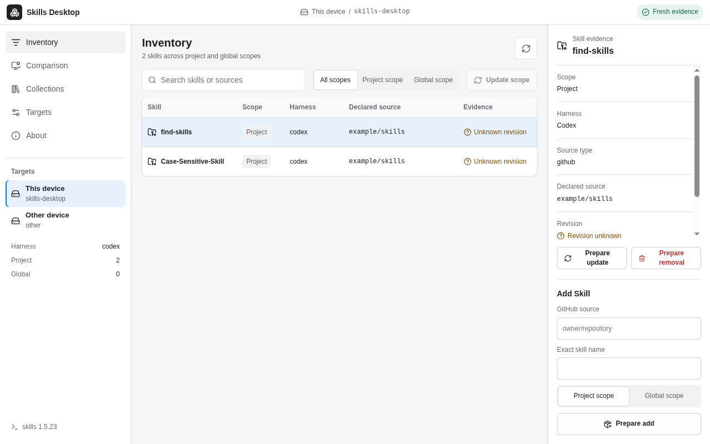
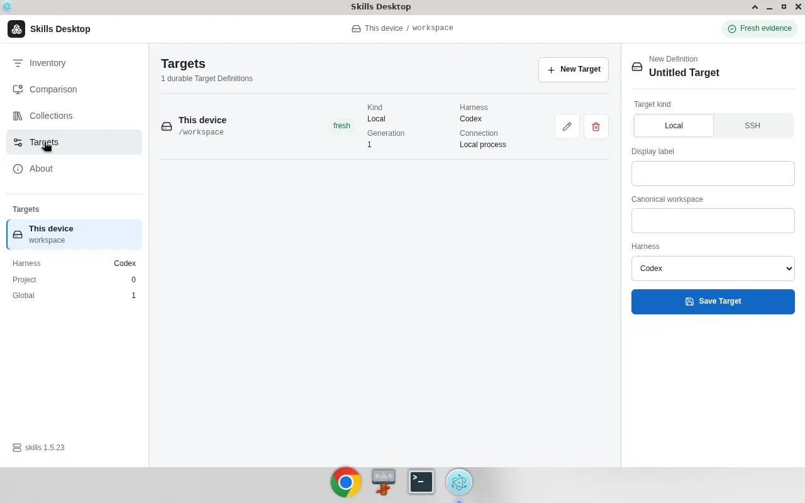
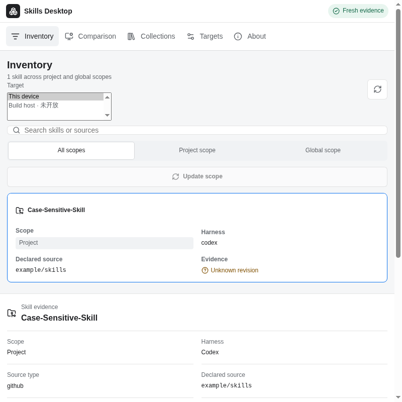
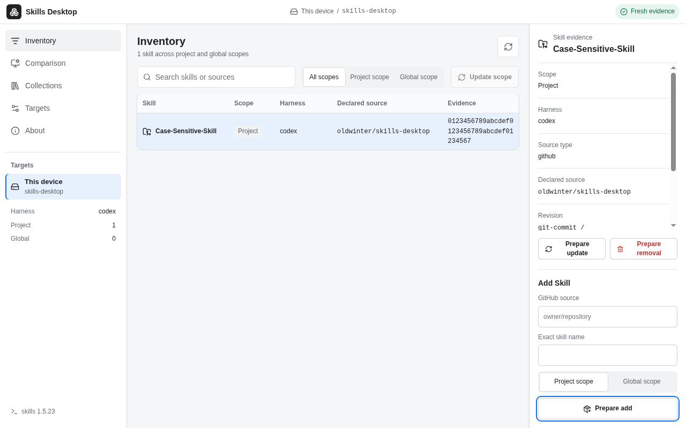
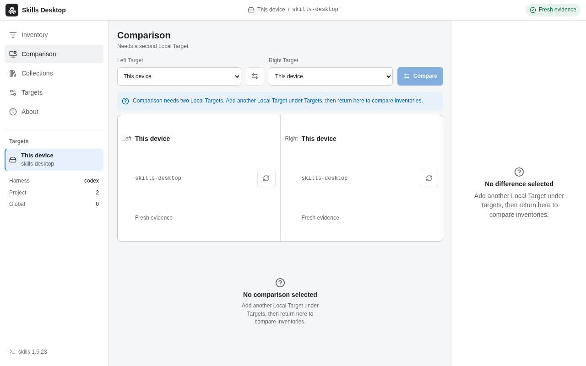
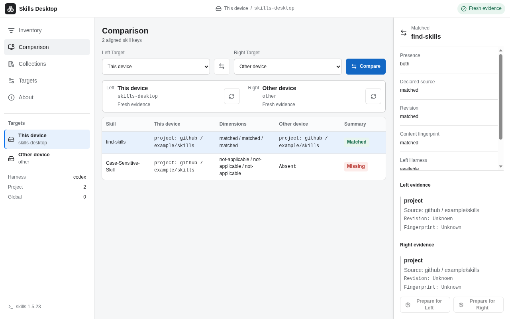
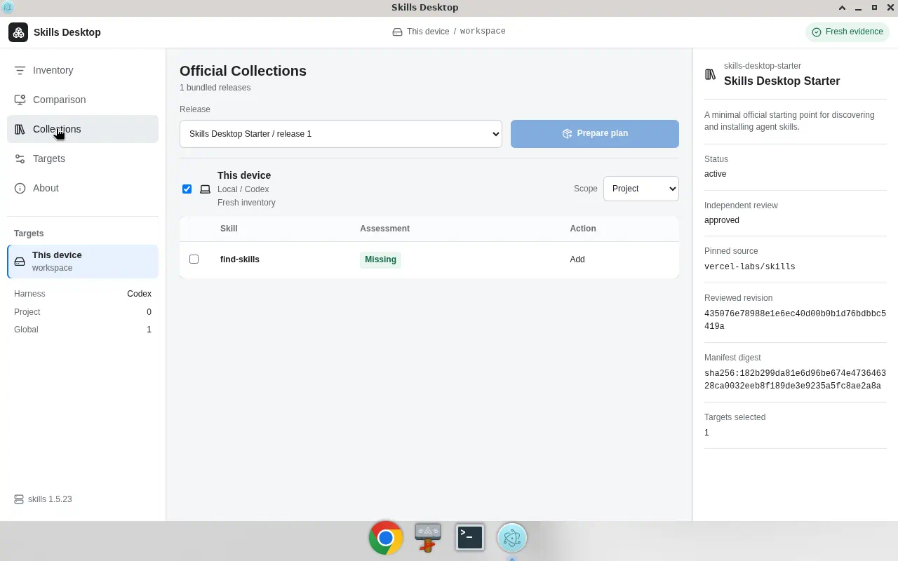
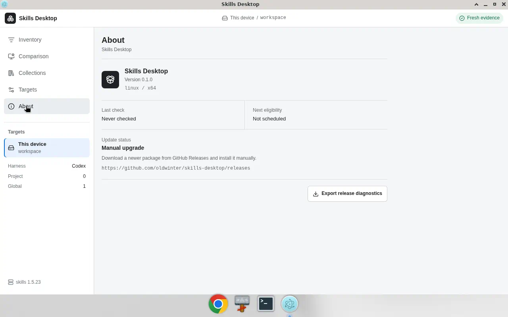

# Skills Desktop 用户手册（V1）

面向已经装好本机 `npx skills` 环境、想用桌面端查看与管理 Skills 的开发者。

**当前产品仍只开放 Local Target。** 已接受的目标架构是 Local 加 POSIX
Remote SSH，但 ADR 不是已交付证明。SSH Inventory 要等 Milestone 3 的打包
tracer 与 validators 全部通过后才会开放；SSH mutation 要等 Milestone 4
的不确定结果与恢复门禁通过后才会开放。在此之前，界面里即使能看见 SSH
Target，也会标成「SSH · 未在 V1 开放」，不能当作当前可用路径。

实际技能发现与变更仍交给 `npx skills`；本应用不另起一套安装器，也不自行扫描技能目录。

---

## 1. 安装与启动

### 推荐：Unsigned Developer Preview

当前公开分发是 **Unsigned Developer Preview**（GitHub prerelease），不是已签名的 Stable Release。

1. 打开 [Releases](https://github.com/oldwinter/skills-desktop/releases)，下载当前唯一公开的 Unsigned Developer Preview，并一并下载 `SHA256SUMS`。
2. **先校验再安装**：确认产物 SHA-256 与 `SHA256SUMS` 一致。有 GitHub CLI 时，按 [安装指南](unsigned-developer-preview.md) 做 attestation 校验。校验失败请停止。
3. 按平台完成安装（摘要如下；细节以 `docs/unsigned-developer-preview.md` 为准）：
   - **macOS 13 Ventura 或更高版本**：打开 DMG，拷到 `/Applications`，对本地副本做 ad-hoc `codesign`，必要时在「系统设置 → 隐私与安全性」里对该应用选 **仍然打开**。这不是 Developer ID，也不是公证。
   - **Windows**：运行 `skills-desktop-0.1.0-win32-x64-setup.exe`。SmartScreen / 未验证发布者警告时，仅在系统提供按文件覆盖选项且你接受风险时继续；策略禁止覆盖则停止，不要自行削弱组织策略。
   - **Linux**：先对照 `SHA256SUMS` 校验 SHA-256，再用 apt 安装本地 DEB（见下方 Linux 小节）。不要只用 `dpkg -i`。RPM 发行版在同样校验后用发行版常规方式安装。预览包有校验与 provenance，但没有项目运维的 Linux 包签名仓库。

#### Linux（Debian / Ubuntu DEB）

1. 下载 `.deb` 与 `SHA256SUMS`，先确认产物 SHA-256 与 `SHA256SUMS` 中对应行一致。不一致则停止：

   ```bash
   sha256sum -c SHA256SUMS --ignore-missing
   ```

2. 用 apt 安装本地文件（必须带 `./`），以便解析 Depends：

   ```bash
   sudo apt install ./skills-desktop-*.deb
   ```

   也可写成带版本号的文件名，例如：

   ```bash
   sudo apt install ./skills-desktop-0.1.0-linux-x64.deb
   ```

3. 该 DEB 的 trash helper `Depends` 为五选一（任意一个即可）：`kde-cli-tools` | `kde-runtime` | `trash-cli` | `libglib2.0-bin` | `gvfs-bin`。`apt install` 本地 DEB 时会自动选一个（常见为 `libglib2.0-bin`）。

不要在 apt 索引过期时裸跑 `sudo apt-get install -f`：它会把未配置的预览包**卸掉**，而不是补依赖。若已经 `dpkg -i` 失败，先更新索引再装本地 DEB（或先装上述任一 helper 再配置）：

```bash
sudo apt update
sudo apt install ./skills-desktop-*.deb
```

```bash
sudo apt update
sudo apt install libglib2.0-bin
sudo dpkg --configure -a
```

仅在已经 `apt update`、并且理解 Depends 无法满足时仍可能卸载预览包的前提下，才考虑 `apt-get install -f`。

预览构建 **不会** 进入应用的稳定自动更新通道。更新需手动下载、校验、安装下一版预览。资源列表里的 `RELEASES` / `*.nupkg` 是 Forge / Squirrel 打包产物，不是 live 稳定更新源。

### 从源码本地跑（开发 / 自建候选）

需要 **Node.js 22.20+**（以便 pinned `skills` CLI 经 `npx` 运行）：

```bash
npm install
npm run verify
```

本地 candidate 构建见仓库 README；本地候选 **没有** 公开发布权威。

启动应用后，侧栏可见：**Inventory / Comparison / Collections / Targets / About**。



侧栏五项与页眉 **Fresh evidence** 如上。后续各节按同一套 chrome 对照截图。

---

## 2. Local Target

**Target** = 应用侧选定的一台机器 + 工作区 + 一个非空的 harness 集合（如本机同时在用的 Codex 与 Claude Code）。V1 只创建与编辑 **Local** Target。

### 新建 / 编辑

1. 打开 **Targets**。
2. **New Target**，填写显示标签、工作区，并在 **Harness** 列表里勾选一个或多个 harness（可按名称或 CLI id 过滤；列表来自 pinned 注册表，标 **project only** 的 harness 不支持 global scope）。至少要保留一个。
3. Kind 保持 **Local**，保存。改动 harness 集合会推进该 Target 的 Generation，之前的 Inventory 会变为 Stale。



列表上 Local 显示为 Local；若仍看到历史残留的 SSH 项，会标 **SSH · 未在 V1 开放**，编辑只读、不能保存。新建 SSH 在 V1 中不可用。



页眉会显示当前 Target 标签与工作区路径。侧栏 **Active Target** 区可切换当前观察对象（这是会话级切换器；编辑 Target Definition 请进入主导航的 **Targets** 页）。侧栏底部显示实际观察到的 `skills` CLI 版本，尚未观察时显示 unobserved。

### 本机前提

- 本机已安装可用的 Node / `npx`。
- Skills Desktop 通过 pinned `skills@1.5.23` 方言调用 `npx skills`（侧栏底部可见 CLI 版本提示）。
- 每个 Local Target 应对应你真实在用的工作区与 harness 集合。

---

## 3. Inventory（清单）

Inventory 是对当前 Target 一次只读 `npx skills list --json` 的归一化结果：同时覆盖 **project** 与 **global** 范围。它是快照证据，不是第二套真相源。

### 新鲜度

| 状态 | 含义 | 能否变更 |
| --- | --- | --- |
| Fresh evidence | 本会话内完整观察成功 | 可以准备变更 |
| Stale evidence | 上次完整结果被保留（刷新失败、Target 变更、或新会话恢复） | 可查看/对比，**不能**授权变更 |
| No evidence | 尚无完整观察 | 先 Refresh |

点标题旁的刷新按钮重新观察；进行中可取消。未筛选的空清单会直接给出 **Add Skill** 按钮，聚焦到同页下方的 Add Skill 表单；`npx skills` 仅作为说明（安装最终仍由固定版本的 CLI 执行）。


### 浏览与筛选

- 表格列：Skill、Scope、Harness、Declared source、Evidence（revision）。
- 搜索框可按名称 / 源过滤；范围可切 All / Project / Global。
- 筛选后没有结果时，点 **Clear filters** 可一次清空搜索词并恢复 All scopes。
- 点选一行，右侧 **Skill evidence** 显示 scope、harness agents、source type、declared source、revision、content fingerprint。未知证据会明确标 Unknown，不会被捏造成版本号。

### 变更（必须先计划、再确认）

任何变更都走：**Prepare → Command Plan → Trusted Review → 执行**。界面上的预览字符串只是说明，**不会**当 shell 执行。



> Trusted Review / Command Plan 在点击 **Prepare add** / **Prepare update** / **Prepare removal** / Collections 的 **Prepare plan** 之后打开；上图是进入该确认链的入口 chrome。


常见操作：

1. **Add Skill**：在 **Source** 填来源，点 **Inspect source**。主进程会用 pinned 的 `skills` CLI 以只读方式（`add <source> --list`）列出该来源里的技能，**不会安装任何东西**；列表出来后勾选要添加的技能、选 project/global，点 **Prepare add of selected Skills**。不检视时，只能按精确名称直接添加 GitHub `owner/repository`。
2. 选中技能后 **Prepare update** / **Prepare removal**。
3. 在 Project 或 Global 范围（不能是 All）可 **Update scope**。
4. 出现 Command Plan 后，点 **Open Trusted Review**，在独立确认界面审阅后再执行。

来源检视（Source Inspection）：

- 支持的来源形态：GitHub `owner/repository[#ref]`、GitHub / GitLab 仓库 URL、以 `.git` 结尾的 Git URL、`https://…/SKILL.md`、`.tar.gz` / `.zip` 归档 URL、`https://skills.sh/p/<pack>`，以及任意 `https://` 站点的 well-known 索引。带凭据、带空白、以 `-` 开头的文本会在启动进程之前被拒绝；本地目录 / 归档需要主进程签发的文件系统授权，本版本尚未提供。
- 列表旁会标注 **Pinned source**（指向确切提交，例如 `https://github.com/owner/repo/archive/<sha>.tar.gz`）或 **Mutable source**（默认分支、命名 ref、HTTP 内容等，执行时会重新获取，内容可能与检视结果不同）。Command Plan 与 Trusted Review 都会重复这一标注，请在批准前确认。注意 pinned CLI 会把 `owner/repo#<sha>` 当作分支去 clone，因此要固定到某个提交，请使用归档 URL。
- 检视结果只在当前会话、当前 Target 及其 generation 内有效。改动 Source 文本会回到直接添加路径；Target 变更或重新检视后，旧的列表即失效，主进程会以 `source_inspection_stale` 拒绝基于它的 Prepare 与批准。
- 检视中可点 **Cancel inspection**；取消不会发布任何部分列表。SSH Target 暂不支持检视。

Harness 影响范围：

- 当 Target 绑定了多个 harness 时，Inventory 右侧会出现 **Bind add and removal to**。默认勾选全部；取消勾选后，Add / Removal 只会改动仍勾选的 harness 链接（命令里的 `--agent` 随之收窄），且至少要保留一个。不属于该 Target 的 harness 不能被选入，主进程会拒绝。
- **Update** 无法按 harness 限定：pinned 的 `skills` CLI 不接受 `--agent`，它会更新所选 scope 下这些技能的**全部** CLI 管理链接，包括这个 Target 没有绑定的 harness。Command Plan 与 Trusted Review 里的 **Harness effect** 会明确写出这一点，请在批准前确认。

仅当 Inventory 为 **fresh**，且不在 reconciliation / 变更进行中时，Prepare 才可用。

skills.sh 交接：

- 当选中技能的 declared source 是 GitHub `owner/repository`，且 Inventory 为 fresh 时，Skill evidence 下方会出现 **Open on skills.sh**。点击后由主进程构造并校验唯一允许的地址形态 `https://skills.sh/<owner>/<repository>/<skill>`，再交给系统浏览器打开。
- 应用只会告诉你「已在浏览器打开」。它不内嵌网页、不登录、不提交、不接收回调，也不知道你在 skills.sh 上是否发布或更新了任何东西；请以浏览器里看到的为准。

若出现 **Reconciliation required**：先按提示 **Reconcile**，在建立新的完整 Inventory 之前不要继续变更。

---

## 4. Comparison（对比）





对比两个 Target 的 Inventory，按技能名对齐，保留多维结果（是否存在、declared source、harness、revision / content fingerprint、新鲜度），**不会**压成单一「好坏」状态。

### V1 用法

1. 至少准备 **两个 Local Target**（各有可用 Inventory）。
2. 打开 **Comparison**，选左右 Target，可互换。
3. 点 **Compare**。

对比结果较多时，可启用 **Differences only**，隐藏完全匹配项，只保留需要关注的差异与未知证据。

在 **Search skills by name** 输入技能名称可进一步筛选，搜索忽略大小写和首尾空格，并与 **Differences only** 叠加。点击 **Clear search** 或在搜索框内按 `Escape` 可清除搜索并保留差异筛选，焦点仍在搜索框。

焦点在技能名称按钮上时，按 `↑` / `↓` 查看上一项或下一项，按 `Home` / `End` 跳到首项或末项。导航仅包含当前搜索与差异筛选后可见的行，到达首尾时停留在原处。`Tab` 仍按原顺序移动焦点，`Enter` 或空格仍可选中技能。

只有一个 Target 时：副标题为 **Needs a second Local Target**，Compare 禁用，并提示先到 Targets 再添加一个。

两侧 Inventory 都为空时：Compare 后会看到 **No skill evidence on either Target**，附带说明与 **Open Inventory** 按钮，先回 Inventory 为其中一个 Target 添加 Skill，再重新对比。

两侧证据最好都是 fresh；一侧 stale 时仍可查看，但向该侧准备变更会受限。选中一行可查看左右证据详情，并在条件满足时准备跨 Target 的更新/同步类操作（仍需 Trusted Review）。

常见维度标签：Source mismatch、Unknown evidence、Revision or content drift 等。

---

## 5. Collections（官方合集）



**Official Collections** = 随应用分发、经审阅的菜谱：从已有源中点名若干 skill，可对 **Local** Target 生成变更意图。合集不拥有已安装技能，也不另起安装协议。

### 典型流程

1. 打开 **Collections**，选择一个已打包的 Official Collection release。
2. 勾选要包含的 **Local** Target 与 scope；查看每项 Assessment（如 missing / present-content-unknown / source-conflict / removal-candidate / incompatible）。
3. 点 **选择缺失技能 / Select missing skills**，一次勾选当前 Target 与 scope 内可添加的 Missing 条目；也可逐项勾选或取消。此操作保留已有选择，不会自动选择 Reapply、来源冲突或不可选条目。
4. 生成 **Collection Plan**，审阅后进入 Trusted Review，再执行。

执行不是跨机事务：每个子 Target 的确认变更独立；若某子项进入 reconciliation，按该 Target 单独处理。

### 导入的包（Imported Package）

除随应用分发的 Official Collections，也可以离线导入团队或个人分享的 `.skillpack` 文件：

1. 在 **Collections** 点 **导入 .skillpack**；主进程弹出原生文件对话框（应用不接受手工输入路径，也不会联网）。
2. 导入结果显示在列表上方：
   - **已导入**：新的包 ID；
   - **相同**：同 ID / release / digest 再次导入，幂等、无变化；
   - **摘要冲突**：同 ID、同 release 但内容 digest 不同——被拒绝，并在已保留的记录上标记冲突，供你与分享方对照；
   - **升级 / 降级**：同 ID 的另一个 release 替换了原记录，Inspector 里显示 release 增量。
3. 导入的包归入列表中的 **导入的包** 分组，与 **官方合集** 区分；Inspector 展示文档 digest、导入时间、声明的 GitHub 源（未 pin 到 commit 时会标注 **未固定**，此时已存在的 skill 只能判定为 present-content-unknown，不能证明「未变化」）。
4. 之后的流程与 Official 完全相同：选择 Target 与 scope、查看 Assessment、生成 Collection Plan、进入 Trusted Review（标题会写明是导入的包，并展示导入证据而非官方审阅收据）、再执行。失败或不确定即停止，不会回滚。

导入只是把菜谱记录在本机的 Package store 中，**不代表任何 skill 已安装**。

### 空态与 SSH

- 若当前构建 **没有** 捆绑任何 reviewed release：会看到空态说明（有合集包之后，才对 Local Target 可用），并提供 **Open Inventory** 按钮回到 Inventory 逐个添加 Skill。
- SSH Target 仍可能出现在列表，但标 **SSH · 未在 V1 开放**，Include 不可用（V1 Local Collections 范围外）。

---

## 6. About 与更新



**About** 显示产品名、版本、平台 / 架构，以及更新策略。

| 构建类型 | 你会看到 | 怎么升级 |
| --- | --- | --- |
| Unsigned Developer Preview | **Manual upgrade**；文案说明未签名/未公证 | 从 [Releases](https://github.com/oldwinter/skills-desktop/releases) 下载新包，按 `docs/unsigned-developer-preview.md` 校验后手动安装 |
| 未来的已签名 Stable（尚未作为当前公开路径） | 才可能走 stable 自动检查 / 下载 | 签名发布仍受 #22 / #27 人闸约束；**不要**把预览当成已签名正式版 |

预览包 **不会** 标为 latest，也 **不会** 进入自动更新源。Windows 预览资源里若出现 `RELEASES` 或 `*.nupkg`，那是 Electron Forge / Squirrel 打包产物，不是线上稳定更新源；请下载安装包与 `SHA256SUMS`。About 里可导出 release diagnostics，便于排障。

若更新/重启被拦住，常见原因：变更进行中、Trusted Review 打开、Reconciliation required 等——先处理完再重启。

### 语言与外观

About 页顶部的 **Language & appearance / 语言与外观** 面板管理两项偏好（ADR 0023）：

| 偏好 | 可选值 | 行为 |
| --- | --- | --- |
| Language / 语言 | 跟随系统、English、简体中文 | 首次启动跟随操作系统语言（仅识别 `zh*` 为简体中文，其余为英文）；一旦显式选择，以选择为准。切换后整个工作区与 Trusted Review 一起换语言，`html lang` 随之变化 |
| Appearance / 外观 | 跟随系统、浅色、深色、高对比度 | 仅 **跟随系统** 会随操作系统深浅色变化；显式模式固定不变。系统开启强制颜色（Windows 高对比度）时，两个渲染器都遵循 `forced-colors` |

偏好保存在用户数据目录的 `preferences.json`，由主进程持有并通过 Snapshot 下发；界面不会在主进程落盘前先行切换。Skill 名、Harness ID、来源、修订、digest 与 Command Plan 预览始终原样显示，不做翻译。

### 应用菜单与快捷键

应用菜单由主进程拥有，文案与工作区来自同一份消息目录，切换语言后菜单随之更新（ADR 0023）。Windows / Linux 上菜单栏默认隐藏，按 **Alt** 显示；macOS 上是标准应用菜单。

| 菜单 | 内容 |
| --- | --- |
| App（仅 macOS） | 关于、服务、隐藏、退出 |
| File / 文件 | macOS：关闭窗口；其他平台：退出 |
| Edit / 编辑 | 撤销、重做、剪切、复制、粘贴、删除、全选 |
| View / 视图 | **刷新库存**（`Ctrl/⌘+R`）、前往库存 / 对比 / 合集 / Targets / 发布 / Studio / 恢复 / 关于（`Ctrl/⌘+1…8`）、实际大小、放大、缩小、切换全屏 |
| Window / 窗口 | 最小化、（macOS：缩放、前置全部窗口）、**Skills Desktop 工作区**（关闭后重新打开工作区窗口） |
| Help / 帮助 | **检查更新…**（跳到 About 并发起与页面按钮相同的检查）；非 macOS 还包含 **关于 Skills Desktop**（原生 About 面板） |

菜单里的刷新与导航不会绕过工作区：主进程只把命令转给当前工作区窗口，由它发出与工具栏按钮完全相同的闭合请求（例如刷新时使用当前 Target），观察进行中时刷新命令被忽略。导航命令执行后焦点落在该视图的主区域。工作区导航按钮与刷新按钮通过 `aria-keyshortcuts` 暴露同样的快捷键。原生 About 面板与 About 页显示同一版本与发布渠道。

---

## 7. Publish（发布）

侧栏 **Publish** 把一个本机 Skills 文件夹导出为确定性的
`.well-known/agent-skills` 发现树（ADR 0019），并可选地通过隔离受护的 Git
发布它（ADR 0020）。这条路径与 Inventory 无关：它不读 `npx skills` 清单，也不
安装任何东西。

### 三步流程

| 步骤 | 你做什么 | 应用做什么 |
| --- | --- | --- |
| 1. 源文件夹 | 点 **选择 Skills 文件夹**，在系统对话框里选一个文件夹，其每个子文件夹都含 `SKILL.md` | 主进程读取（不跟随链接、跳过点开头条目、受导出上限约束），跑确定性导出器，只把 Skill 名、文件数、tree digest 和一个不透明的 grant 交给界面；路径不会进入窗口 |
| 2. 仅导出 | 点 **导出到文件夹**，选一个**新的或空的**文件夹 | 写入精确的树，不调用 Git；非空文件夹会被拒绝 |
| 3. 通过 Git 发布（可选） | 填 **远端** 与一个精确 **分支** 名，点 **规划发布** | 主进程消毒两者（只接受不含凭据的 `https://`、`ssh://`、`user@host:path`；拒绝 `file:`、选项、查询串等），在应用自有的 0700 临时根里用系统 Git 准备候选提交，并把整份 `PublicationPlanV1` 展示出来 |

计划就绪后点 **打开可信复核**。Trusted Review 会显示远端、精确 `refs/heads/*`、
已复核的基线（或「尚未创建的分支」）、候选提交、每个受管文件与其 digest、导出树
digest、计划 digest 与过期时间。批准后主进程会**先持久化 Publication Guard**，
再重新拉取该分支并以**单条 fast-forward refspec** 推送——没有 force、tag、
hook 或删除；远端一旦变化，推送取消，需重新规划。

### 结果与核对

推送后会精确回读远端 ref，并在 **最近结果** 里记录 `已发布` / `未发布` /
`已分叉` / `不确定`。若结果不确定（例如传输中断、远端无法读取），Guard 会保留，
**规划发布** 会被挡住，并且重启后依然如此；此时点 **回读远端** 只做回读、永不
自动重推，读到确定结果后 Guard 才解除。

凭据始终留给系统 Git / OpenSSH；应用不读取、不保存、不记录任何凭据，也不会打开或
修改你的工作区仓库与 Git 配置。清理只删除应用自己创建的临时根。本机 bare Git
fixture 是硬验收面；对 GitHub 等真实远端的证据属于后续资格认证，不能凭 fixture
声称。

---

## 8. Studio（编写 Skill）

侧栏 **Studio** 是 Local-only 的静态编写台（ADR 0018）：打开一个 Skill 文件夹做
校验、编辑自动保存的 `SKILL.md` 草稿、惰性预览，并把草稿原子导出为新的 Skill
文件夹。它不运行任何脚本、工具或 Markdown 插件；被编写的内容自始至终是惰性的。

### 文件夹授权

点 **打开 Skill 文件夹**，在系统对话框里选一个含 `SKILL.md` 的文件夹。主进程把路径
规范化后只交给界面一个不透明、绑定本窗口的 **Filesystem Grant** 和一个显示名；
路径不会进入渲染层。授权只允许 Studio 自己的校验 / 建稿操作，在你点 **释放**、
关闭窗口或重启应用时失效，从不持久化。

校验器（profile v1）对符号链接、硬链接、特殊文件、`..` 穿越、非法或大小写冲突的
路径、超限文件、缺失或损坏的 `SKILL.md`、与文件夹名不一致的 frontmatter `name`、
指向 Skill 之外或无法解析的链接一律 **fail closed**；发现项只带稳定代码与相对
位置，不带原文。原始 HTML 只是警告，预览会把它按纯文本显示。

### 草稿与自动保存

每个草稿是独立的版本化记录（`studio-drafts/<id>.json`）。编辑框在停止输入后自动
保存，保存以当前版本号做 **比较交换**：若草稿已在别处改动，会显示冲突并提供
**重新加载**，绝不静默覆盖。损坏或更新版本的草稿在启动时被单独隔离，不影响其他
草稿。可从已授权文件夹的 `SKILL.md` 新建草稿，也可 **预览**：预览是主进程渲染的
封闭语义块（标题、段落、列表、引用、代码、分隔线；链接与图片只以文字标注目标），
没有 HTML、脚本、远程资源或导航。

### 原子导出

**导出 Skill** 只对没有任何错误的草稿可用。选一个父文件夹后，主进程先在其旁边写
一个自有的临时树，逐字节校验并落盘，再以重命名提交到 `<父文件夹>/<name>`；目标
已存在则拒绝，任何失败只删除临时树，不留半成品。

---

## 9. Recovery（恢复）

侧栏 **Recovery** 汇总需要你亲自做一个「有类型」动作的状态；有待处理项时导航上会显示数量。这里没有通用的「清除 / 重试」按钮，每一项只有一个明确动作：

| 状态 | 含义 | 你能做什么 |
| --- | --- | --- |
| Reconciliation required | 某次已确认的变更结束时无法确定效果（进程被中断、超时等），Mutation Guard 仍然保留 | 到达原操作 deadline 后点 **Reconcile**，应用会重新观察一份 Fresh Inventory；单纯刷新不能解除 |
| Blocked Target Definitions | 旧版本保存的 Target 写着当前 pinned 注册表不认识的 harness，迁移被挡住，Target 存储保持只读 | 为它选一个注册表里的 **Replacement harness** 再点 **Repair**；应用不会替你猜。原始文件会先备份，然后才改写 |
| Restart required | 修复已经写入磁盘，但本次运行的 Target 权威还未重建 | 重启 Skills Desktop，修好的 Target 会回到 Targets 列表并推进 Generation |

修复只改写那个被挡住的 Target；若同一个文件里还有别的未知 harness，会继续列在 Blocked 里，逐个修复即可。若该 Target 还挂着未完成的 Mutation Guard，Repair 会被拒绝，需先处理 Guard。

---

## 10. 常见问题

**Q：和直接跑 `npx skills` 有什么区别？**  
A：桌面端把 project+global 清单、对比、变更计划和确认做成可审阅流程；真正的 list/add/remove/update 仍委托给 `npx skills`。

**Q：为什么不能改技能？Prepare 是灰的？**  
A：需要 **Fresh evidence**。先 Refresh；若显示 Reconciliation required，先 Reconcile。Stale / No evidence 只能看，不能授权变更。

**Q：Stale evidence 是过期了吗？**  
A：不是按时间自动过期。刷新失败、Target 定义变更、或新会话恢复上次完整快照时，会标 stale。可继续查看和对比，不可拿它做变更依据。

**Q：为什么 Comparison 不能点？**  
A：V1 需要两个 Local Target。先到 Targets 再建一个，再回来 Compare。

**Q：界面上还有 SSH，能用吗？**  
A：**不能当作 V1 主路径。** 列表可能显示 **SSH · 未在 V1 开放**；新建/保存不可用，已有项只读；Collections 也不会把 SSH 纳入 V1 Include。远程相关能力属于下一步（next-scope），不是 V1 承诺范围。

**Q：macOS / Windows 拦安装正常吗？**  
A：对 Unsigned Developer Preview 是预期行为。先校验字节，再按平台自带的「仍要打开 / 按文件覆盖」处理。不要为了安装去关 Gatekeeper 或导入不受信的自签根证书。

**Q：Linux 上 `dpkg -i` 失败，或 `apt-get install -f` 把包卸掉了？**  
A：DEB 依赖 trash helper 五选一（`kde-cli-tools` | `kde-runtime` | `trash-cli` | `libglib2.0-bin` | `gvfs-bin`）。先对照 `SHA256SUMS` 校验，再用 `sudo apt install ./skills-desktop-*.deb`。不要在 apt 索引过期时裸跑 `apt-get install -f`，那会卸掉未配置的预览包。

**Q：应用内提示有更新吗？**  
A：预览构建走手动升级。到 Releases 取新包并校验；不要期待稳定通道的自动更新。

**Q：Command Plan 里的命令能复制到终端跑吗？**  
A：预览字符串仅供审阅，不是可执行输入。请在 Trusted Review 里确认，由应用按参数数组调用 CLI。

---

## 相关文档

- 产品边界与状态：[README](../README.md)
- Unsigned 安装与校验细节：[unsigned-developer-preview.md](unsigned-developer-preview.md)
- 概念定义：[CONTEXT.md](../CONTEXT.md)
- 架构决策：[`docs/adr/`](adr/)

有问题或复现步骤，请到 [oldwinter/skills-desktop](https://github.com/oldwinter/skills-desktop/issues) 开 Issue。
