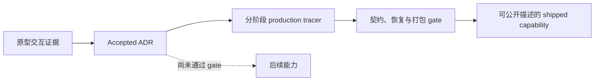

# 架构背景

Skills Desktop 的背景资料解释两件容易混在一起的事：为什么生产代码采用主进程集中授权的深模块结构，以及哪些设计只是已经接受的后续合同、尚未成为公开产品能力。当前 V1 的公开承诺仍是 Local-only；完整的 Local 加 POSIX SSH 架构要按里程碑 tracer 和打包验证逐步晋级。

## 阅读这组页面

| 页面 | 回答的问题 |
| --- | --- |
| [架构决策](architecture-decisions.md) | 24 篇 ADR 如何共同约束权威、Target、执行、恢复、发行与后续演进？ |
| [原型与产品演进](prototype-and-evolution.md) | Variant A/B/C 留下了什么证据，生产 tracer 又刻意没有复制什么？ |
| [代码库沿革](../lore.md) | 这些决策和实现分别在何时进入仓库？ |
| [系统架构](../overview/architecture.md) | 当前生产模块、IPC 角色和数据流如何连接？ |
| [维护机会](../cleanup-opportunities.md) | 哪些大文件和高 churn 区域值得在现有接口保护下渐进整理？ |

## 三条历史主线

### 从交互证据到生产合同

仓库保留 `prototype/`，因为它回答了信息架构问题：Inventory 应是主壳，Comparison 需要成对 Target 与差异矩阵，Collections 是建立在现有来源之上的配方。它没有回答生产授权、持久化、错误恢复或发行信任问题。生产代码因此从 `apps/desktop/` 和两个私有 package 重新建立边界，没有把 `prototype/src/main.js` 直接改造成产品入口。

### 从单机 tracer 到受门禁的演进架构

ADR 0001—0013 建立了固定 `npx skills` 权威、Typed Mutation、Trusted Review、Mutation Guard、恢复记录和发行分类。ADR 0014—0024 接受更完整的演进方向，包括多 Harness Target、来源检查、Wire v3、Package、Studio、确定性导出、Git 发布、Recovery Center 和双语无障碍壳。

“Accepted”在这里表示后续实现必须遵守这份合同，不表示对应能力已经通过生产适配器、恢复路径和打包门禁。尤其是 SSH：目标架构已经接受，当前公开产品仍是 Local-only。

### 从可执行预览到主进程拥有的授权

原型里的命令字符串用于解释用户选择；生产架构把它们降为不可执行的 `Command Plan` 投影。真正的参数数组、Target binding、Fresh Inventory、单次确认和 Guard 顺序都留在主进程。普通 renderer 可以请求计划和展示审阅，但不能把预览文本、argv、路径或确认 token 送回执行。

## 当前阅读边界

- 已安装 Skill 的事实来自固定 `npx skills` 方言；持久化 Inventory 只是恢复证据，重启后必为 stale。
- 主进程拥有 Target 会话、Mutation、Trusted Review、Guard、恢复和事件顺序；renderer 只持有严格投影。
- 仓库中的 SSH、Remote Bootstrap 或后续协议代码不能单独证明远端能力已经交付。
- Unsigned Candidate 或 Unsigned Developer Preview 不是签名、已公证的 Stable Release。
- 后续文档若描述 accepted destination，应同时标出尚未通过的 tracer 或平台门禁。

## 关键背景来源

| 路径 | 用途 |
| --- | --- |
| `CONTEXT.md` | 当前领域词汇、非协商边界和公开范围 |
| `docs/adr/README.md` | ADR 状态与“accepted 不等于 shipped”的解释 |
| `docs/adr/0001-delegate-skill-operations-to-npx-skills.md` 至 `docs/adr/0024-qualify-an-unsigned-mission-candidate.md` | 跨实现票据的长期架构合同 |
| `prototype/VERDICT.md` | Variant 取舍与生产边界 |
| `prototype/README.md` | 原型的运行方式、样例范围与缺失能力 |
| `prototype/DESIGN.md` | 原型的信息密度、布局和无障碍设计依据 |

要从当前代码而不是历史理由开始阅读，可转到 [DesktopCapabilities](../systems/desktop-capabilities/index.md)。
