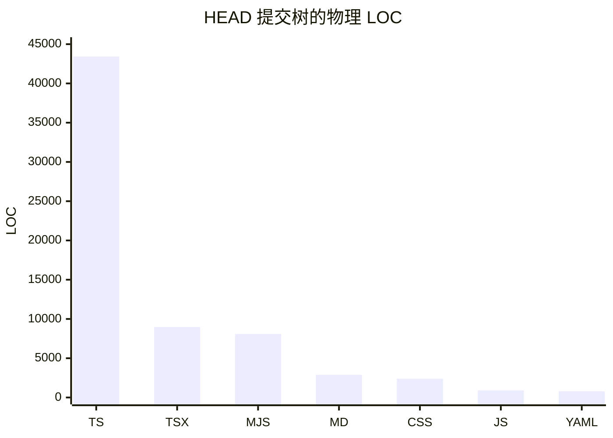

# 代码库数字

> 数据采集于 2026-08-26

本页是一张可复核的规模快照，不是质量评分。当前规模统一取提交 `5311da1` 的受跟踪树，未提交和未跟踪文件不计入；Git 历史趋势与 churn 另以 `origin/main` 为稳定对照。这样可以避免采集期间并行工作继续修改磁盘内容而让同一页的数字互相漂移。

## 快照摘要

| 指标 | `HEAD` | `origin/main` |
| --- | ---: | ---: |
| 基准 | `5311da1` | `6e6fb8c` |
| 提交数 | 177 | 174 |
| 跟踪文件 | 223 | 206 |
| 源文件 | 83 | 82 |
| 测试与测试支撑文件 | 65 | 62 |
| 配置、文档、数据与资产 | 75 | 62 |
| `.ts` 物理 LOC | 43,422 | 41,261 |
| `.tsx` 物理 LOC | 8,974 | 8,924 |
| npm workspace | 3 | 3 |

`HEAD` 比 `origin/main` 多 3 个提交，没有落后提交。这里的文件分类按路径互斥：位于任意 `test`、`tests`、`__tests__` 目录，或文件名匹配 `*.test.*`、`*.spec.*` 的路径归入“测试与测试支撑”；其余 `.ts`、`.tsx`、`.js`、`.jsx`、`.mjs`、`.cjs` 归入“源文件”；剩余路径归入最后一类。因此 `tests/packaged-ui-qa/README.md` 也算测试支撑，而图片、清单和 lockfile 算最后一类。

三个实际 workspace 是：

- `apps/desktop/package.json`：`@skills-desktop/desktop`
- `packages/skills-runtime/package.json`：`@skills-desktop/skills-runtime`
- `packages/remote-bootstrap/package.json`：`@skills-desktop/remote-bootstrap`

`prototype/package.json` 不匹配根清单中的 `apps/*` 或 `packages/*`，所以不是 workspace。初扫出现过约 42,474 行 `.ts`；最终冻结的 `HEAD` 提交树为 43,422 行。这个差值来自提交 `5099f16`、`2274821` 和 `5311da1`，不是把未提交工作误算成历史增长。

## 按语言与文本格式统计

以下是 `HEAD` 提交树的物理行数，即 `wc -l` 口径；不扣空行和注释。图只画主要扩展名，完整数字见表。



| 扩展名 | 文件数 | 物理 LOC | 主要用途 |
| --- | ---: | ---: | --- |
| `.ts` | 108 | 43,422 | 主进程、契约、运行时及测试 |
| `.tsx` | 16 | 8,974 | 普通与可信审阅 renderer |
| `.mjs` | 20 | 8,084 | 发布、验证、smoke 与 QA 脚本 |
| `.md` | 40 | 2,885 | ADR、指南与仓库文档 |
| `.css` | 3 | 2,392 | renderer 与 prototype 样式 |
| `.js` | 2 | 898 | ESLint 配置与 prototype |
| `.yml` | 4 | 792 | GitHub Actions |
| `.json` | 11 | 246 | 去除 lockfile 后的清单与配置 |
| `.tsv` | 1 | 78 | 固定 harness registry fixture |
| `.html` | 3 | 45 | renderer 与 prototype 入口 |
| `.cjs` | 1 | 5 | prototype preload |

这些文本合计 67,821 行，但不能把文档、CSS、fixture 和程序代码相加后解释为“代码量”。

### 排除项

- `package-lock.json` 的 13,352 行和 `prototype/package-lock.json` 的 1,166 行从语言 LOC、目录平均值、复杂度和导入图中排除；它们仍计入 223 个跟踪文件，也保留在 Git churn 的原始总量里。
- `dist/`、`coverage/`、`release-candidates/` 和 `node_modules/` 是忽略的生成或依赖目录，没有进入跟踪文件样本。
- `.png`、`.ico`、`.icns` 等二进制资产没有“行数”，从 LOC 和平均文本文件大小中排除。
- 当前未提交的产品改动和未跟踪的 `droid-wiki/` 内容不计入本快照；所有规模数字都可以直接从 `5311da1` 的提交树重建。

## 提交节奏

趋势使用 committer date、ISO 周和完整可达历史。仓库首个提交时间为 2026-08-20，因此“最近 90 天”实际上覆盖了仓库的全部历史；W35 在采集日仍未结束。

| 时间桶 | 日期范围 | `HEAD` | `origin/main` |
| --- | --- | ---: | ---: |
| 2026-W34 | 2026-08-17 至 2026-08-23 | 161 | 161 |
| 2026-W35（截至采集日） | 2026-08-24 至 2026-08-26 | 16 | 13 |
| 2026-08（截至采集日） | 2026-08-01 至 2026-08-26 | 177 | 174 |

这说明 177 个提交集中在 7 个日历日内；它描述的是仓库建立期的提交密度，不应外推为长期速度，也不用于衡量任何个人。

## 90 天 churn 热点

窗口为 2026-05-28 至 2026-08-26，数据源为 `origin/main` 的 `git log --numstat`。churn 定义为每个路径累计的 `added + deleted`；表内只排名代码与样式扩展名，并排除两个 lockfile。该口径得到 149 个曾变更的源路径、67,432 行增加、5,747 行删除，共 73,179 行 source churn。

| 排名 | 仓库根完整路径 | 增加 | 删除 | churn |
| ---: | --- | ---: | ---: | ---: |
| 1 | `apps/desktop/src/main/application/desktop-capabilities.test.ts` | 7,178 | 199 | 7,377 |
| 2 | `apps/desktop/src/main/application/desktop-capabilities.ts` | 4,308 | 285 | 4,593 |
| 3 | `apps/desktop/src/renderer/features/inventory/InventoryApp.test.tsx` | 3,262 | 270 | 3,532 |
| 4 | `apps/desktop/src/renderer/features/inventory/InventoryApp.tsx` | 1,952 | 599 | 2,551 |
| 5 | `tests/packaged-electron.smoke.mjs` | 1,883 | 610 | 2,493 |
| 6 | `apps/desktop/src/main/persistence/recovery-records.test.ts` | 2,419 | 45 | 2,464 |
| 7 | `apps/desktop/src/main/persistence/recovery-records.ts` | 2,222 | 201 | 2,423 |
| 8 | `prototype/src/styles.css` | 1,920 | 0 | 1,920 |
| 9 | `apps/desktop/src/main/adapters/local-skills-process.ts` | 1,451 | 415 | 1,866 |
| 10 | `scripts/release/release-integrity.mjs` | 1,702 | 117 | 1,819 |

原始全仓库 churn 为 93,830，其中根 `package-lock.json` 单独贡献 15,921，`prototype/package-lock.json` 贡献 1,166；这正是热点榜排除 lockfile 的原因。高 churn 只表示近期反复改动，不自动等于缺陷或设计问题；模块职责与后续拆分线索见[维护热点](cleanup-opportunities.md)。

## 结构复杂度近似

复杂度使用 Babel TypeScript AST 扫描当前工作树中 59 个非测试生产 `.ts`/`.tsx` 模块。单函数近似圈复杂度为 `1 + if/循环/catch/有 test 的 case/三元表达式/&&/||/?? 数`；不包含类型系统复杂度，也不等同于测试难度。表按“最高单函数近似复杂度”排序。

| 仓库根完整路径 | 物理 LOC | 文件决策节点 | 最高单函数近似复杂度 | 对应符号 |
| --- | ---: | ---: | ---: | --- |
| `apps/desktop/src/main/application/desktop-capabilities.ts` | 4,011 | 593 | 241 | `request` |
| `apps/desktop/src/renderer/features/inventory/InventoryApp.tsx` | 1,355 | 181 | 74 | `InventoryApp` |
| `apps/desktop/src/main/persistence/recovery-records.ts` | 2,405 | 208 | 59 | 匿名回调 |
| `apps/desktop/src/renderer/features/comparison/ComparisonView.tsx` | 699 | 111 | 51 | `ComparisonView` |
| `apps/desktop/src/main/adapters/ssh-skills-process.ts` | 846 | 100 | 37 | `observeInventory` |
| `apps/desktop/src/main/ssh/openssh-target.ts` | 816 | 90 | 31 | `resolveCandidate` |
| `packages/skills-runtime/src/wire.ts` | 539 | 115 | 26 | `validateWireObservationRequest` |
| `apps/desktop/src/renderer/features/collections/CollectionsView.tsx` | 673 | 80 | 21 | `CollectionsView` |

特别是 `apps/desktop/src/main/application/desktop-capabilities.ts`，高值部分来自一个统一请求分派器的多分支编排；这个近似值适合定位阅读入口，不能单独证明应当拆分。边界和依赖方向的语义解释见[系统架构](overview/architecture.md)。

## 导出面与 import chain

同一批 59 个非测试生产模块中，AST 近似识别出：

- 311 个直接导出名；
- 30 个 re-export 条目，其中 5 个是 `export *`；
- 合并记为约 **341 个导出条目**。它是语法级近似，会重复计算经 barrel 再导出的符号，也不会把一个 `export *` 展开成其全部目标符号。

静态 `import` 与带 source 的 `export` 构成的内部图有 59 个节点、131 条去重有向边，平均每个模块 2.22 条内部出边。解析相对 `.js` specifier 到对应 `.ts`/`.tsx`，并解析两个内部 workspace 包入口；type-only import 计入，动态 import、外部包和 CSS 不计入。

将强连通分量压缩后，最长静态 import chain 为 **9 个模块**：

```text
apps/desktop/src/main/index.ts
→ apps/desktop/src/main/adapters/electron-ipc.ts
→ apps/desktop/src/main/application/desktop-capabilities.ts
→ apps/desktop/src/contracts/review.ts
→ apps/desktop/src/contracts/workspace.ts
→ packages/skills-runtime/src/index.ts
→ packages/skills-runtime/src/harness-registry.ts
→ packages/skills-runtime/src/inventory.ts
→ packages/skills-runtime/src/result.ts
```

图中有 1 个双模块循环分量：`apps/desktop/src/main/ssh/openssh-target.ts` 与 `apps/desktop/src/main/targets/skills-targets.ts`。最长链指标受 barrel 和 type-only import 影响，适合衡量静态导航深度，不代表运行时调用栈。更完整的包与第三方依赖说明见[依赖关系](reference/dependencies.md)。

## 目录平均文件大小

下表递归统计各目录中的跟踪文本文件，仍排除 lockfile、二进制和生成目录；“平均 LOC”是物理行数，不做语言归一化。目录间不重叠，但并未覆盖仓库根部配置文件。

| 仓库根完整目录 | 文本文件数 | 平均大小 | 平均 LOC |
| --- | ---: | ---: | ---: |
| `apps/desktop/src/main/` | 56 | 17.4 KiB | 569.0 |
| `apps/desktop/src/contracts/` | 13 | 5.8 KiB | 196.1 |
| `apps/desktop/src/renderer/` | 15 | 18.8 KiB | 546.9 |
| `apps/desktop/src/review-renderer/` | 7 | 6.4 KiB | 184.7 |
| `apps/desktop/src/preload/` | 4 | 5.3 KiB | 171.8 |
| `packages/skills-runtime/src/` | 10 | 6.1 KiB | 222.6 |
| `packages/remote-bootstrap/src/` | 2 | 30.3 KiB | 938.0 |
| `tests/` | 21 | 13.3 KiB | 411.1 |
| `scripts/` | 6 | 15.3 KiB | 515.0 |
| `prototype/` | 14 | 6.9 KiB | 232.7 |
| `docs/` | 31 | 3.5 KiB | 67.2 |

`packages/remote-bootstrap/src/` 的平均值受只有 2 个文件的小样本显著影响；目录平均值不应脱离文件数解读。

## 自动化提交归因

按 author 名称/邮箱中的显式 bot 标记，以及提交正文中的 `Co-authored-by: factory-droid[bot]` trailer 去重：

| 归因类型 | `HEAD` | `origin/main` |
| --- | ---: | ---: |
| Dependabot 作为直接 author | 2 | 2 |
| Factory Droid bot 作为 co-author | 7 | 4 |
| 任一显式 bot 归因的提交 | 9 | 6 |

Dependabot 行表示依赖自动化；Factory Droid trailer 才是可直接观察到的 AI 协作标记。后者的 7 个 `HEAD` 提交、4 个 `origin/main` 提交只是 **AI 辅助提交的下界**：没有 trailer 的辅助无法从 Git 元数据可靠恢复，不能据此推断其余提交均为纯人工，也不能把 bot 共著等同于 bot 独立完成。
