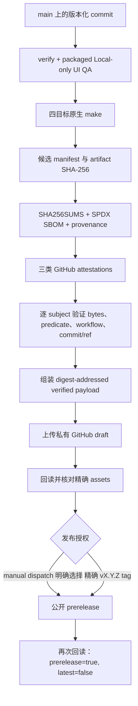

# 构建与发布

Skills Desktop 当前可发布的是 **Unsigned Developer Preview**：可复现、带 checksum、SPDX SBOM 和 GitHub attestation 的公开 GitHub pre-release。它不是 Stable Release，没有 Apple Developer ID、notarization、Windows Authenticode 或 publisher reputation；不会标记为 latest，也不会进入自动更新 feed。当前产品能力仍是 **Local-only V1**，候选包包含 `packages/remote-bootstrap` 的构建证据不代表 SSH 已成为支持面。

## 本地构建与验证

根工作区要求 Node.js 22.20 或更高版本；CI 使用 Node.js 24。常用入口定义在 `package.json`：

```bash
npm ci
npm run verify
npm run smoke:cli
npm run smoke:packaged
```

`npm run verify` 依次执行 typecheck、ESLint、import 边界检查、覆盖率测试和全部 workspace build。`apps/desktop/package.json` 的 desktop build 显式构建五个 Vite 入口：

1. Electron main；
2. workspace preload；
3. review preload；
4. workspace renderer；
5. review renderer。

Electron Forge 只打包这些预构建输出，不使用实验性 Forge Vite plugin。`apps/desktop/forge.config.ts` 将运行时收敛到 `dist/main`、`dist/preload`、`dist/renderer` 和 `dist/review-renderer`，使用 ASAR，并在打包阶段应用 Electron fuses。

## CI 门禁

`.github/workflows/verify.yml` 的当前验证矩阵是：

| Runner | 门禁 |
| --- | --- |
| Ubuntu 24.04 x64 | `npm run verify`、打包 Electron smoke；向 `main` push 时另跑隔离的真实 CLI smoke |
| macOS 15 | typecheck、import 检查、单元/契约测试 |
| Windows 2025 | typecheck、import 检查、单元/契约测试 |

`.github/workflows/packaged-ui-qa.yml` 另在 Linux x64、macOS arm64、macOS x64 和 Windows x64 上打包应用，并用隔离 profile 执行 **Local-only** UI QA。失败时只上传受控的 `failure.json` 证据。该矩阵证明对应 runner 上的候选行为，不证明外部 SSH、跨机器行为、原生 VoiceOver/NVDA 或平台 publisher trust。

## 原生产物矩阵

`apps/desktop/forge.config.ts` 与 `scripts/release/candidate-contract.mjs` 规定精确目标：

| 平台 / 架构 | Forge maker | 候选产物 |
| --- | --- | --- |
| macOS arm64 | DMG、ZIP | `skills-desktop-<version>-darwin-arm64.dmg`、同名 `.zip` |
| macOS x64 | DMG、ZIP | `skills-desktop-<version>-darwin-x64.dmg`、同名 `.zip` |
| Windows x64 | Squirrel.Windows | `skills-desktop-<version>-win32-x64-setup.exe`、`skills_desktop-<version>-full.nupkg`、`RELEASES` |
| Linux x64 | DEB、RPM | `skills-desktop-<version>-linux-x64.deb`、同名 `.rpm` |

V1 不生产 macOS Universal、Windows ARM64、MSIX、AppImage、Snap 或 Flatpak，也不运营 APT/DNF repository。Stable 的操作系统支持集应取 vendor 仍维护版本与固定 Electron major 支持范围的交集；Linux 正式资格要求记录当时最新 Ubuntu LTS 和 Fedora Stable 的实测结果。

## Candidate 构建约束

`scripts/release/build-candidate.mjs` 只能在目标原生平台运行，并执行以下检查：

- `package.json`、`apps/desktop/package.json`、`packages/skills-runtime/package.json` 和 `packages/remote-bootstrap/package.json` 使用同一精确版本；
- checkout commit 与 `--source-commit` 完全一致，tracked source tree 干净；
- lockfile bytes 绑定 SHA-256；
- unsigned job 不得带 Apple、Windows、Azure 或 GitHub release credential，并设置 `CSC_IDENTITY_AUTO_DISCOVERY=false`；
- 依次构建 Skills Runtime、Remote Bootstrap 和 Desktop，再执行 `electron-forge make`；
- 只接受目标平台应有的精确、非空 maker 文件集，不接受符号链接、额外 artifact 或覆盖既有 candidate directory。

每个平台目录附带 `candidate-manifest-v1.json` 和其 SHA-256 sidecar。Manifest 绑定 source commit、repository、workflow identity、Node/Electron/Forge 版本、lockfile digest、六项构建输出 digest、Remote Bootstrap digest，以及每个 artifact 的名称、大小和 SHA-256；同时固定：

```text
candidateUse: unsigned-preview-only
signingStatus: unsigned
```

`assertPublicReleaseEligible()` 对这类 manifest 永远失败，因此 unsigned candidate 不能原地“晋升”为 Stable。

## 从候选到公开 pre-release



主流程在 `.github/workflows/release-candidates.yml`：

1. **普通 PR / `main` push**：各平台构建 unsigned candidate；保留短期 manifest 证据，但不进入公开发布链。
2. **对 `main` 的手动 dispatch**：运行完整 verify 与 packaged UI QA，生成并验证候选、证据和私有 draft；只有 `publish_preview=true` 才公开。
3. **推送精确 `vX.Y.Z` tag**：在安装依赖前验证 tag 与所有 workspace/lockfile 版本一致，并验证 tag commit 属于 `main` 历史；之后自动走完整门禁并发布该既有 tag。工作流不会创建、移动或替换触发 tag。

`draft-assembly` 只拿已验证 payload，上传前再次计算 payload digest，创建 `draft=true`、`prerelease=true`、`latest=false` 的私有 GitHub Release，然后通过 API 回读每个 asset 的名称、大小和 GitHub SHA-256。发布 job 再次验证 draft，随后只把同一个 release 改为公开 pre-release，**不重建、不替换 asset**，最后回读公开状态。

## Evidence、SBOM 与 attestation

`scripts/release/release-integrity.mjs` 生成和封存：

- 全部平台 artifact 的 `SHA256SUMS`；
- `skills-desktop-<version>.spdx.json`（SPDX 2.3）；
- `candidate-provenance-v1.json`；
- 四个平台 candidate manifest 及其 checksum；
- provenance、SBOM、candidate identity 三类 Sigstore bundle；
- `candidate-evidence-v1.json` 索引；
- 组装后的 `verification-receipt-v1.json`。

Evidence job 使用 GitHub OIDC 对精确 artifact subjects 建立三类 attestation：

1. SLSA provenance v1；
2. SPDX document v2.3；
3. 项目定义的 unsigned-candidate identity predicate。

后续 verify job 对每个 subject 检查预期 repository、`.github/workflows/release-candidates.yml` signer workflow、source commit、source ref，并拒绝 self-hosted runner provenance；还会核对签名 statement 的 subject 集和本地 predicate bytes。Candidate set、evidence set 和最终 draft payload 分别有 inventory digest，job 间交换也使用 digest-addressed artifact 名称。

## 安装与手动升级

公开 preview 的 release notes 会显著声明 unsigned、not notarized、not stable-eligible，并链接到精确 source commit 下的 `docs/unsigned-developer-preview.md`。用户必须先核对 `SHA256SUMS`，并用 `gh attestation verify` 验证 provenance，失败即停止。

- **macOS**：选择正确架构的 DMG；验证后复制应用，可对本地副本做 ad-hoc signature，并仅使用系统的单应用 **Open Anyway** 流程。它不建立 Developer ID 身份，也不等于 notarization。
- **Windows**：验证 `win32-x64-setup.exe` 后，只在 Windows 自身提供 per-file override 且用户接受风险时继续；项目不会指导用户把不可信自签根证书加入 Trusted Root。
- **Linux**：验证 DEB/RPM 后使用发行版常规工具手动安装；项目没有 Linux package repository 或长期 package-signing key。

Unsigned Developer Preview 被 GitHub 标记为 pre-release，排除在 stable 自动更新 feed 之外。preview-to-preview 升级必须重新下载、验证并手动安装。应用内当前 `releaseChannel: "unsigned-preview"` 也只显示手动升级指引；详见[更新协调](systems/updates.md)。

## Stable Release 尚未满足的门禁

ADR 0011 定义的 Stable Release 要求保持不变，当前仓库的 unsigned workflow 和 Forge 配置没有满足以下事项：

### 平台信任

- macOS 应用及嵌套代码需要 Developer ID Application、Hardened Runtime、最小受审 entitlements 和 secure timestamp；应用与 DMG 需要 notarize/staple，并通过 `codesign` 和 Gatekeeper 验证。更新 ZIP 必须包含与 DMG 相同的已签名、已 notarize 应用。
- Windows 所有可签 PE 和 Squirrel installer 需要 Authenticode 签名并用 Windows 工具验证；签名 authority 需使用合格的 Azure Artifact Signing 或受硬件/托管服务保护的 OV certificate。Unsigned Stable 不是 fallback。

### 发布授权与不可变 bytes

- 受审批保护的 `release-signing` environment 只能让最小签名/notarization job 接触凭据；它消费已识别候选，不重建、不运行测试、不启动打包应用，也不在持有凭据后运行 package lifecycle hook。
- 平台签名验证完成后，必须为**最终已签 bytes**重新记录 checksum、SPDX SBOM 关联和 GitHub attestation。
- 精确已验证 bytes 先进入 draft；人类在记录的支持矩阵上安装、启动，并验证 candidate update 路径。
- 独立的、受审批保护的 `production-release` environment 才能公开相同 bytes。发布后还需 stable-feed smoke；失败时停止分发并发布更高 patch，不能覆盖既有 version/artifact。

### Stable 更新

只有满足上述门禁的 macOS arm64/x64 与 Windows x64 Stable 才能使用按平台和架构分区的 `update.electronjs.org` stable feed。Linux 仍是手动升级。应用不得在 mutation、受保护进程、Trusted Review、reconciliation 或 recovery uncertainty 存在时强制即时重启。

因此，当前“buildable、attested、public prerelease”只能证明 unsigned preview 流程成立；它不证明签名、notarization、publisher continuity、独立生产审批或 Stable 自动更新已经可用。

## 关键实现路径

- `package.json`
- `apps/desktop/package.json`
- `apps/desktop/forge.config.ts`
- `scripts/release/build-candidate.mjs`
- `scripts/release/candidate-contract.mjs`
- `scripts/release/release-integrity.mjs`
- `scripts/release/release-integrity-cli.mjs`
- `scripts/release/packaged-application-contract.mjs`
- `.github/workflows/verify.yml`
- `.github/workflows/packaged-ui-qa.yml`
- `.github/workflows/release-candidates.yml`
- `docs/unsigned-developer-preview.md`

## 相关页面

- [系统架构](overview/architecture.md)
- [安全边界](security.md)
- [更新协调](systems/updates.md)
- [remote-bootstrap](packages/remote-bootstrap.md)
- [测试指南](how-to-contribute/testing.md)
- [配置参考](reference/configuration.md)
