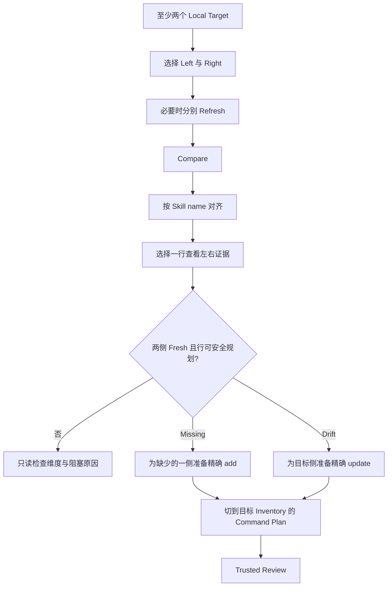

# Comparison

活跃贡献者：oldwinter、chendongdong

## Purpose

Comparison 对齐两个 Target 的 Inventory，帮助用户看到“缺少、来源冲突、证据未知或内容漂移”分别发生在哪个维度。它不是简单的版本比较，也不会扫描 Skill 目录制造证据。V1 需要两个不同的 **Local Target**；SSH 不能作为可规划的任一侧。

Comparison 的输入仍是 [Inventory](inventory.md)。陈旧证据可以显示差异，但两侧都 fresh 之前不能从差异生成变更计划。

## 对齐与证据维度

Comparison Key 是精确、区分大小写的 Skill 名，只用于把可能相关的条目放在同一行；它不是完整 Skill Identity。每一侧可包含不同 scope 或不同 declared source 的多个条目，算法先按 scope、source type 和 source 排序，再分别计算：

| 维度 | 可能结果 | 解释 |
| --- | --- | --- |
| Presence | `both`、`left-only`、`right-only` | 一侧是否完全没有同名条目 |
| Declared source | `matched`、`mismatch`、`unknown`、`not-applicable` | 精确 `(sourceType, source)` 是否一致；不重写来源别名 |
| Harness availability | `available`、`unavailable`、`absent` | 每一侧 Target 的全部 harness 是否有可用条目 |
| Revision | `matched`、`drift`、`unknown`、`not-applicable` | 只比较 authority 与 kind 可对齐的已知权威值 |
| Content fingerprint | `matched`、`drift`、`unknown`、`not-applicable` | 与 revision 独立判断 |
| Freshness | `fresh`、`stale`、`none` | 保留在 Comparison 顶层和左右侧，不掺入 revision 结论 |

条目数量不同或 Unknown 可能解释差异时，算法保守返回 unknown；只有已知值计数无法由另一侧 unknown 覆盖时才判定 drift。这样不会把“没有证据”错误地解释成“相同”或“不同”。

## 摘要优先级

表格提供便于浏览的 Summary，但原始维度仍完整保留：

1. presence 不是 `both` → **Missing**；
2. declared source 为 mismatch → **Source mismatch**；
3. revision 或 fingerprint 为 drift → **Revision or content drift**；
4. 任一 source/revision/fingerprint 为 unknown → **Unknown evidence**；
5. 其余 → **Matched**。

Summary 是导航提示，不是期望状态判决。例如 Source mismatch 不会自动触发 remove/add，Unknown evidence 也不会被当成 drift。

## 用户工作流

用户可交换 Left/Right；交换后会清除行选择并以新的配对重新建立 Comparison。每一侧状态卡显示 Target、workspace、Inventory freshness、reconciliation 和结构化错误，并提供单独刷新入口。

## 从差异准备变更

Comparison 只把两类可证明安全的差异转换成 Mutation Intent：

- **Missing**：目标侧没有条目，来源侧恰好一个条目，且该条目 declared source 是非空 GitHub 来源。生成相同 scope、精确名字和来源的 add intent。
- **Revision or content drift**：两侧 declared source 已匹配，各恰好一个条目且 scope 相同。为目标侧生成 update intent。

准备前，`DesktopCapabilities` 再验证：

- Comparison ID、row key 和 destination Target 仍与当前投影一致；
- 左右 Inventory 都是 fresh；
- 没有 observation、preparation 或 mutation 冲突；
- 目标 Target 有 Fresh Target Session，且不在 reconciliation-required；
- Prepared Mutation 绑定左右 Target，任一依赖 Target 刷新或变化都会使计划失效。

Source mismatch、Unknown evidence、Matched、多条歧义记录和 scope 不一致不会自动产生计划。准备成功后，UI 切回目标 Target 的 Inventory，并从那里打开[可信审阅](mutations-and-trusted-review.md)。

## 空态与限制

- **Needs a second Local Target**：少于两个 Local Target；Compare 禁用。SSH 项不计入数量。
- **Left and Right must be different Targets**：相同 Target 不能作为两侧。
- **No comparison selected**：已选 Target，但尚未点击 Compare。
- **No skill evidence on either Target**：两侧均有可比较 Inventory 状态，但没有任何 Skill 行。
- **No difference selected**：尚无行可在 Inspector 中展示。
- 一侧 stale/none 时仍可生成只读 Comparison；Inspector 会提示两侧都需 fresh 才能 planning。
- 任一目标 reconciliation-required 时，该目标不能接收 Comparison mutation。
- Comparison 是派生状态，不持久化。Target 被删除、配对改变或 Snapshot 重建后会重新计算。
- V1 不支持把 SSH UI 痕迹解释为已发布跨机器同步；目标管理边界见[Target 管理](../systems/target-management.md)。

## Key source files

以下路径均相对于仓库根目录：

- `apps/desktop/src/renderer/features/comparison/ComparisonView.tsx`
- `apps/desktop/src/renderer/features/inventory/InventoryApp.tsx`
- `apps/desktop/src/contracts/workspace.ts`
- `apps/desktop/src/contracts/inventory-availability.ts`
- `apps/desktop/src/main/application/comparison.ts`
- `apps/desktop/src/main/application/desktop-capabilities.ts`
- `apps/desktop/src/main/adapters/skills-process.ts`
- `docs/adr/0004-compare-only-authoritative-skill-evidence.md`
- `docs/user-guide.md`
