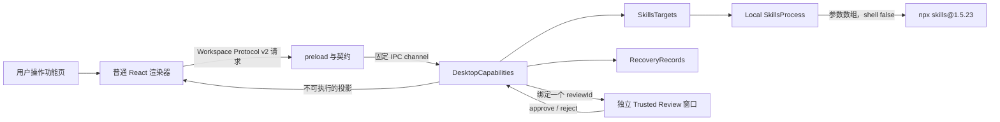

# 功能

活跃贡献者：oldwinter、chendongdong

## Purpose

本组页面从用户任务出发，解释 Skills Desktop 的 Inventory、Comparison、变更审阅、官方合集与 Target 工作流，以及这些界面如何跨越渲染器、公共契约、`DesktopCapabilities` 和固定 `npx skills` 边界。当前公开产品是 **Local-only V1**：本地观察与受确认的本地变更是已发布路径；仓库中的 SSH、Remote Bootstrap 和远端协调代码是后续范围，不代表已发布能力。

系统分层与进程关系见[系统架构](../overview/architecture.md)；本页只描述用户可感知的功能语义。

## 功能地图

| 功能 | 用户解决的问题 | 关键安全或证据规则 |
| --- | --- | --- |
| [Inventory](inventory.md) | 同时查看一个 Local Target 的 project 与 global Skills | 完整观察才成为 Fresh Inventory；恢复的快照只能是 stale |
| [Comparison](comparison.md) | 对齐两个 Local Target 的 Skills 并检查差异 | 保留 presence、source、harness、revision、fingerprint、freshness，不压成单一真假判断 |
| [变更与可信审阅](mutations-and-trusted-review.md) | 添加、移除、更新或取消正在执行的变更 | Fresh Inventory → Prepared Plan → 独立 Trusted Review；普通渲染器不能自我批准 |
| [官方合集](official-collections.md) | 从随应用交付的审阅菜谱选择 Skills | 合集是固定源的菜谱，不是安装状态、期望状态或第二套安装器 |
| [Target 工作流](target-workflows.md) | 创建、编辑、切换和删除观察对象 | V1 只允许 Local；执行相关定义变化会推进 generation 并使旧证据失效 |

## 跨系统职责

- 渲染器拥有搜索词、筛选器、选中行、表单草稿和焦点等可丢弃状态。
- `apps/desktop/src/contracts/` 定义有界 Snapshot、请求、结果和事件；它不授予通用进程、文件系统或 SSH 权限。
- `DesktopCapabilities` 拥有 Target 会话、Fresh Inventory、Prepared Mutation、审阅、执行顺序、恢复门禁和事件顺序。
- `SkillsProcess` 隐藏真正的参数数组、进程生命周期和后置观察。界面中的 Command Plan preview 只是说明文字。
- `RecoveryRecords` 只保存允许列表中的恢复证据。Comparison、Command Plan 和渲染器 Snapshot 不是持久化权威。

更深入的边界说明见 [DesktopCapabilities](../systems/desktop-capabilities/index.md)、[本地 CLI 边界](../systems/local-cli-boundary.md)和[安全模型](../security.md)。

## 共同状态与空态

所有功能页都以主进程发布的 Snapshot 为展示输入。启动时尚未取得 Snapshot，会显示打开中的状态；请求失败只展示经过允许列表投影的错误，不展示 raw stdout/stderr、参数、环境或堆栈。事件出现序号缺口时，渲染器重新取得完整 Snapshot，而不是自行拼接权威状态。

常见限制如下：

- **No evidence**：还没有完整 Inventory；先刷新。
- **Stale evidence**：可浏览、筛选和比较，但不能准备变更。
- **Reconciliation required**：可能存在未确定效果或重启后遗留的 Mutation Guard；普通 Refresh 不能清除，必须走显式 reconciliation。
- **SSH · 未在 V1 开放**：历史或实验定义可能仍被投影到界面，但不能创建、保存、纳入合集或作为可规划的 Comparison 一侧。
- **无可执行合集**：构建未捆绑 reviewed release，或 release/receipt/compatibility 未通过时，Collections 只能说明原因，不能生成计划。

## 阅读顺序

第一次理解产品可按以下顺序阅读：

1. [Inventory](inventory.md)：先理解 Fresh、Stale 与 Unknown evidence。
2. [Comparison](comparison.md)：理解为什么差异是多维证据。
3. [变更与可信审阅](mutations-and-trusted-review.md)：理解授权和执行为何分离。
4. [官方合集](official-collections.md)：理解菜谱如何复用普通变更边界。
5. [Target 工作流](target-workflows.md)：理解 Local Target、generation 与失效规则。

## Key source files

以下路径均相对于仓库根目录：

- `apps/desktop/src/renderer/features/inventory/InventoryApp.tsx`
- `apps/desktop/src/renderer/features/comparison/ComparisonView.tsx`
- `apps/desktop/src/renderer/features/collections/CollectionsView.tsx`
- `apps/desktop/src/renderer/features/targets/TargetsView.tsx`
- `apps/desktop/src/review-renderer/ReviewSurface.tsx`
- `apps/desktop/src/contracts/workspace.ts`
- `apps/desktop/src/contracts/review.ts`
- `apps/desktop/src/main/application/desktop-capabilities.ts`
- `apps/desktop/src/main/composition-root.ts`
- `docs/user-guide.md`
