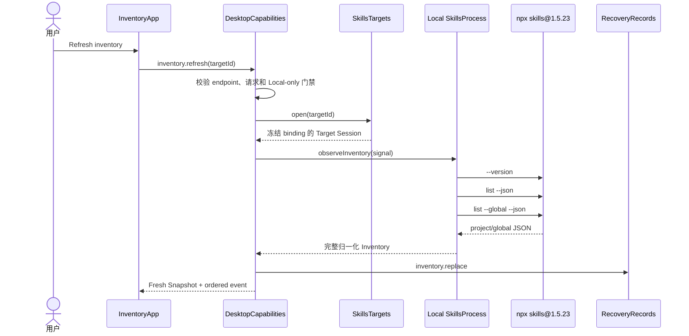

# Inventory

活跃贡献者：oldwinter、chendongdong

## Purpose

Inventory 展示一个 Target 通过固定 `npx skills` 方言完成的一次归一化观察。一次成功观察同时包含 **project** 和 **global** 两个 scope；应用不会扫描 Skill 目录，也不会把 Snapshot 变成第二个安装真相源。Inventory 是 Comparison、变更准备和官方合集评估的共同证据基础。

Inventory 的执行权在主进程，而不是 `apps/desktop/src/renderer/features/inventory/InventoryApp.tsx`。渲染器只能请求刷新、取消观察、筛选投影并准备结构化变更。进程边界详见[本地 CLI 边界](../systems/local-cli-boundary.md)。

## 用户工作流

1. 在侧栏选择一个 Local Target。
2. 打开 **Inventory**；首次进入本地且当前证据不 fresh 时，界面会请求刷新。
3. 手动点击刷新可重新观察；观察进行中可点击取消。
4. 使用名称/来源搜索，以及 All scopes、Project scope、Global scope 筛选。
5. 选择一行，在右侧检查 scope、harness、source type、declared source、revision 和 content fingerprint。
6. 只有证据 fresh 时，才可从 Inventory 进入[变更与可信审阅](mutations-and-trusted-review.md)。

## 观察数据流

project 与 global 读取组成一个原子观察：任一部分失败、被取消或格式不合法，都不会用部分结果替换上一次完整 Inventory。成功后，`DesktopCapabilities` 建立带 `inventoryId` 的会话内 Fresh Target Session；持久化失败会作为 warning 返回，但不会把持久化副本提升为执行权威。

## 展示的证据

| 字段 | 含义 |
| --- | --- |
| Skill | 精确、区分大小写的 Skill 名称 |
| Scope | `project` 或 `global`；All 只是界面筛选值，不是 mutation scope |
| Harness | 当前 Target 的 harness 是否能使用该条目；无匹配时显示 Not linked |
| Declared source | CLI 报告的 `(sourceType, source)`；缺失时显示 provenance unavailable |
| Revision | CLI 权威接口报告的不可变 revision；未报告时保持 Unknown |
| Content fingerprint | 权威接口报告的内容摘要；应用不会自行扫描或哈希目录补齐 |

`sourceUrl`、文件系统路径、raw CLI 输出和未知扩展不会进入公共 Inventory 投影。Unknown 只表示缺少权威证据，既不证明相同，也不证明漂移。

## 新鲜度与状态

| 状态 | 形成原因 | 允许的操作 |
| --- | --- | --- |
| `fresh` | 当前应用会话内，对未变化的 Target 完成一次 project+global 观察 | 浏览、比较、准备变更、合集评估 |
| `stale` | 刷新失败后保留旧结果、Target execution binding 变化，或新会话恢复上次快照 | 浏览和比较；不能授权变更 |
| `none` | 尚无任何完整观察 | 只能刷新 |

新鲜度是事件驱动的，不按经过时间自动过期。更新 Target 的 workspace、harness、kind 或 connection reference 会改变执行绑定、推进 generation，并使旧 Inventory stale；恢复记录无论多新，启动后也总是 stale。

刷新期间页面保留旧的 fresh/stale 标签并明确显示 “Refreshing”；取消会显示 “Refresh cancelled”。失败时，如已有完整证据则保留并降为 stale；如没有证据则进入 unavailable/no evidence 状态。普通 Refresh 不能清除 Mutation Guard 引起的 reconciliation。

## 空态与错误态

- **Opening local inventory**：尚未获得初始 Snapshot。
- **启动失败**：显示允许列表化错误，并提供重新打开 Inventory 的按钮。
- **No inventory evidence**：尚未建立完整观察；若正在加载则提示等待，失败则提示重新刷新。
- **No skills found**：已经有完整观察，但 project 与 global 均为空；建议刷新或直接通过 `npx skills` 安装。
- **No matching skills**：搜索或 scope 筛选没有结果；清除或调整筛选条件。
- **No skills to inspect**：清单为空，Inspector 没有可展示条目。
- **Stale after error / Offline**：保留上次完整证据并展示结构化错误。SSH 相关 offline 文案存在于代码中，但 SSH 不是 V1 已发布路径。
- **Persistence warning**：观察成功，但快照持久化失败；用户可查看当前会话证据，后续恢复不能依赖本次写入。

## 变更入口与门禁

Inventory 提供：

- 指定 GitHub `owner/repository`、精确 Skill 名和 scope 的 **Prepare add**；
- 选中一行后的 **Prepare update** 与 **Prepare removal**；
- 先选定 Project 或 Global 后的 **Update scope**。

这些按钮只有在以下条件同时满足时才可用：

1. Target 是 Local；
2. Inventory 为 fresh；
3. mutation 不处于 running；
4. Target 不处于 reconciliation-required。

页面只提交 Mutation Intent。`DesktopCapabilities` 再次验证 Fresh Target Session，`SkillsProcess` 才生成 Prepared Mutation 与 Command Plan。UI 中的 preview 不会被执行。

## V1 限制

- V1 只开放 Local Target。SSH 项即使因历史数据出现在侧栏，也会标记“未开放”，不能刷新为已发布远端 Inventory，也不能准备变更。
- 当前固定 CLI 为 `skills@1.5.23`。不兼容版本或超出有界 schema 的输出会失败关闭。
- Inventory 没有“已安装合集”“期望版本”或应用自定义语义版本字段。
- 当前 CLI 未报告 revision/fingerprint 时，界面会持续显示 Unknown，而不是猜测。
- 观察取消是直接、幂等的；正在执行的 mutation 不能复用这个取消路径。

## Key source files

以下路径均相对于仓库根目录：

- `apps/desktop/src/renderer/features/inventory/InventoryApp.tsx`
- `apps/desktop/src/contracts/workspace.ts`
- `apps/desktop/src/contracts/inventory-availability.ts`
- `apps/desktop/src/main/application/desktop-capabilities.ts`
- `apps/desktop/src/main/adapters/skills-process.ts`
- `apps/desktop/src/main/adapters/local-skills-process.ts`
- `apps/desktop/src/main/targets/skills-targets.ts`
- `apps/desktop/src/main/targets/local-skills-targets.ts`
- `docs/adr/0001-delegate-skill-operations-to-npx-skills.md`
- `docs/adr/0005-own-the-local-skill-process-lifecycle.md`
- `docs/user-guide.md`
