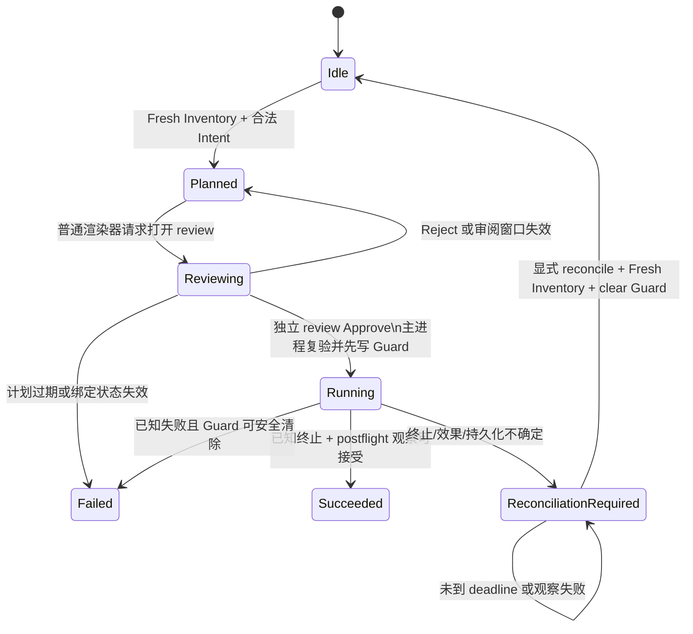

# 变更与可信审阅

活跃贡献者：oldwinter、chendongdong

## Purpose

变更工作流让用户添加、移除或更新 Skills，同时确保展示文本、普通渲染器和未经确认的计划都不能直接获得执行权。核心序列是：

**Fresh Inventory → Prepared Mutation / Command Plan → 独立 Trusted Review → Confirmed Mutation → 执行与 postflight Inventory**。

普通渲染器只能请求准备和打开审阅；批准或拒绝只能来自绑定了一个 `reviewId` 的独立审阅窗口。更完整的进程隔离见[安全模型](../security.md)。

## 支持的意图

| 用户动作 | 结构化 intent | 约束 |
| --- | --- | --- |
| Add Skill | `add` + 精确名字 + GitHub source + project/global | 不接受任意 URL 族、参数或 wildcard |
| Update selected | `update` + 精确名字 + scope | Skill 必须存在于 Fresh Inventory 且可用于 Target harness |
| Remove selected | `remove` + 精确名字 + scope | 同样要求已存在 |
| Update scope | `update-all` + 明确 project/global | 主进程把 Fresh Inventory 中符合 harness 的名字展开成普通 named update；All scopes 不合法 |
| Comparison prepare | 安全差异派生的 add/update | 还绑定两个 Comparison Target |
| Collection prepare | 固定 reviewed source 派生的 add/reapply | 复用同一个 `SkillsProcess.prepareMutation` |

Mutation Intent 不含 command text、任意 CLI flags 或 cwd。`SkillsProcess` 验证后私下保留参数数组，并向 UI 投影有界 Command Plan。

## 授权与执行流程

### 1. 准备

`DesktopCapabilities` 要求：

- 当前 Target 为 V1 可用的 Local Target；
- Inventory 在当前会话中 fresh；
- mutation 不在 running 或 reconciliation-required；
- 没有与 Target 冲突的 observation、preparation、definition change 或 Collection reservation。

`SkillsProcess.prepareMutation` 再验证 intent、harness、scope 和 Inventory 中的存在性，生成绑定 `targetId`、generation、`inventoryId`、过期时间和 digest 的 Prepared Mutation。计划默认 10 分钟后过期；remove timeout 为 2 分钟，add/update 为 10 分钟。

### 2. Command Plan

普通渲染器看到 operation、scope、names、harness、timeout、可选 source 和 preview。preview 例如 `npx skills@1.5.23 ...`，但它是解释性输出：

- renderer 不接收真正执行参数；
- main 不回读或解析 preview 来执行；
- 本地 Adapter 使用预先构造的参数数组并关闭 shell；
- 修改 intent、Target、generation 或 Inventory 都需要新计划。

### 3. 独立 Trusted Review

普通工作区调用 `review.request(preparedMutationId)`，只能要求 main 展示审阅。Main 创建单用途 review，将独立窗口绑定到其 ID。Review Protocol v2 只允许：

- `getReview()` 获取不可执行的投影；
- `approve()`；
- `reject()`。

审阅页展示 Target、workspace、harness、scope、Skill 名和 Command Plan；Collection 审阅还展示 release receipt、固定 source、digest、子 Target 顺序和“Sequential, non-transactional”。普通渲染器不能收到确认 token，也不能提交“批准 + 任意计划”的组合请求。

批准时 main 原子复验 expiry、Prepared digest、Target generation、Fresh Inventory binding、当前 review/collection evidence、Guard 和操作冲突。review 只能消费一次；重放或状态漂移会失败。

### 4. 执行与验证

执行开始前，主进程先持久化最小 Mutation Guard，再把单次 confirmation 交给 `executeConfirmed`。本地 CLI 执行完成且终止已知时，Adapter 进行 postflight Inventory：

1. 记录进程 disposition、exit code 和 termination certainty；
2. 独立判断可观察 effects；
3. 持久化新 Inventory；
4. 安全清除 Guard；
5. 发布 fresh Inventory 和 succeeded/failed outcome。

进程零退出不是唯一成功条件。Outcome 将进程状态与效果状态分开：

| 维度 | 值 |
| --- | --- |
| Process disposition | `completed`、`failed`、`cancelled`、`timed-out` |
| Termination | `known`、`unknown` |
| Effects | `verified`、`content-unverified`、`not-observed`、`possible` |

Add 指定 immutable revision 或 Update 在 CLI 不提供内容证据时，可能得到 `content-unverified`；这比虚构“已安装准确版本”更保守。

## 取消与 Reconciliation

Inventory 观察可直接取消；mutation 取消不同。正在执行的变更可能已经产生部分效果，因此普通渲染器只能请求 **cancellation Trusted Review**。批准后才向当前执行发送 abort。

以下情况进入 reconciliation-required：

- 进程终止未知；
- postflight Inventory 不存在；
- 新 Inventory 或 Guard 清理持久化失败；
- 应用重启时恢复到仍存在的 Guard；
- Guard store 损坏导致影响范围无法安全确定。

Reconcile 不能在原操作 deadline 前执行。到期后，主进程重新打开 Target、完成一次新 Inventory 观察、持久化它并清除 Guard，才恢复 idle。普通 Refresh 不能代替此流程。详细恢复规则见[恢复与持久化](../systems/recovery-and-persistence.md)。

## 空态、阻塞态与错误态

- Inventory 不是 fresh：Prepare 按钮禁用，并显示 Refresh 入口。
- reconciliation-required：Prepare 禁用，并显示 Reconcile 入口与原始结构化错误。
- mutation running：显示执行中；只能发起 cancellation review，不能直接停止。
- 尚无 Prepared Mutation：不显示 Command Plan。
- Prepared Mutation 失效、过期或所绑定状态变化：Trusted Review 请求/批准失败，必须重新准备。
- Review unavailable：独立窗口没有有效绑定，或 review 已 settled。
- Reject：不会执行；普通计划状态回到 planned/idle 路径，Collection Plan 会被丢弃。
- renderer/window teardown：会取消其未完成观察或未确认 review，但不会静默取消已经由 main 管理的 active mutation，也不会清除 Guard。

## V1 限制

- 只执行 Local Target mutation。SSH 相关 host trust、远端不确定结果和传输代码不构成 V1 用户能力。
- 没有任意命令、通用 terminal、任意 `npx` 参数、wildcard 或 renderer 提供的 shell 文本入口。
- Prepared/Confirmed Mutation、review authority、参数数组和 Command Plan 不持久化。
- 不保存长期 mutation 历史；UI 只展示当前有界 outcome。
- Collection 多 Target 执行是顺序、非事务性的，已成功子项不回滚。

## Key source files

以下路径均相对于仓库根目录：

- `apps/desktop/src/renderer/features/inventory/InventoryApp.tsx`
- `apps/desktop/src/review-renderer/ReviewSurface.tsx`
- `apps/desktop/src/contracts/workspace.ts`
- `apps/desktop/src/contracts/review.ts`
- `apps/desktop/src/main/application/desktop-capabilities.ts`
- `apps/desktop/src/main/adapters/skills-process.ts`
- `apps/desktop/src/main/adapters/local-skills-process.ts`
- `apps/desktop/src/main/persistence/recovery-records.ts`
- `apps/desktop/src/main/adapters/electron-ipc.ts`
- `docs/adr/0002-execute-only-typed-confirmed-skill-operations.md`
- `docs/adr/0009-isolate-trusted-review-from-renderer-capabilities.md`
- `docs/user-guide.md`
