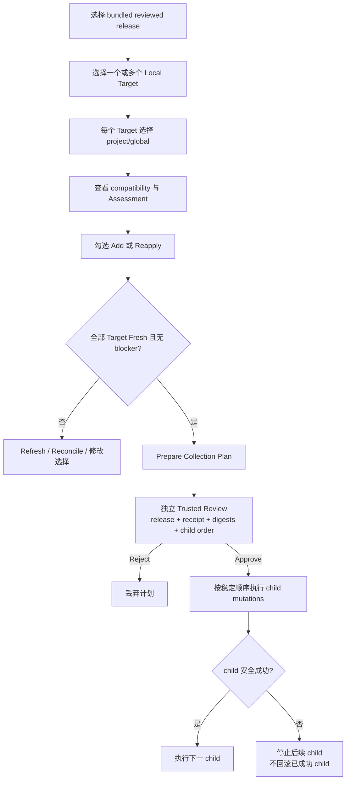

# 官方合集

活跃贡献者：oldwinter、chendongdong

## Purpose

Official Collections 是随已验证应用构建交付、由 Skills Desktop 维护者审阅的固定菜谱。每个 release 从一个已有 GitHub source 精确点名 Skills，并可为选定 Local Target 生成普通 Mutation Intents。它不是安装状态、期望状态、Skill 内容包、在线 catalog，也不是第二套安装协议。

合集最终仍通过固定 `npx skills` 边界执行；其信任语义和普通变更确认互相独立。用户应先理解[变更与可信审阅](mutations-and-trusted-review.md)。

## Release 证据

一个可执行 Official Collection Release 必须绑定：

- 稳定 `collectionId` 与单调递增 `releaseNumber`；
- canonical manifest 的 SHA-256 digest 和合法 supersedes 链；
- 一个公开 GitHub `owner/repository`；
- 完整 40 字符 Reviewed Source Revision；
- 精确、区分大小写且无冲突的 Skill 名；
- CLI 版本、harness、平台和 required target capability 的显式 compatibility；
- author、不同的 independent reviewer、review time、location 和 `official-collection-v1` policy；
- `active` 状态和 `approved` receipt。

deprecated、revoked 或 review pending 的 release 可投影说明原因，但不能产生新 Mutation Intent。Unknown fields、重复 digest、断裂的 supersedes 链、来源 URL 不规范或 author/reviewer 不独立都会使 catalog validation 失败关闭。

当前源码中的 bundled catalog 定义了 `skills-desktop-starter` release 1：固定到 `vercel-labs/skills` 的完整 commit，并点名 `find-skills`。它要求 Local capability 和 `skills@1.5.23`。是否在某个 Target 上可执行仍由运行时对 receipt、release status、平台、harness、CLI 与 Fresh Inventory 的完整评估决定，不能仅凭“出现在列表里”推断已经安装或可应用。

## Assessment 语义

每个 release 会针对每个 Target 的 project/global scope 分别投影 Assessment：

| 状态 | 含义 | 可选择动作 |
| --- | --- | --- |
| `missing` | 当前 scope/harness 没有同名 Skill | Add |
| `present-content-unknown` | 已存在，但权威证据不足以证明 reviewed revision | Reapply |
| `unchanged` | 来源相同，且已知 git commit 等于 reviewed revision | 可显式 Reapply；默认不会自动改 |
| `source-conflict` | 同名 Skill 的 declared source 不同 | 不可选择；需单独审阅 remove/add 决策 |
| `removal-candidate` | 前一 release 包含、当前 release 已移除，但 Target 仍观察到 | 只提示，不自动移除 |
| `incompatible` | capability、platform、harness 或 CLI 不匹配 | 不可选择 |

Assessment 不是“已安装合集版本”。同一合集的 Acknowledgement 也只记录用户审阅了一个 release/delta，不证明应用成功，更不授予后续 mutation authority。

## 用户工作流

准备多 Target 计划时，`DesktopCapabilities` 为每个 child 复用其 Fresh Target Session 和 `SkillsProcess.prepareMutation`，并将以下证据绑定进 plan/review digest：

- release、manifest 和 receipt；
- Target ID、generation 与 binding digest；
- Inventory ID/digest 与 Assessment digest；
- scope、选择模式、Skill 名；
- child Prepared Mutation digest 与 Command Plan；
- 稳定、从 1 开始的执行顺序和统一过期时间。

批准前，main 会重新计算并比较这些证据，再预留全部受影响 Target。批准并不把多个 child 变成事务。

## 执行语义

child mutation 逐 Target 顺序执行。每个 child 都先写自己的 Mutation Guard，调用普通 `executeConfirmed`，再做 postflight Inventory 和效果评估：

- 当前 child 成功，才进入下一个；
- 失败、状态漂移或不确定效果会阻止后续 child 启动；
- 已成功 child 不回滚；
- 未开始 child 标为 stopped，其 confirmation 被丢弃；
- 任一 child 进入 reconciliation-required 时，按该 Target 单独处理；
- 继续或重试需要新的 Fresh Inventories、Assessment、Plan 和 Trusted Review。

执行结果按 Target 和 Skill 展示 `completed`、`failed`、`stopped`、`reconciliation-required`，并保持 `verified`、`content-unverified`、`not-observed`、`possible` 等效果语义。

## 空态与限制

- **No Official Collections**：当前构建没有 bundled reviewed releases；页面只说明 V1 合集在构建捆绑 release 后才能用于 Local Target。
- release 没有 active+approved 资格：显示 blockers，不能 Prepare。
- Target stale/none：显示 Fresh inventory required，可从页面 Refresh。
- Target reconciliation-required：显示 blocker，并在执行结果中提供 Reconcile。
- 没有选中 Target、没有选中 entry、Assessment incompatible 或 entry 不可选择：Prepare plan 禁用。
- SSH Target 可能可见，但 Include 固定禁用并标记“SSH · 未在 V1 开放”。
- 计划或执行进行中时，release、scope 和选择会锁定，防止显示内容与主进程计划漂移。
- 合集内容不 vendored、不缓存、不在 Target 间复制；每个 Target 仍从固定 source 通过自己的 `npx skills` Adapter 获取。
- V1 不接受用户 manifest、第三方 catalog、remote feed 或 catalog 热更新。

合集的 acknowledgement、Guard 和 Inventory 恢复边界见[恢复与持久化](../systems/recovery-and-persistence.md)。

## Key source files

以下路径均相对于仓库根目录：

- `apps/desktop/src/renderer/features/collections/CollectionsView.tsx`
- `apps/desktop/src/review-renderer/ReviewSurface.tsx`
- `apps/desktop/src/contracts/workspace.ts`
- `apps/desktop/src/contracts/review.ts`
- `apps/desktop/src/main/application/official-collections.ts`
- `apps/desktop/src/main/application/bundled-official-collections.ts`
- `apps/desktop/src/main/application/desktop-capabilities.ts`
- `apps/desktop/src/main/adapters/skills-process.ts`
- `docs/adr/0008-ship-reviewed-pinned-collection-recipes.md`
- `docs/user-guide.md`
