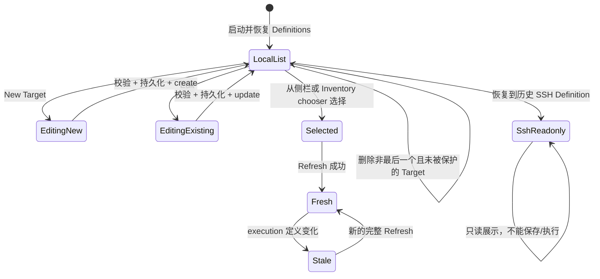

# Target 工作流

活跃贡献者：oldwinter、chendongdong

## Purpose

Target 是应用拥有的稳定观察与执行身份：它选择一台机器、一个 canonical workspace、一个非空 canonical harness 集合及对应 Skills dialect/registry binding。当前公开产品是 **Local-only V1**，所以用户只能创建、保存、刷新和变更 Local Target。

仓库中保留了 SSH Target、OpenSSH 和 Remote Bootstrap 的后续架构代码，但 production composition 明确设置 `v1LocalOnlyTargets: true`。界面里出现 SSH 历史定义时只能理解为不可用痕迹，不能解释为已发布远端能力。系统所有权见[Target 管理](../systems/target-management.md)。

## Target Definition

公共 Definition 包含：

| 字段 | 作用 |
| --- | --- |
| `id` | 应用生成的稳定 UUID；label、workspace 或 SSH alias 都不是身份 |
| `kind` | `local` 或架构中的 `ssh`；V1 可保存值只有 local |
| `label` | 展示名称；不成为 CLI 输入 |
| `workspace` / `workspaceLabel` | canonical absolute workspace 与展示短名 |
| `harnessIds` | registry 顺序中的非空 canonical Harness ID 集合 |
| `generation` | 所有影响执行的定义/绑定版本 |
| `dialectId`、`registryVersion`、`registryDigest` | 固定 CLI dialect 与兼容 registry binding |
| `connectionReference` / `executionBindingDigest` | SSH 后续范围字段；Local 必须为 null |

Local workspace 保存前必须是绝对路径，并由主进程 realpath/canonicalize；草稿不能借 renderer 提供路径绕过 main 的验证。当前 UI 为 Local 暴露单个 `codex` harness 选择。

## 用户工作流

### 创建

1. 打开 **Targets**，点击 **New Target**。
2. 填写 display label、canonical workspace 和 harness；kind 固定为 Local。
3. 保存请求通过 Workspace Protocol v2 到达 `DesktopCapabilities`。
4. Main 校验 V1 Local-only、Definition、绝对路径与 harness，生成 UUID 和 generation 1。
5. `RecoveryRecords` 成功替换 Target Definitions 后，catalog 才提交新 Definition；UI 选中新 Target。

### 编辑

Label 变化只影响显示，不改变执行绑定。kind、workspace、harness 或 connection reference 变化会被视为 `executionChanged`：

- generation 加一；
- Fresh Target Session 被移除；
- 依赖该 Target 的 Prepared Mutation/Collection Plan 失效；
- 旧 Inventory 保留但标 stale；
- mutation 投影重置，除非已有 Guard/reconciliation 阻止编辑。

编辑处于 active observation、preparation、mutation、Collection reservation 或 recovery guard 中的 Target 会失败关闭，而不是排入隐式队列。

### 切换

侧栏 Target 列表和 Inventory 中的 chooser 只切换当前投影。每个 Target 有独立 Inventory、mutation 和合集 Assessment 状态；切换不会把一个 Target 的 Fresh Inventory 当成另一个 Target 的证据。

Comparison 使用两个显式 Target ID，Collections 可选择多个 Local Target。Target 被删除后，引用它的 Comparison 选择和 Prepared work 会失效。

### 删除

以下任一条件会阻止删除：

- 它是唯一剩余 Target；
- 有 active Inventory observation 或 mutation preparation；
- 有 durable Mutation Guard / reconciliation-required；
- 正在执行 mutation；
- 被 Collection execution 预留。

删除成功后，main 先持久化新的 Definition 集合，再删除会话内 Inventory/mutation/session 和 Prepared 依赖；若删除的是当前 Target，则选择第一个剩余 Target。

## Inventory 与 generation

打开 Target 会冻结一个 Effective Target Binding，并返回对应 `SkillsProcess`。对 Local Target，这不保留通用进程或连接；刷新时才执行完整 Inventory 观察。

Fresh Inventory 必须同时绑定：

- Target ID；
- 当前 generation；
- 当前会话打开的 binding；
- 新生成的 inventory ID；
- 一次完整 project+global 观察。

Target 定义改变、binding 漂移、刷新失败或应用重启都会让旧证据 stale。上一会话持久化的 Snapshot 可以恢复用于查看，但永远不能直接准备 mutation。详细状态见 [Inventory](inventory.md)。

## 空态、状态与 V1 限制

- Targets 页正常情况下至少有一个启动 Local Target；最后一个 Target 不能删除，因此“零 Target”不是正常用户空态。
- 新建草稿初始为空，未填写必填 label/workspace 时浏览器和 main 都会拒绝保存。
- 每张 Target 卡显示 Fresh、Stale、No evidence 或 Loading，并展示经过投影的 Inventory 错误。
- 删除按钮只反映 Snapshot 的 `deletionBlocked`；即使按钮可用，main 仍会在请求时复验并发和恢复状态。
- 历史 SSH Definition 显示 “SSH · 未在 V1 开放”；表单只读、Save 禁用，不能纳入 V1 Collections 或 Comparison planning。
- V1 不能新建 SSH、启动 host-key review、刷新远端 Inventory 或执行远端 mutation。
- Target 配置不是跨机器同步格式，也不包含 SSH credential。后续架构中的 connection reference 只是 OpenSSH alias，不是主机身份或凭据。

## 与其他功能的关系

- [Comparison](comparison.md) 需要两个不同的 Local Target。
- [官方合集](official-collections.md) 可聚合多个 Local Target，但逐 Target 准备和执行。
- [变更与可信审阅](mutations-and-trusted-review.md) 将 Prepared Mutation 绑定到一个 Target generation。
- Target Definitions 和 stale Inventory Snapshot 的恢复规则见[恢复与持久化](../systems/recovery-and-persistence.md)。

## Key source files

以下路径均相对于仓库根目录：

- `apps/desktop/src/renderer/features/targets/TargetsView.tsx`
- `apps/desktop/src/renderer/features/inventory/InventoryApp.tsx`
- `apps/desktop/src/contracts/workspace.ts`
- `apps/desktop/src/main/targets/skills-targets.ts`
- `apps/desktop/src/main/targets/local-skills-targets.ts`
- `apps/desktop/src/main/targets/workspace-path.ts`
- `apps/desktop/src/main/application/desktop-capabilities.ts`
- `apps/desktop/src/main/composition-root.ts`
- `apps/desktop/src/main/persistence/recovery-records.ts`
- `docs/user-guide.md`
