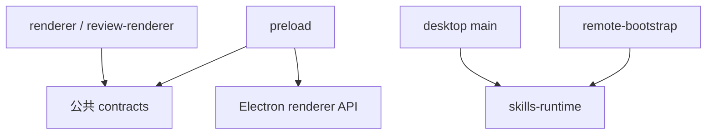

# 模式与约定

本仓库通过少量深接口、严格边界校验和显式证据状态控制复杂度。修改代码时应保持这些约定，而不是为了方便向 renderer、IPC 或外部进程暴露通用能力。

## Local-only 是文档和验收边界

`AGENTS.md`、`README.md` 和 `SECURITY.md` 都规定 V1 公开承诺为 Local-only。`apps/desktop/src/main/composition-root.ts` 虽然组装了 SSH 适配器，但通过 `v1LocalOnlyTargets: true` 阻止它成为当前公开路径。ADR 可以描述已接受的后续架构，不能替代 tracer 与验证门禁。

## 使用深接口

生产主路径围绕四个接口组织：

| 接口 | 所有权 |
| --- | --- |
| `DesktopCapabilities` | 应用状态、授权、审阅、事件与工作流顺序 |
| `SkillsTargets` | Target Definition、Generation、绑定和 Target 打开 |
| `SkillsProcess` | Inventory 观察、Mutation 准备与确认后执行 |
| `RecoveryRecords` | 版本化恢复记录的读取与封闭变更提交 |

接口定义分别位于 `apps/desktop/src/main/application/desktop-capabilities.ts`、`apps/desktop/src/main/targets/skills-targets.ts`、`apps/desktop/src/main/adapters/skills-process.ts` 和 `apps/desktop/src/main/persistence/recovery-records.ts`。不要增加任意 argv、任意文件、任意 IPC channel 或通用 JSON repository 作为捷径。

## 在边界上解析

- `packages/skills-runtime/src/inventory.ts` 在 CLI stdout 进入领域层前限制字节、条目、字段和嵌套深度。
- `apps/desktop/src/contracts/workspace.ts` 与 `apps/desktop/src/contracts/review.ts` 使用严格 Zod schema 约束 IPC 数据。
- `packages/skills-runtime/src/wire.ts` 校验远端请求的精确键集合、长度、POSIX 路径和帧大小。
- `apps/desktop/src/main/application/official-collections.ts` 对合集 manifest、摘要链、状态和独立审阅收据做封闭校验。

解析失败应返回带 `code`、`effects`、`phase`、`retryable` 的结构化公共错误。不要把原始 CLI、SSH 或文件系统错误直接送到 renderer。

## 命令计划不是命令执行

`apps/desktop/src/main/adapters/skills-process.ts` 可以生成 `CommandPlan.preview`，但执行使用保存在主进程中的参数数组。`apps/desktop/src/main/adapters/local-skills-process.ts` 设置 `shell: false`，并只传递环境变量允许列表。任何 renderer 生成的 shell 文本都不能进入执行边界。

## 明确区分证据状态

Unknown、stale、process disposition 和 observed effects 是不同维度。`apps/desktop/src/main/application/comparison.ts` 不把未知 revision 当作相等；`apps/desktop/src/main/adapters/skills-process.ts` 也不把退出码 0 单独当作变更成功。新增状态时应保留这种维度，而不是折叠成一个布尔值。

## 主进程拥有权威状态

普通 renderer 的 Snapshot 是可替换投影。搜索、排序、焦点和未提交表单由 React 本地状态持有；Fresh Inventory、Prepared Mutation、Trusted Review、Mutation Guard 和执行控制保留在主进程。事件出现序列缺口时，`apps/desktop/src/renderer/features/inventory/InventoryApp.tsx` 会重新获取 Snapshot，而不是自行补写状态。

## 导入方向

`scripts/check-imports.mjs` 强制以下规则：

- renderer 不能导入 Node、Electron 主进程、preload 或 `skills-runtime`。
- preload 只能依赖 Electron 与公共 contracts。
- `skills-runtime` 保持环境中立。
- `remote-bootstrap` 除相对模块外只能依赖 `skills-runtime`。

## 测试约定

测试与实现文件同目录，文件名使用 `*.test.ts` 或 `*.test.tsx`。深边界有共享 contract tests，外部行为再由真实 CLI、localhost SSH、打包 Electron 和跨平台 UI QA 覆盖。`vitest.config.ts` 设置 statements、branches、functions 和 lines 均为 80% 的全局门槛。

提交流程和 Definition of Done 见[贡献指南](index.md)，具体测试层次见[测试](testing.md)。
