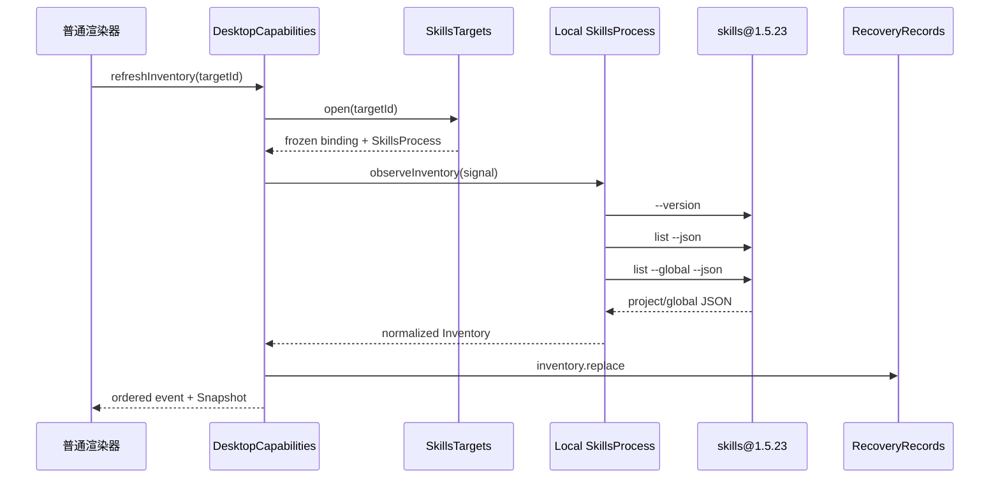
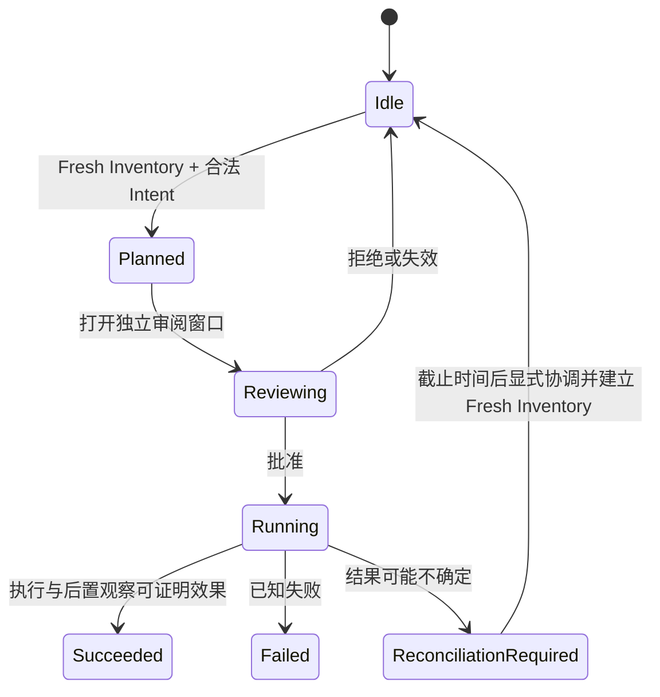

# 系统架构

Skills Desktop 采用 Electron 主进程集中授权、多个受限渲染角色和三个私有 workspace 的结构。核心规则是让主进程拥有状态、执行与确认权，渲染器只持有用途明确的投影和请求方法，具体约束记录在 `docs/adr/0010-center-production-on-desktop-capabilities.md`。

## 组件关系

```mermaid
graph LR
    UI[普通 React 渲染器] -->|Workspace Protocol v2| WP[workspace preload]
    Review[可信审阅渲染器] -->|Review Protocol v2| RP[review preload]
    WP -->|固定 IPC channel| IPC[Electron IPC adapter]
    RP -->|approve / reject| IPC
    IPC --> DC[DesktopCapabilities]
    DC --> Targets[SkillsTargets]
    DC --> Recovery[RecoveryRecords]
    Targets --> Process[SkillsProcess]
    Process --> Local[本地 npx skills adapter]
    Process -. 后续范围 .-> SSH[SSH adapter]
    SSH -. Wire 帧 .-> Bootstrap[Remote Bootstrap]
    Local --> CLI[skills@1.5.23]
    Bootstrap --> CLI
```

应用启动入口 `apps/desktop/src/main/index.ts` 创建普通工作区窗口和独立审阅窗口。`apps/desktop/src/main/composition-root.ts` 负责组装生产适配器，初始化 `DesktopCapabilities`，并明确设置 `v1LocalOnlyTargets: true`。

## 主要层次

| 层次 | 职责 | 关键路径 |
| --- | --- | --- |
| 渲染器 | 展示 Snapshot，保留筛选、选中项、焦点等可丢弃视图状态 | `apps/desktop/src/renderer/`、`apps/desktop/src/review-renderer/` |
| Preload 与公共契约 | 把固定 IPC channel 转成受限方法，并用 Zod 约束输入输出 | `apps/desktop/src/preload/`、`apps/desktop/src/contracts/` |
| Electron 适配器 | 验证发送者角色、文档 URL 和 attachment epoch，连接系统能力 | `apps/desktop/src/main/adapters/electron-ipc.ts`、`apps/desktop/src/main/adapters/electron-security.ts` |
| 应用编排 | 拥有 Target 会话、Inventory、新鲜度、变更、审阅、合集和事件顺序 | `apps/desktop/src/main/application/desktop-capabilities.ts` |
| 深接口 | 隔离目标选择、CLI 进程和持久化 | `apps/desktop/src/main/targets/skills-targets.ts`、`apps/desktop/src/main/adapters/skills-process.ts`、`apps/desktop/src/main/persistence/recovery-records.ts` |
| 环境中立运行时 | 定义固定 Skills 方言、解析器、Mutation Intent、Harness Registry 和 Wire codec | `packages/skills-runtime/src/` |

## Inventory 数据流



`apps/desktop/src/main/adapters/local-skills-process.ts` 使用参数数组和 `shell: false` 调用 CLI，并只传递允许列表中的环境变量。`packages/skills-runtime/src/inventory.ts` 对输出大小、条目数量、字段结构和重复身份进行有界校验。持久化后的完整清单在恢复时始终标为 stale，不能授权变更。

## 变更与可信审阅

变更遵循 `Mutation Intent → Prepared Mutation → Trusted Review → Confirmed Mutation → postflight Inventory`。`apps/desktop/src/main/adapters/skills-process.ts` 生成带摘要、目标代次、Inventory 标识和过期时间的计划；预览字符串只用于说明，实际执行仍使用保存在主进程中的参数数组。`apps/desktop/src/review-renderer/ReviewSurface.tsx` 只能读取并决定一个已分配的审阅，普通渲染器不能直接发送确认令牌。



## 持久化与恢复

`apps/desktop/src/main/persistence/recovery-records.ts` 只暴露 `restore()` 和 `commit(DurableChange)`。它分别管理 Target Definition、Inventory Snapshot、Mutation Guard、Host Trust 和 Collection Acknowledgement 的版本化文档，隐藏锁、迁移、临时文件、原子替换、备份和隔离细节。派生的 Comparison、Command Plan 和 renderer Snapshot 不会作为权威状态持久化。

## 语言与规模

生产代码以 TypeScript 和 TSX 为主，React 负责界面，Electron 负责桌面运行时，Zod 负责边界校验。当前工作树中 TypeScript/TSX 约占 5.1 万行，完整统计和采集口径见[代码库数字](../by-the-numbers.md)。

下一步可按[应用](../apps/index.md)、[内部系统](../systems/index.md)、[功能](../features/index.md)或[工作区包](../packages/index.md)继续阅读。
