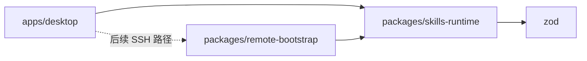

# 工作区包
活跃贡献者：oldwinter、chendongdong

## 概览

仓库根目录通过 npm workspaces 管理三个私有工作区。`apps/desktop` 是
Electron 应用；`packages/skills-runtime` 是环境中立的协议与数据边界；
`packages/remote-bootstrap` 是为后续 POSIX SSH 路径准备的固定远端程序。
三个工作区都标记为 `private`，当前没有把它们作为独立 npm 包发布。

应用主进程可以消费两个包，但 renderer 不能直接导入它们。
`scripts/check-imports.mjs` 将这一方向作为静态门禁，并要求
`skills-runtime` 不依赖 Node 或 Electron 运行时、`remote-bootstrap`
除相对模块外只依赖 `skills-runtime`。

## 包一览

| 工作区 | 当前职责 | 范围状态 |
| --- | --- | --- |
| `apps/desktop` | 窗口、IPC、应用编排、本地 CLI 适配器、持久化与 UI | V1 应用；详见[系统架构](../overview/architecture.md) |
| `packages/skills-runtime` | 固定 `skills@1.5.23` 方言、Inventory parser、Mutation schema、Harness Registry、Result 与 Wire codec | 本地生产路径正在使用 |
| `packages/remote-bootstrap` | 把结构化 Wire 请求转换为固定 `npx skills` 参数数组，并返回有界证据 | 在树内但属于后续 SSH 范围，不是 V1 已交付能力 |

包的详细说明见 [skills-runtime](skills-runtime.md) 和
[remote-bootstrap](remote-bootstrap.md)。

## 职责边界

### 为什么单独保留 skills-runtime

同一套 CLI 方言、Harness 标识、Inventory 语义和结构化错误会被本地适配器、
SSH 实验代码、持久化 schema 与 IPC 契约共同引用。把这些定义放在环境中立包中，
可避免每个运行时分别解释 `npx skills` 输出，也不会让 renderer 获得进程能力。

### 为什么 remote-bootstrap 不是通用远端代理

远端包只接受封闭的观察、变更和取消请求。它不能接收任意命令或 argv，
也不会安装常驻 helper。其远端命令由构建产物固定，Target、workspace 和
Mutation 等动态数据只进入长度前缀帧。当前公开承诺仍是 Local-only；
远端代码是后续门禁的实现证据，不应被文档描述成已发布功能。

### 方言升级必须整体推进

Harness Registry 与确切 CLI 版本绑定。更换 CLI、Registry、Wire 或 Remote
Bootstrap 都可能改变执行证据，不能只修改一个常量。升级应同步更新 runtime
schema、受审 fixture、摘要、两端 codec、适配器和测试，并遵循 ADR 0014–0016
记录的兼容性与分阶段发布要求。

## 构建与验证

- 根目录 `npm run build` 按 workspace 执行各自的 `build`。
- `skills-runtime` 通过 `tsc -b` 生成普通 TypeScript 构建。
- `remote-bootstrap` 先执行 `tsc -b`，再由
  `packages/remote-bootstrap/vite.release.config.ts` 生成单文件 Node SSR
  release bundle。
- `npm run check:imports` 验证跨包和跨 Electron 角色的导入方向。
- 包内测试由仓库级 Vitest 运行，覆盖解析上限、Registry fixture、Wire
  污染、固定 argv、取消和子进程清理。

## Key source files

- `package.json`：workspace 列表与仓库级构建、测试命令。
- `scripts/check-imports.mjs`：运行时中立性和导入方向门禁。
- `packages/skills-runtime/package.json`：runtime 包入口、依赖与构建命令。
- `packages/skills-runtime/src/index.ts`：runtime 公共导出面。
- `packages/remote-bootstrap/package.json`：远端包依赖和双阶段构建命令。
- `packages/remote-bootstrap/vite.release.config.ts`：固定 release bundle 配置。

## 相关页面

- [系统架构](../overview/architecture.md)
- [本地 CLI 边界](../systems/local-cli-boundary.md)
- [实验性远端传输](../systems/remote-transport-experimental.md)
- [数据模型](../reference/data-models.md)
