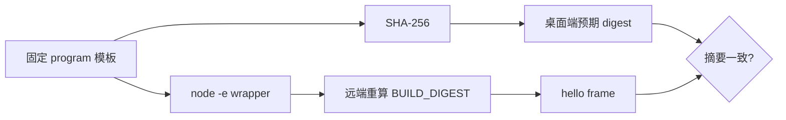
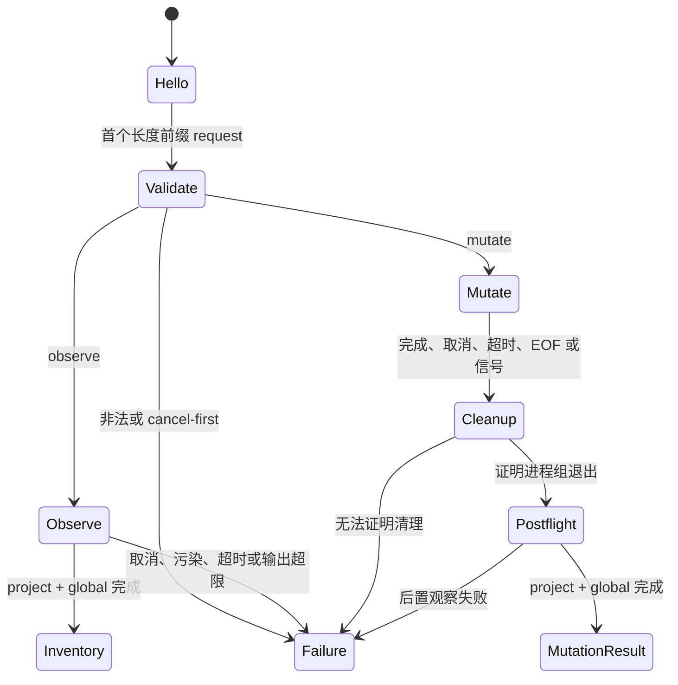

# remote-bootstrap
活跃贡献者：oldwinter、chendongdong

> **范围状态：未发布、非 V1 能力。** `packages/remote-bootstrap` 虽然在源码树中
> 有实现和测试，但它属于后续 POSIX SSH 路径。当前公开产品承诺是 Local-only，
> 不能据此声称 SSH Target、远端 Inventory 或远端 Mutation 已交付。

## 概览

`packages/remote-bootstrap` 是私有 ESM 包，只依赖
`@skills-desktop/skills-runtime`。它生成一个构建时固定、单次运行的 Node
程序：从 SSH stdin 接收封闭 Wire 帧，验证后在远端构造受支持的
`npx --yes skills@1.5.23` 参数数组，并把有界结果帧写到 stdout。

它不是常驻 agent、通用 shell、argv 转发器或远端安装器。每次操作应由桌面主
进程通过新的 OpenSSH session 调起；凭据和主机信任也不由此包管理。上层设计见
[实验性远端传输](../systems/remote-transport-experimental.md)。

## 固定模板与 BUILD_DIGEST

`packages/remote-bootstrap/src/index.ts` 的核心导出是 `REMOTE_BOOTSTRAP_PROGRAM`。这是一个
`String.raw` 程序模板，构建时嵌入以下受审值：

- `skills-runtime` 的 Wire 版本与字节/字符串上限；
- Wire request validator、frame encoder 和单帧 decoder 的函数源码；
- 固定 CLI 包名、版本和 Harness scope 支持表。

模块对完整 program 字符串计算 SHA-256，导出
`REMOTE_BOOTSTRAP_DIGEST`。随后生成的 wrapper 在远端再次对同一字符串计算
摘要，并用 `Function("BUILD_DIGEST", program)(digest)` 把摘要值作为
`BUILD_DIGEST` 参数传入程序。bootstrap 启动后的第一帧是 `hello`，其中
`bootstrapDigest: BUILD_DIGEST` 供桌面端核对预期字节身份。



`REMOTE_BOOTSTRAP_COMMAND` 只包含 shell 安全引用后的固定 wrapper。Target、
workspace、Harness、技能名和 Mutation 都不拼进这个命令，而是走 stdin
结构化帧。`describeRemoteBootstrap()` 只公开 CLI 包、CLI 版本、摘要和协议版本。

## Release 构建

包的 `build` 先运行 `tsc -b`，再运行 Vite release build。
`packages/remote-bootstrap/vite.release.config.ts`：

- 以 `packages/remote-bootstrap/src/index.ts` 为 Node SSR 入口；
- 把 `zod` 与 `@skills-desktop/skills-runtime` 一起内联；
- 生成 `packages/remote-bootstrap/dist/release/index.js` 单入口；
- 关闭 minify 和 sourcemap，清空 release 输出目录。

因此 SSH 侧使用的是固定 bundle 产生的 command 字符串，而不是在目标机解析
workspace 依赖。`scripts/check-imports.mjs` 还会拒绝本包导入除相对模块和
`skills-runtime` 之外的包。

## 输入帧与状态机

当前实现复用 `skills-runtime` 的 **Wire Protocol v2**。输入最多两帧：

1. 第一帧必须是一个 `observe` 或 `mutate` request；
2. 第二帧如果存在，只能是与第一帧 `requestId` 匹配的 `cancel`。

非法长度、非法 UTF-8/JSON、未知键、未知 Harness、额外第三帧、错误 request ID
或 mutation 权限都会 fail-closed。observe 可以在启动前或执行中取消；mutation
通道 EOF 被视为 transport loss，而不是成功。



响应只通过 stdout Wire 帧传输；原始 stderr、路径和底层异常不会直接返回桌面端。

## 子进程边界

每个支持的操作都先运行 `npx --yes skills@1.5.23 --version`，确认远端方言
恰好为 `1.5.23`。执行时设置 `shell: false`、以请求中的规范绝对 POSIX
workspace 为 `cwd`，环境变量只从 `HOME`、locale、npm cache、`PATH` 和临时
目录相关允许列表复制。

支持的 argv 由 bootstrap 自己构造：

- observe：依次运行 project `list --json` 和 global
  `list --global --json`；
- add：GitHub repo 或固定 commit archive、精确 `--skill` 名称、
  规范 `--agent`、可选 `--global` 和 `--yes`；
- remove：精确名称、规范 `--agent`、scope flag 和 `--yes`；
- update：精确名称、`--project`/`--global` 和 `--yes`，不接受
  `--agent`，因为固定 CLI 的 update 是 Harness-unscoped。

在 spawn 前还会用 Registry scope 表拒绝不支持的 Harness/scope 组合。
请求永远不能直接提供 `npx` 参数。更多本地侧对照见
[本地 CLI 边界](../systems/local-cli-boundary.md)。

## 输出捕获、取消与清理证明

普通 invoke 把 stdout 写入权限为 `0600` 的临时文件；在 POSIX 上打开后立即
unlink，并持续检查文件大小。stderr 只计数字节。任何一侧超过 8 MiB 都会终止
子进程并返回 `output_limit_exceeded`；文件描述符和临时目录无论成功或失败都要
清理。

Mutation 使用 detached 子进程组，以便连同 `npx` 的后代一起处理：

1. 正常完成、匹配取消、超时、stdin EOF 或 bootstrap 收到终止信号后，进入统一
   cleanup 路径；
2. 先向整个进程组发送 `SIGTERM`，必要时约一秒后发送 `SIGKILL`；
3. 轮询进程组，只有确认其不再存在才认为 cleanup 成功；
4. cleanup 成功后，在同一 bootstrap session 中重新执行 project/global
   Inventory postflight；
5. 只有 postflight 也完成，才返回
   `mutation-result.process.cleanup = "confirmed"`，同时单独报告
   `completed`、`failed`、`cancelled` 或 `timed-out` disposition。

无法证明进程组消失、transport 已丢失或 postflight 失败时，不会伪造 terminal
成功。桌面应用负责把缺少所需终帧的情形提升为 Remote Outcome Uncertain、
保留 Guard 并要求显式 reconciliation；这些持久化与授权规则不属于本包。

## 当前协议与未发布范围

ADR 0016 已接受 Wire v3 和 POSIX SSH 作为后续产品目标，但明确要求观察/检查和
mutation 分别通过打包门禁后才能公开。本包当前仍发送 Wire v2，尚未携带 v3
要求的 Target Generation、Registry digest、方言、bootstrap 和完整 Harness
set 绑定，也没有 source-inspection request。

因此应把本页理解为“树内实验实现如何工作”，而不是可用性声明。任何提升都必须：

- 以破坏性升级实现 Wire v3，不做静默降级；
- 加入 ADR 0015 的封闭 Source Descriptor 与 source inspection；
- 通过 ADR 0016 指定的 packaged trust/observation 和 uncertainty/recovery
  门禁；
- 保持系统 OpenSSH 拥有凭据、每次操作新建 session、远端命令固定。

## 测试与维护

`packages/remote-bootstrap/src/index.test.ts` 使用临时 `npx` fixture 真正启动
`REMOTE_BOOTSTRAP_COMMAND`，而不是只测字符串。代表性覆盖包括：

- 共享 validator/codec 确实嵌入 program；
- 展示型或未知 Harness 在 CLI spawn 前被拒绝；
- workspace 即使含 shell 元字符也只作为 `cwd`，不会进入远端命令；
- project/global 观察、固定 add/remove/update argv 和原子 postflight；
- 输出上限、错误阶段和临时捕获目录清理；
- 匹配取消终止整个 mutation 进程组并证明后代消失；
- 错误取消、重复帧、stdin EOF 和 transport loss 不会被当作成功。

这些集成测试在 Windows 上跳过 POSIX 进程组场景，这与“Windows 可以运行桌面
客户端、但不是 Remote SSH Target”的范围一致。可运行：

```bash
npm run typecheck --workspace @skills-desktop/remote-bootstrap
npm run build --workspace @skills-desktop/remote-bootstrap
npm test -- packages/remote-bootstrap/src/index.test.ts
```

## Key source files

- `packages/remote-bootstrap/src/index.ts`：固定 program、摘要、命令 wrapper 与公开描述。
- `packages/remote-bootstrap/src/index.test.ts`：真实子进程、帧、固定 argv、取消和清理测试。
- `packages/remote-bootstrap/vite.release.config.ts`：单文件 Node SSR release 构建。
- `packages/remote-bootstrap/package.json`：唯一 workspace 依赖与构建命令。
- `packages/skills-runtime/src/wire.ts`：共享 Wire v2 validator、schema 与 codec。
- `packages/skills-runtime/src/harness-registry.ts`：嵌入的固定 Harness/scope 兼容性表。
- `scripts/check-imports.mjs`：remote-bootstrap 依赖边界门禁。
- `apps/desktop/src/main/adapters/ssh-skills-process.ts`：桌面端实验性 Wire 对端。

## 相关页面

- [工作区包](index.md)
- [skills-runtime](skills-runtime.md)
- [系统架构](../overview/architecture.md)
- [实验性远端传输](../systems/remote-transport-experimental.md)
- [数据模型](../reference/data-models.md)
