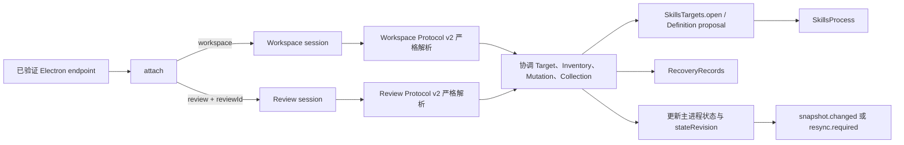

# DesktopCapabilities
活跃贡献者：oldwinter、chendongdong

## 目的

`DesktopCapabilities` 是 Electron 主进程中的应用编排深模块。它把 Target 会话、Inventory 新鲜度、Mutation 生命周期、Trusted Review、Official Collection、恢复记录和 renderer 事件放在同一授权边界内，对外只暴露 `attach()`、`initialize()`、`restartSafety()` 与 `shutdown()`。普通 renderer 得到的是可替换的 Snapshot 和封闭请求能力，不会取得进程、持久化、确认或执行权。

生产组装点 `apps/desktop/src/main/composition-root.ts` 明确传入 `v1LocalOnlyTargets: true`。因此当前 V1 是 **Local-only**：创建或更新 SSH Target、对 SSH Target 发起操作、请求主机信任审阅，以及包含 SSH Target 的 Collection 计划都会在进入 SSH 或 Mutation 适配器前被拒绝。恢复记录中的 SSH Target 仍可被投影，供兼容与后续范围使用，但不会因此成为 V1 可操作路径。

本页聚焦模块边界；总体分层见[系统架构](../../overview/architecture.md)，功能层行为分别见 [Inventory](../../features/inventory.md)、[变更与可信审阅](../../features/mutations-and-trusted-review.md)和[官方合集](../../features/official-collections.md)。

## 目录布局

```text
apps/desktop/src/contracts/workspace.ts                              # Workspace Protocol v2
apps/desktop/src/contracts/review.ts                                 # Review Protocol v2
apps/desktop/src/main/application/desktop-capabilities.ts            # 编排、状态与授权
apps/desktop/src/main/application/comparison.ts                      # 私有派生 Comparison
apps/desktop/src/main/application/official-collections.ts            # Catalog 校验、评估与投影
apps/desktop/src/main/adapters/electron-ipc.ts                       # 已验证 endpoint 到会话的适配
apps/desktop/src/main/adapters/skills-process.ts                     # SkillsProcess / PreparedMutation
apps/desktop/src/main/targets/skills-targets.ts                      # Definition、Generation、open()
apps/desktop/src/main/persistence/recovery-records.ts                # restore() / commit(DurableChange)
apps/desktop/src/main/composition-root.ts                            # 生产适配器与 Local-only 开关
```

`apps/desktop/src/main/application/desktop-capabilities.ts` 虽然体量较大，但公共接口很小。Comparison 和 Official Collection 逻辑是其进程内协作者，不是 renderer 可选的插件或通用端口。

## 关键抽象

| 抽象 | 模块内职责 |
| --- | --- |
| `DesktopEndpoint` | 标识 `workspace` 或 `review` 角色、endpoint、文档 epoch；review endpoint 还绑定一个 `reviewId`。 |
| `DesktopSession` | 只提供 `request(input)`、`snapshot()`、`teardown()`；实际返回哪类 Snapshot 由 endpoint 角色决定。 |
| `FreshTargetSession` | 把冻结的 Effective Target Binding、`SkillsProcess`、最新完整 Inventory 与本次 `inventoryId` 绑定在一起。 |
| `ActiveObservation` / `ActivePreparation` / `ActiveMutation` | 保存主进程拥有的操作、取消控制、所有者和 Promise，参与冲突、teardown、shutdown 与重启安全判断。 |
| `TrustedReview` / `HostTrustReview` | 保存单次、角色绑定的待决审阅；普通 workspace 只能请求展示，专用 review session 才能决定。 |
| `CollectionPlan` | 将公开计划投影与主进程保留的 Prepared Mutation ID 对应起来；公开摘要不是执行权。 |
| `WorkspaceSnapshot` / `DesktopEvent` | Workspace Protocol v2 的严格公开投影；Snapshot 是 renderer 重新同步依据，事件只是有序变更通知。 |
| `RecoveryRecords` | 唯一持久化安全转换接口；模块只提交封闭的 `DurableChange`，不直接读写 JSON。 |

状态分为三类：

- **主进程会话状态**：Fresh Target Session、活动操作、Prepared Mutation、Trusted Review、Collection 计划与事件序号。
- **持久状态**：Target Definition、stale-on-restore Inventory Snapshot、Mutation Guard 与 Collection Acknowledgement，由 `RecoveryRecords` 管理字节。
- **派生投影**：Comparison、Collection Assessment、Command Plan、Snapshot 和结构化错误；按当前输入重算，不作为另一份权威状态持久化。

## 工作方式



1. `initialize()` 先验证 bundled Official Collection catalog，再恢复独立记录；Snapshot 被恢复为 stale，Guard 被恢复为 `reconciliation-required`。
2. `attach()` 为已验证 endpoint 创建角色会话。review 角色只接受 `review.decide`；workspace 角色只接受 `workspaceRequestSchema` 中的封闭请求联合。
3. 请求处理先做 schema、角色、Local-only、恢复权威和并发检查，再调用 `SkillsTargets`、`SkillsProcess` 或 `RecoveryRecords`。
4. 成功或失败状态通过 `publish()` / `publishMutation()` 提升全局 `stateRevision`，并向每个 workspace endpoint 投递带独立 sequence 的 Snapshot 事件。
5. teardown 会终止该 workspace 拥有的 Inventory 观察、使其准备失效并拒绝其未决审阅；已经开始且由主进程拥有的 Mutation 不会因普通 renderer 消失而被暗中取消。

Workspace 请求包含 Inventory 刷新/取消、Mutation 准备/协调、Target 增删改、Comparison 打开/准备、Collection 准备/审阅请求，以及 Trusted Review 展示请求。它不包含通用 argv、路径读写、SSH 命令、持久化或确认 token。

内部细节按三个区域展开：

- [状态、事件与 Target 会话](state-and-events.md)
- [变更、可信审阅与合集执行](mutations-and-reviews.md)
- [启动恢复、协调与重启安全](recovery-coordination.md)

## 集成点

| 集成点 | `DesktopCapabilities` 的约束 |
| --- | --- |
| Electron IPC | `apps/desktop/src/main/adapters/electron-ipc.ts` 负责验证 sender 与角色后再 attach；模块不接受 renderer 自报的可信角色。详见 [IPC 与 renderer 隔离](../ipc-and-renderer-isolation.md)。 |
| `SkillsTargets` | 获取 Definition 列表、提出增删改/主机信任转换并打开冻结绑定；定义变化会使相关 Fresh Session 和 Prepared Mutation 失效。 |
| `SkillsProcess` | 只调用 `observeInventory`、`prepareMutation`、`executeConfirmed`；Command Plan 预览不会被送回执行。 |
| `RecoveryRecords` | 在 Target 切换、Guard、Inventory、Collection acknowledgement 等安全转换处先提交持久记录，再开放后续权威。详见[恢复与持久化](../recovery-and-persistence.md)。 |
| Comparison | `apps/desktop/src/main/application/comparison.ts` 只从当前 Fresh/Stale 投影派生结果，不为比较而重新打开 Target。 |
| Official Collection | `apps/desktop/src/main/application/official-collections.ts` 验证 catalog 并生成 assessment；实际 child 仍进入普通 Mutation 生命周期。 |
| 更新与退出 | `restartSafety()` 将活动操作、待决审阅、协调要求和恢复不确定性投影为更新模块可消费的阻断原因。 |

## 修改入口

| 变更目标 | 首要入口 | 同步检查 |
| --- | --- | --- |
| 新增 renderer 能力 | `apps/desktop/src/contracts/workspace.ts` 或 `apps/desktop/src/contracts/review.ts` | 严格 schema、preload 方法、IPC sender 校验、角色矩阵和公开错误；不要添加通用操作。 |
| 修改 Inventory/Target 会话 | `apps/desktop/src/main/application/desktop-capabilities.ts` 的 refresh、activate、invalidation 路径 | Fresh/Stale 语义、Generation 变化、独立 Target Session、事件重同步测试。 |
| 修改 Mutation 或审阅 | 同文件的 preparation、review decision、`runApprovedMutation` | 审阅单次性、Inventory/Generation 绑定、Guard-before-spawn、效果与进程结果分离。 |
| 修改 Collection 执行 | 同文件的 `collection.prepare*`、`runApprovedCollection` | catalog 证据摘要、全 Target 预留、稳定顺序、fail-stop、无回滚和 V1 Local-only。 |
| 修改恢复行为 | 同文件的 `initialize`、`runReconciliation`、`restartSafety`、`shutdown` | 不可读记录 fail-closed、显式协调、deadline、剩余 Guard 保留和有界等待。 |

以 `apps/desktop/src/main/application/desktop-capabilities.test.ts` 的角色会话契约作为主要可观察行为测试，并保留 `apps/desktop/src/main/application/desktop-capabilities.v1-local-only.test.ts` 对生产范围开关的负面断言。接口或 schema 有变化时，先更新契约和边界测试，不要通过公开私有 Map 或 helper 来绕过深模块。

## Key source files

| 文件 | 作用 |
| --- | --- |
| `apps/desktop/src/main/application/desktop-capabilities.ts` | 公共深接口与完整主进程编排实现。 |
| `apps/desktop/src/main/application/desktop-capabilities.test.ts` | Inventory、Target、事件、审阅、Mutation、恢复和 Collection 的角色会话契约。 |
| `apps/desktop/src/main/application/desktop-capabilities.v1-local-only.test.ts` | 验证 Local-only 开关在打开 SSH 或提交持久变更前拒绝后续范围操作。 |
| `apps/desktop/src/contracts/workspace.ts` | Workspace Protocol v2 的请求、结果、Snapshot、事件和公开错误 schema。 |
| `apps/desktop/src/contracts/review.ts` | Review Protocol v2 的投影、决定与桥接接口。 |
| `apps/desktop/src/main/composition-root.ts` | 生产依赖组装，并设置 `v1LocalOnlyTargets: true`。 |
| `apps/desktop/src/main/targets/skills-targets.ts` | Target Definition、Generation、Effective Binding 和 Target Session 接口。 |
| `apps/desktop/src/main/adapters/skills-process.ts` | Inventory、Prepared Mutation 与确认执行接口。 |
| `apps/desktop/src/main/persistence/recovery-records.ts` | 持久恢复记录和封闭 `DurableChange`。 |

返回[内部系统索引](../index.md)。
