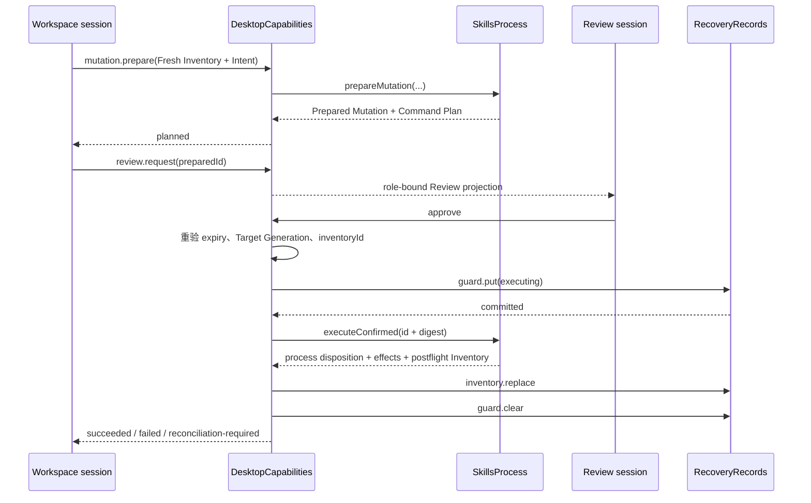
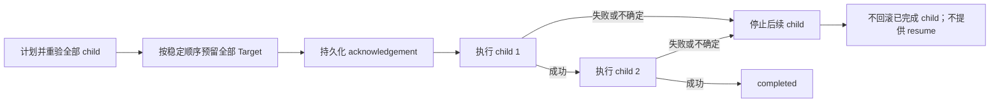

# 变更、可信审阅与合集执行
活跃贡献者：oldwinter、chendongdong

## 目的

本页描述 `DesktopCapabilities` 如何把 Fresh Inventory 上的结构化 Intent 转成 Prepared Mutation，如何通过独立 review 角色取得单次决定，以及如何在持久 Mutation Guard 保护下执行。用户功能说明见[变更与可信审阅](../../features/mutations-and-trusted-review.md)和[官方合集](../../features/official-collections.md)；这里聚焦主进程内的授权与排序。

## 目录布局

```text
apps/desktop/src/contracts/workspace.ts
apps/desktop/src/contracts/review.ts
apps/desktop/src/main/application/desktop-capabilities.ts
apps/desktop/src/main/application/official-collections.ts
apps/desktop/src/main/adapters/skills-process.ts
apps/desktop/src/main/persistence/recovery-records.ts
apps/desktop/src/review-renderer/ReviewSurface.tsx
```

Prepared Mutation 和可执行参数的所有权留在 `SkillsProcess` 与主进程内。`apps/desktop/src/contracts/workspace.ts` 只公开可审阅 `CommandPlan`；`apps/desktop/src/contracts/review.ts` 只允许专用 review surface 读取一个绑定投影并提交 `approve` 或 `reject`。

## 关键抽象

| 抽象 | 安全含义 |
| --- | --- |
| `preparedMutations` | 以 ID 保存主进程中的 Prepared Mutation；renderer 只有 ID 和 Command Plan 投影。 |
| `preparedDependencies` | 记录计划依赖的 Target 集合；Comparison 或多 Target Collection 任一输入变化都会使计划整体失效。 |
| `TrustedReview` | 绑定 review ID、所有 workspace endpoint、Prepared Mutation、用途 `execute`/`cancel` 和一次性 decision。 |
| `ReviewSnapshot` | Review Protocol v2 的 `pending`、`settled`、`unavailable` 联合；Mutation、Host Trust 和 Collection 使用不同严格投影。 |
| `ActiveMutation` | 保存 operation ID、AbortController、Prepared Mutation 和运行 Promise；取消控制不交给普通 renderer。 |
| Mutation Guard | 执行前通过 `guard.put` 持久化；只有终止与后置 Inventory 足够确定且新 Inventory 已落盘后才 `guard.clear`。 |
| `CollectionPlan` | 公开证据投影与一个或多个 Prepared Mutation 的主进程映射；`reviewDigest`、binding、Inventory 和 assessment 摘要用于批准前重验。 |

`CommandPlan.preview` 是说明文本。批准路径最终向 `executeConfirmed()` 传递的是主进程保留的 `{ preparedMutationId, digest }`，不会执行 renderer 回传文本。

## 工作方式

### 单个 Mutation



准备要求当前 Target 有 `freshTargetSession`、Inventory 为 fresh、没有 Guard/协调要求，也没有相冲突的观察、准备或 Mutation。`runPreparation()` 调用 `SkillsProcess.prepareMutation()` 后才保存 Prepared Mutation；owner teardown 或 Target 变化会使尚未完成的准备失效。

普通 workspace 请求 `review.decide` 会被 Workspace Protocol 拒绝。review session 批准时再次验证：

- review 未决定且未过期；
- Prepared Mutation 仍存在；
- `targetId`、Target Generation、`inventoryId` 与当前 Fresh Target Session 一致；
- 没有 Target Definition 变更或冲突操作；
- Collection 审阅还要重验 release、receipt、plan digest、binding、Inventory 和 assessment 证据。

批准会消费 Prepared Mutation；重放同一 review 不会再次执行。若 `guard.put` 失败，`executeConfirmed()` 不可达。已知终止且有完整 postflight Inventory 时，模块先持久化 Inventory，再清 Guard；未知终止或缺少 Inventory 会保留 Guard、将效果标成 possible 并进入显式协调。

### 取消也需要第二次审阅

`review.cancel-request` 只为匹配的运行中 Mutation 创建 `purpose: "cancel"` 的新 Trusted Review。批准后才 abort `ActiveMutation.controller`；拒绝或 teardown 不会取消 Mutation。取消返回仍按 `process.termination` 与可观察 Inventory 判断是否需要协调，而不是把本地 abort 当成远端或子进程已经停止的证明。

### Official Collection

单 Target Collection 先用 `apps/desktop/src/main/application/official-collections.ts` 的 assessment 检查 active/approved release、兼容性、Fresh Inventory 和逐项 selection mode，再生成带 reviewed Git revision 的普通 `add` Intent。批准前提交 Collection acknowledgement，child 随后复用同一 Guard、执行、postflight 和协调生命周期。

多 Target Collection 的公开计划 schemaVersion 为 2。模块按请求顺序准备 child，将每个 child 的 binding、Inventory、assessment、Prepared Mutation 和 Command Plan 摘要纳入 review evidence。批准时先重验所有 child，再一次性预留所有目标，之后顺序执行：



执行投影明确写入 `semantics: "non-transactional"`。child 失败会把后续 child 标为 stopped、使相关 Inventory stale，并丢弃剩余确认；已完成 child 不回滚。

虽然该实现保留 Local/SSH 共用和多 Target 顺序执行代码，生产 `apps/desktop/src/main/composition-root.ts` 的 `v1LocalOnlyTargets: true` 会拒绝 SSH Target 的 Mutation、单 Target Collection 和 `collection.prepare-many`。这些 SSH 分支是后续范围，不是 V1 交付证明。

## 集成点

| 集成点 | 责任 |
| --- | --- |
| `apps/desktop/src/contracts/workspace.ts` | 定义结构化 Mutation Intent 请求、Command Plan、公开 outcome 与 Collection plan/execution。 |
| `apps/desktop/src/contracts/review.ts` | 定义独立 review 角色唯一可见的投影与 `approve`/`reject`。 |
| `apps/desktop/src/main/adapters/skills-process.ts` | 负责 prepare/execute 接口和 Prepared Mutation；本地、SSH 适配器不能从 preview 反构造命令。 |
| `apps/desktop/src/main/persistence/recovery-records.ts` | 提交 Guard、postflight Inventory 与 Collection acknowledgement。 |
| `apps/desktop/src/main/application/official-collections.ts` | 验证 bundled catalog，投影 release 和 assessment，计算 canonical digest。 |
| `apps/desktop/src/review-renderer/ReviewSurface.tsx` | 展示一个绑定的 review；没有 workspace、进程或持久化能力。 |

## 修改入口

| 要修改的行为 | 修改点 | 必须验证 |
| --- | --- | --- |
| Mutation eligibility / plan | `apps/desktop/src/main/application/desktop-capabilities.ts` 的 `runPreparation` 与 `mutation.prepare` 分支，及 `apps/desktop/src/main/adapters/skills-process.ts` | 仅 Fresh Inventory、精确 Intent、Target/Inventory 绑定、preview 不参与执行。 |
| Trusted Review | `apps/desktop/src/contracts/review.ts` 和 `apps/desktop/src/main/application/desktop-capabilities.ts` 的 review 角色分支 | 角色矩阵、过期、重放、并发、drift、teardown 和单次消费。 |
| Guard/执行顺序 | 同文件的 `runApprovedMutation`、`enterReconciliation` | `guard.put` 失败零执行；成功路径为 Guard→执行→Inventory→清 Guard；不确定结果保留 Guard。 |
| 取消 | 同文件的 cancellation review 分支 | 只有第二次批准才 abort；终止确定性与 effects 不折叠。 |
| Collection | 同文件的 `collection.prepare*`、`runApprovedCollection` 与 `apps/desktop/src/main/application/official-collections.ts` | release/receipt/digest 重验、全量预留、稳定顺序、fail-stop、无回滚、Local-only。 |

## Key source files

| 文件 | 作用 |
| --- | --- |
| `apps/desktop/src/main/application/desktop-capabilities.ts` | Preparation、Trusted Review、Guard、执行、取消和 Collection 编排。 |
| `apps/desktop/src/main/application/desktop-capabilities.test.ts` | 证明 role-bound review、Guard-before-execute、过期/drift/replay、协调和 Collection fail-stop。 |
| `apps/desktop/src/main/application/desktop-capabilities.v1-local-only.test.ts` | 证明包含 SSH 的 Collection 计划在 V1 中于执行前被拒绝。 |
| `apps/desktop/src/contracts/review.ts` | Review Protocol v2 与 ReviewBridge。 |
| `apps/desktop/src/contracts/workspace.ts` | Mutation/Collection 的公开请求、状态和投影 schema。 |
| `apps/desktop/src/main/adapters/skills-process.ts` | Prepared Mutation 与确认执行接口。 |
| `apps/desktop/src/main/application/official-collections.ts` | Catalog 校验、assessment 与摘要。 |
| `apps/desktop/src/main/persistence/recovery-records.ts` | Mutation Guard、Inventory Snapshot 和 acknowledgement 转换。 |
