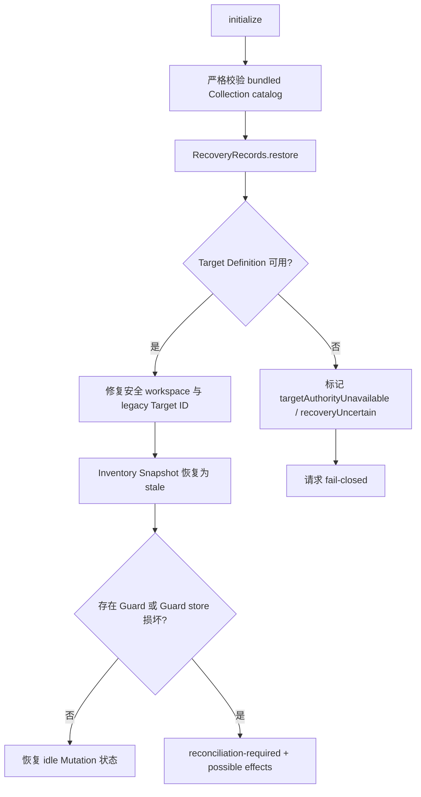

# 启动恢复、协调与重启安全
活跃贡献者：oldwinter、chendongdong

## 目的

本页说明 `DesktopCapabilities` 如何把独立恢复记录重建为 fail-closed 的会话状态，如何通过显式 reconciliation 清理不确定 Mutation，以及如何向更新与退出流程报告重启阻断原因。持久化适配器的文件格式、迁移和原子替换细节见[恢复与持久化](../recovery-and-persistence.md)。

## 目录布局

```text
apps/desktop/src/contracts/about.ts
apps/desktop/src/main/application/desktop-capabilities.ts
apps/desktop/src/main/persistence/recovery-records.ts
apps/desktop/src/main/persistence/recovery-records.test.ts
apps/desktop/src/main/composition-root.ts
apps/desktop/src/main/update-composition.ts
```

`apps/desktop/src/main/persistence/recovery-records.ts` 拥有记录字节与迁移；`apps/desktop/src/main/application/desktop-capabilities.ts` 拥有这些记录在 Target、Inventory、Mutation 和重启状态中的领域含义。

## 关键抽象

| 抽象 | 恢复语义 |
| --- | --- |
| `recoverableSnapshots` / `recoverableGuards` | 启动时按 Target 保存可重附着记录，用于稳定 UUID 与 legacy ID 迁移后的恢复。 |
| `guardedTargetIds` | 阻止 Target 删除/执行相关更新和新 Mutation；Guard store 损坏时会覆盖所有已知 Target。 |
| `recoveryUncertain` | Target 或 Mutation Guard 恢复失败的全局安全信号，进入 `restartSafety()`。 |
| `guardStoreCorrupted` | 表示不能把 Guard store 当作空；Mutation 准备继续被阻断，直到 typed reconciliation。 |
| `targetAuthorityUnavailable` | Target Definition 恢复或重映射失败；workspace 请求整体返回 `target_unavailable`。 |
| `reconciliationDeadline` | 原 Mutation Guard 的截止时间；在此之前显式协调返回 `reconciliation_wait`。 |
| `RestartGuardReason` | 更新/重启层消费的封闭原因：活动 Mutation、受保护进程、待决审阅、协调要求、恢复不确定。 |

## 工作方式

### 启动恢复



初始化先验证 Official Collection catalog；严格校验失败会阻止正常启动，而不是把未知字段忽略。随后：

1. 恢复并过滤仍能匹配 bundled release 的 Collection acknowledgements；失效项通过封闭 replacement 转换移除。
2. 恢复 Target Definitions。持久记录为空且 store 可用时写入启动 Local Target；Target store 失败时不会打开 fallback Target。
3. 若旧 Local Target workspace 是文件系统根，而启动 workspace 是安全的非根目录，则持久化修复后的 Definition、提升 Generation，并让旧 Inventory stale。
4. 对识别出的 legacy Target ID 提交 `target.remap`；当前 UUID 已有记录时保留当前证据，不用 legacy 数据覆盖。
5. 每个 Inventory Snapshot 都恢复为 stale。Generation 不匹配会额外公开 `stale_inventory`。
6. 每个 surviving Guard 恢复为 `reconciliation-required`，效果为 possible；Guard store 不可读时所有已知 Target 都被视为 guarded，而不是视作无 Guard。

恢复出的 SSH Definition 可以出现在 Snapshot 中，但生产 `v1LocalOnlyTargets: true` 会在 refresh、prepare、reconcile 或 host-trust review 到达 SSH 实现前拒绝请求。这保持了持久 schema 兼容，同时不扩大 V1 Local-only 承诺。

### 显式 reconciliation

普通 Inventory refresh 即使成功建立 Fresh Inventory，也不会清除 `reconciliation-required`。只有 `mutation.reconcile` 可以在原 deadline 到达后运行：

1. 重新 `SkillsTargets.open(targetId)`；
2. 做一次完整 `observeInventory`；
3. 提交 `inventory.replace`；
4. 提交 `guard.clear`；
5. 建立新的 Fresh Target Session；
6. 使旧 Prepared work 失效，并把 Mutation 状态恢复到 `idle`。

如果 Guard store 正处于 corruption 状态，普通 `guard.clear` 失败后只能使用 typed `guards.clear-corruption`，且必须把其他 Target 的剩余 Guard 重新写回。这样协调一个 Target 不会顺便解除 sibling Target 的阻断。任一步失败都会保留协调状态和公开错误。

### 不确定执行如何进入协调

Mutation 的进程终止未知、缺少 postflight Inventory、Inventory 持久化失败或 Guard 清理失败时，`enterReconciliation()` 会：

- 用原 operation ID、Generation 和 deadline 提交 `guard.put` 的 `reconciliation-required` 状态；
- 将 effects 标为 possible；
- 删除 Fresh Target Session 并把 Inventory 降为 stale；
- 阻止 Target 删除、执行相关更新和后续 Mutation。

具体执行顺序见[变更、可信审阅与合集执行](mutations-and-reviews.md)。

### 重启与 shutdown

`restartSafety()` 从当前内存状态即时派生原因：

| 原因 | 触发条件 |
| --- | --- |
| `mutation-active` | 存在 `ActiveMutation`，包括正在执行的显式协调。 |
| `protected-process-active` | Inventory 观察、Mutation/Collection 准备或 Target Definition 转换进行中。 |
| `trusted-review-active` | Mutation、取消或 Host Trust review 仍待决。 |
| `reconciliation-required` | 存在 guarded Target 或任一 Target Mutation 状态要求协调。 |
| `recovery-uncertain` | Guard/Target 恢复不确定，或 Target 权威不可用。 |

`shutdown()` 先拒绝新请求，abort 活动 Inventory 观察，使准备失效并拒绝待决审阅；它不会把普通退出当成取消已开始 Mutation 的授权。随后在 `shutdownTimeoutMs` 内等待观察、Mutation 和准备 Promise，超时后停止等待，但不会因此清除 Guard。重复调用共享同一 shutdown Promise。

## 集成点

| 集成点 | 作用 |
| --- | --- |
| `apps/desktop/src/main/persistence/recovery-records.ts` | 返回按 store 隔离的恢复结果和 failure，并接受 `targets.replace`、`target.remap`、`inventory.replace`、`guard.*` 等封闭转换。 |
| `apps/desktop/src/main/targets/skills-targets.ts` | 为协调重新打开冻结 binding；Definition 不可用时不会跳过到任意 Target。 |
| `apps/desktop/src/contracts/about.ts` | 定义更新/重启 UI 可见的 `RestartGuardReason`。 |
| `apps/desktop/src/main/update-composition.ts` | 通过 `restartSafety()` 判断更新重启是否被当前安全状态阻断。 |
| `apps/desktop/src/main/composition-root.ts` | 提供生产 JSON RecoveryRecords、时钟与 Local-only 开关，并在窗口开放前调用 `initialize()`。 |

## 修改入口

| 要修改的行为 | 修改点 | 必须验证 |
| --- | --- | --- |
| 启动恢复投影 | `apps/desktop/src/main/application/desktop-capabilities.ts` 的 `initialize`、`stateFromRecoveredRecords` | stale-on-restore、store failure 隔离、Target authority fail-closed、Guard 不被当空。 |
| Target ID/workspace 修复 | 同文件的 `repairPersistedRootWorkspaces` 与 remap 流程 | Generation 只按方案推进、当前 UUID 证据优先、提交失败不替换内存权威。 |
| 显式协调 | 同文件的 `runReconciliation` | deadline、完整观察、Inventory-before-clear、corruption typed repair、sibling Guard 保留。 |
| 重启阻断 | 同文件的 `restartSafety` 与 `apps/desktop/src/contracts/about.ts` | 每个封闭 reason 的出现和状态结束后的清除。 |
| shutdown | 同文件的 `shutdown` | 新请求拒绝、观察取消、准备失效、审阅拒绝、有界等待、活动 Mutation Guard 不被清除。 |

不要新增“清空全部 Guard”“重试原 Mutation”或“忽略损坏记录”的通用入口。恢复操作必须保持状态特定、类型化且能证明不会覆盖其他 Target 的安全证据。

## Key source files

| 文件 | 作用 |
| --- | --- |
| `apps/desktop/src/main/application/desktop-capabilities.ts` | 初始化恢复、Guard 状态、显式协调、restart safety 与 shutdown。 |
| `apps/desktop/src/main/application/desktop-capabilities.test.ts` | 重启 Guard、损坏 Guard store、deadline、显式协调和 bounded shutdown 的可观察契约。 |
| `apps/desktop/src/main/application/desktop-capabilities.v1-local-only.test.ts` | 证明恢复的 SSH Target 不会绕过 Local-only 进入打开或持久转换。 |
| `apps/desktop/src/main/persistence/recovery-records.ts` | 版本化记录、恢复 failure 与 `DurableChange` 联合。 |
| `apps/desktop/src/main/persistence/recovery-records.test.ts` | Memory/JSON 记录转换与故障注入测试。 |
| `apps/desktop/src/contracts/about.ts` | `RestartGuardReason` 公共投影。 |
| `apps/desktop/src/main/composition-root.ts` | 生产恢复适配器和初始化顺序。 |
| `apps/desktop/src/main/update-composition.ts` | 消费重启安全投影。 |
