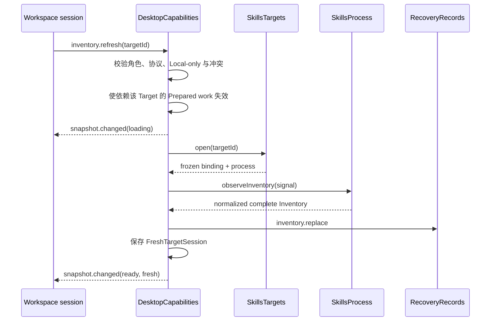

# 状态、事件与 Target 会话
活跃贡献者：oldwinter、chendongdong

## 目的

本页说明 `DesktopCapabilities` 如何为多个 Target 保留互相独立的 Inventory、Mutation 和 Fresh Session，如何把 renderer endpoint 限定为角色会话，以及如何用 Snapshot 与有界事件通知同步 UI。模块总览见 [DesktopCapabilities](index.md)。

## 目录布局

```text
apps/desktop/src/contracts/workspace.ts
apps/desktop/src/main/application/desktop-capabilities.ts
apps/desktop/src/main/application/comparison.ts
apps/desktop/src/main/targets/skills-targets.ts
apps/desktop/src/main/targets/local-skills-targets.ts
apps/desktop/src/main/targets/workspace-path.ts
apps/desktop/src/main/adapters/electron-ipc.ts
```

状态容器、会话切换、刷新与事件发布都在 `apps/desktop/src/main/application/desktop-capabilities.ts` 内；Target Definition 的规范化、Generation 与 `open()` 由 `apps/desktop/src/main/targets/skills-targets.ts` 的接口及其实现负责。

## 关键抽象

| 抽象 | 含义 |
| --- | --- |
| 活跃 Target | `target`、`inventoryState`、`mutationState` 和 `freshTargetSession` 是当前 workspace 投影的快捷引用。 |
| 每 Target 状态 Map | `inventoryStates`、`mutationStates`、`freshTargetSessions` 保存非活跃 Target 的独立状态；切换时 `storeActiveTargetState()` 与 `activateTarget()` 交换引用。 |
| `FreshTargetSession` | 同一 Target Generation 的冻结 binding、`SkillsProcess`、完整 Inventory 与 `inventoryId`；Mutation 准备必须使用它。 |
| `EndpointState` | 保存 endpoint 角色、`sessionEpoch`、独立 sequence、最多一个 pending event 及投递状态。 |
| `stateRevision` | 每次公开状态变化递增的模块级修订；与每个 endpoint 的事件 sequence 分离。 |
| `comparisonSelection` | 仅保存左右 Target 和 comparison ID；Comparison 每次从当前 Inventory 投影重新派生。 |

Inventory 的 `fresh` 只表示当前应用会话、未变 Target 的完整观察。恢复的 Snapshot、刷新失败后保留的最后完整结果，以及执行相关 Definition 改变后的旧结果都为 `stale`；单纯经过时间不会在这里自动变 stale。

## 工作方式

### Inventory 刷新



- 如果 `open()` 报告 effective binding 改变，模块先提交 `targets.replace`，替换 Definition、提升 Generation、清除 Fresh Session 与依赖计划，再重新打开。
- 观察失败调用统一错误投影，保留上一次完整 entries，但将已有证据降为 stale；没有旧证据时保持 `none`。
- Inventory Snapshot 提交失败时仍会公开本次 Fresh Inventory，同时设置 `persistenceWarning` 并让请求返回持久化错误；当前会话的观察与跨重启恢复证据因此保持可区分。
- 对同一个活动观察的重复刷新共享同一 Promise；不同冲突操作不被隐式排队，而是返回 `mutation_conflict`。

### Target Definition 与会话失效

Target 创建、更新、删除先通过 `SkillsTargets.propose*` 得到规范化方案，再提交 `targets.replace`，最后才替换内存 Definition。执行相关字段变化会：

1. 提升 Target Generation；
2. 删除对应 Fresh Target Session；
3. 将已有 Inventory 明确标为 stale；
4. 删除依赖该 Target 的 Prepared Mutation 和 Collection Plan；
5. 拒绝受影响的待决 Trusted Review。

活动观察、准备、Mutation Guard 或 Collection 预留会阻止不安全的 Target 变更。最后一个 Target 不可删除。`snapshotFor()` 同时投影活跃 Target 和 `targets[]` 中所有 Definition 的独立 Inventory、Mutation、Collection 与 `deletionBlocked` 状态。

生产 `apps/desktop/src/main/composition-root.ts` 设置 `v1LocalOnlyTargets: true`。因此 Target 定义接口虽然保留 `kind: "ssh"` 以维持 schema 和后续实现兼容，V1 仍拒绝新建/更新 SSH Target，并在对恢复出的 SSH Target 执行刷新或 Mutation 前停止。

### Snapshot 与事件

`publish()` 和 `publishMutation()` 都先保存活跃 Target 状态，再增加 `stateRevision`，随后为每个开放的 workspace endpoint 构造完整 `snapshot.changed`。review endpoint 不接收 Workspace 事件。

每个 endpoint 只有一个 pending event 槽：如果新状态到来时旧事件尚未投递，pending 内容会被替换为 `resync.required`，原因是 `buffer_overflow`。renderer 收到它后应重新调用 Snapshot，而不是假设自己能重放中间状态。`sessionEpoch` 防止导航或文档替换后的旧事件被误接收；具体 IPC 绑定见 [IPC 与 renderer 隔离](../ipc-and-renderer-isolation.md)。

### Endpoint teardown

- workspace teardown 会 abort 由该 endpoint 发起的 Inventory 观察；
- 正在异步准备的 work 被标记为 invalidated，即使底层 Promise 后来成功也不会被保留；
- 该 workspace 发起的未决 Mutation、Collection 或 Host Trust 审阅被拒绝；
- review teardown 只拒绝自己绑定且仍待决的审阅；
- renderer teardown 不会自动 abort 已启动 Mutation。

## 集成点

| 集成点 | 数据/控制流 |
| --- | --- |
| `apps/desktop/src/contracts/workspace.ts` | 定义 `WorkspaceSnapshot`、`DesktopEvent`、请求联合和严格公开状态上限。 |
| `apps/desktop/src/main/adapters/electron-ipc.ts` | 创建经验证的 endpoint、attachment epoch 与事件 sink。 |
| `apps/desktop/src/main/targets/skills-targets.ts` | 提供 Definition、Generation、冻结 binding、`SkillsProcess` 和 Target 变更 proposal。 |
| `apps/desktop/src/main/application/comparison.ts` | 从两侧现有 Fresh/Stale Inventory 派生 Comparison；打开比较不会调用 `SkillsTargets.open()`。 |
| `apps/desktop/src/main/persistence/recovery-records.ts` | 保存 Target Definition 与最后完整 Inventory Snapshot；恢复细节见[恢复与持久化](../recovery-and-persistence.md)。 |

## 修改入口

| 要修改的行为 | 修改点 | 必须保留的测试性质 |
| --- | --- | --- |
| 刷新状态或错误投影 | `apps/desktop/src/main/application/desktop-capabilities.ts` 的 `runRefresh`、`finishWithError` | 成功事件顺序、失败后 stale 保留、取消幂等、敏感字段不进入 Snapshot。 |
| 多 Target 切换 | 同文件的 `storeActiveTargetState`、`activateTarget`、`snapshotFor` | 两个显式刷新 Target 的 Fresh Session 互不覆盖。 |
| Target 增删改 | 同文件的 request 分支和 `apps/desktop/src/main/targets/skills-targets.ts` | 持久化先于替换、Generation、活动操作冲突、Guard/预留删除阻断。 |
| 事件策略 | 同文件的 `enqueue`、`publish`、`publishMutation` | endpoint 独立 sequence、overflow 后 `resync.required`、Snapshot 修订可重新同步。 |
| 新增公开状态 | `apps/desktop/src/contracts/workspace.ts` | 严格 Zod schema、大小上限、renderer 只获得投影。 |

## Key source files

| 文件 | 作用 |
| --- | --- |
| `apps/desktop/src/main/application/desktop-capabilities.ts` | Target 状态 Map、刷新、失效、Snapshot 与事件实现。 |
| `apps/desktop/src/main/application/desktop-capabilities.test.ts` | stale 恢复、刷新失败、取消、Target 会话、事件 overflow 与 teardown 契约。 |
| `apps/desktop/src/main/application/desktop-capabilities.v1-local-only.test.ts` | 恢复出的 SSH Target 只可投影、不可在 V1 打开或操作。 |
| `apps/desktop/src/contracts/workspace.ts` | Workspace Protocol v2 的 Snapshot、事件和请求 schema。 |
| `apps/desktop/src/main/targets/skills-targets.ts` | Target 与 Target Session 接口。 |
| `apps/desktop/src/main/application/comparison.ts` | Comparison 的纯派生实现。 |
