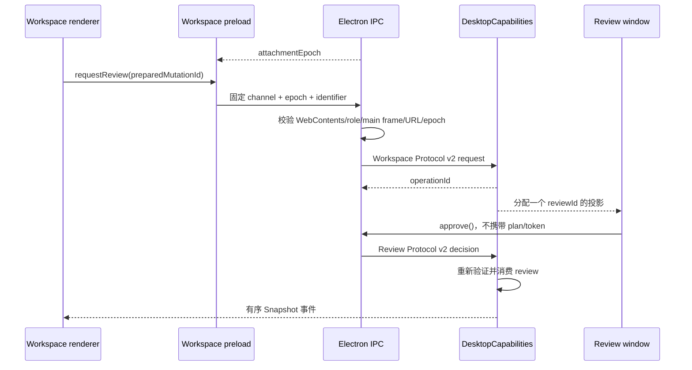

# IPC 与渲染器隔离
活跃贡献者：oldwinter、chendongdong

## 目的

该系统把普通工作区渲染器、可信审阅渲染器和 Electron 主进程隔离成三个角色。渲染器只能发出用途明确的请求并接收有界投影；进程、文件、持久化、确认和执行权限始终留在主进程。更高层的所有权关系见[系统架构](../overview/architecture.md)，变更确认语义见[变更和可信审阅](../features/mutations-and-trusted-review.md)。

## 目录布局

| 仓库根路径 | 内容 |
| --- | --- |
| `apps/desktop/src/contracts/workspace.ts` | Workspace Protocol v2、Snapshot、事件、请求与结果 |
| `apps/desktop/src/contracts/review.ts` | Review Protocol v2、审阅投影与 `approve`/`reject` |
| `apps/desktop/src/contracts/about.ts` | 更新检查、重启与诊断导出的 About 合约 |
| `apps/desktop/src/preload/workspace.ts` | 暴露冻结的 `skillsDesktop` bridge |
| `apps/desktop/src/preload/review.ts` | 暴露冻结的 `skillsReview` bridge |
| `apps/desktop/src/main/adapters/electron-ipc.ts` | 固定 channel、发送者授权、输入输出校验和 session attachment |
| `apps/desktop/src/main/adapters/electron-security.ts` | 自定义协议、CSP、窗口配置和导航/权限限制 |
| `apps/desktop/src/main/adapters/electron-window-lifecycle.ts` | 窗口关闭时解绑对应 session |

## 关键抽象

### 两个角色协议

- `WorkspaceBridge` 暴露刷新、Target 管理、比较、变更准备、请求审阅、协调和合集等具名方法；renderer 看不到通用 request union 或 IPC channel。
- `ReviewBridge` 只有 `getReview()`、`approve()` 和 `reject()`。审阅窗口只读取主进程分配给它的一个不可变投影，不能提交 plan、argv 或确认 token。
- Workspace 与 Review 均为协议版本 2；About 合约独立使用版本 1 请求与版本化 Snapshot。

### Attachment 与发送者授权

`registerDesktopIpc()` 为每个 live `WebContents` 建立 `RegisteredEndpoint`，绑定：

- 随机 `attachmentEpoch`；
- `workspace` 或 `review` 角色；
- 精确的 `WebContents.id`；
- 精确的 `skills-desktop://workspace/index.html` 或 `skills-desktop://review/index.html`；
- 由 `DesktopCapabilities.attach()` 返回的 main-owned session。

每次调用必须来自已登记的同一个 `WebContents`、主 frame、正确角色和精确 URL，并携带当前 epoch。旧 document、subframe、导航后的页面或错误角色都会得到有界 `unauthorized` 结果。

### 严格投影

边界两侧都解析数据：preload 在返回 renderer 前解析结果和事件，IPC adapter 在进入/离开应用 session 时解析请求、Snapshot、Review Snapshot 和结果。Schema 使用 `.strict()`、长度上限、枚举和 discriminated union；异常、stack、原始 stdout/stderr、argv、环境和主机细节不会成为 renderer API。

## 工作方式

事件不是恢复权威。Workspace session 使用 `sessionEpoch`、单调 `sequence` 与 `stateRevision`。每个 endpoint 只保留一个待发送事件；新变化覆盖未送达变化时改发 `resync.required(reason: "buffer_overflow")`，renderer 随后重新读取完整 Snapshot。

## 窗口安全

`workspaceWindowOptions()` 与 `reviewWindowOptions()` 均启用 `contextIsolation`、sandbox、`webSecurity`，关闭 `nodeIntegration`、`webviewTag` 和生产 devtools。自定义 `skills-desktop:` 协议只读取对应 bundle 根目录下的真实普通文件，限制单文件为 20 MiB，设置 deny-by-default CSP，并拒绝意外导航、子窗口、webview、权限、下载和远端连接。更多威胁边界见[安全](../security.md)。

## 集成点

- `apps/desktop/src/main/adapters/electron-ipc.ts` 不实现业务授权；它验证 Electron sender 后把请求交给 [Desktop Capabilities](desktop-capabilities/index.md)。
- `DesktopCapabilities` 只向 workspace session 发布 Workspace Snapshot，只向 role-bound review session发布对应 Review Snapshot。
- About 更新事件只发送给 workspace endpoint，更新 feed 和 `autoUpdater` 不进入 renderer。
- renderer teardown 会使 session 失效；主进程中已开始的受保护 mutation 不因此被静默取消或清 Guard。

## 修改入口

新增能力需同时完成以下工作，不能只加一个 channel：

1. 在 `apps/desktop/src/contracts/` 增加封闭、版本化、有限长的 schema 和 bridge 方法。
2. 在正确 preload 中映射一个固定方法；不要暴露 `ipcRenderer`、channel 名、任意参数或 Electron 对象。
3. 在 `apps/desktop/src/main/adapters/electron-ipc.ts` 增加角色矩阵、sender 校验和双向 schema 解析。
4. 在 `DesktopCapabilities` 中实现当前状态下的授权与 redaction。
5. 补充协议、恶意 sender、stale epoch、错误角色、输出校验和敏感 sentinel 测试。

## Key source files

- `apps/desktop/src/contracts/desktop.ts`
- `apps/desktop/src/contracts/workspace.ts`
- `apps/desktop/src/contracts/review.ts`
- `apps/desktop/src/contracts/about.ts`
- `apps/desktop/src/preload/workspace.ts`
- `apps/desktop/src/preload/review.ts`
- `apps/desktop/src/main/adapters/electron-ipc.ts`
- `apps/desktop/src/main/adapters/electron-security.ts`
- `docs/adr/0009-isolate-trusted-review-from-renderer-capabilities.md`
- `docs/adr/0023-ship-a-native-bilingual-accessible-shell.md`
