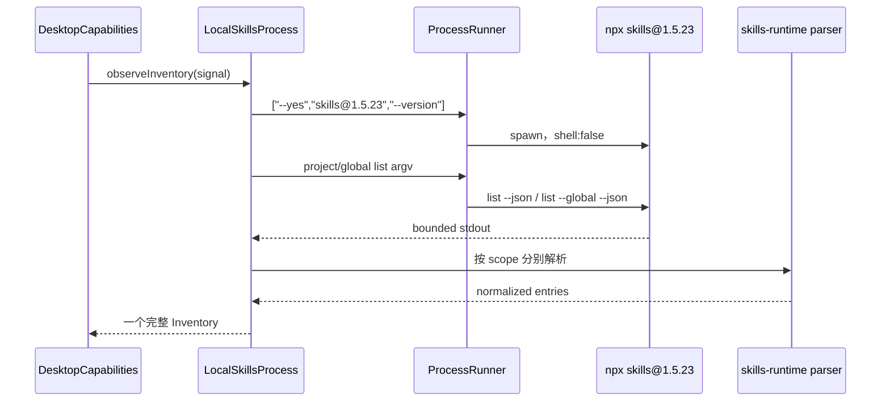

# 本地 CLI 边界
活跃贡献者：oldwinter、chendongdong

## 目的

本地 CLI 边界把 `npx skills` 保持为发现、添加、删除和更新的唯一权威，同时阻止 renderer 文本、任意 argv、shell 字符串或完整环境成为执行输入。V1 固定使用 `skills@1.5.23`；应用只规范化 CLI 证据并验证变更效果，不扫描 Skill 目录建立第二套真相。

功能结果的解释分别见[库存](../features/inventory.md)和[变更和可信审阅](../features/mutations-and-trusted-review.md)；本页只描述进程与方言边界。

## 目录布局

| 仓库根路径 | 内容 |
| --- | --- |
| `apps/desktop/src/main/adapters/skills-process.ts` | `SkillsProcess` 接口、Command Plan、准备规则和 effects 验证 |
| `apps/desktop/src/main/adapters/local-skills-process.ts` | Local 实现、CLI 解析、环境、spawn、取消和 postflight |
| `packages/skills-runtime/src/inventory.ts` | `skills@1.5.23` 常量、有界 Inventory parser |
| `packages/skills-runtime/src/mutation.ts` | 封闭 Mutation Intent schema |
| `packages/skills-runtime/src/harness-registry.ts` | 固定 Harness Registry、scope 支持和 Skills Dialect |
| `apps/desktop/src/contracts/inventory-availability.ts` | Inventory entry 对 Harness 的可用性判断 |

## 关键抽象

### `SkillsProcess`

公开接口只有三个方法：

```text
observeInventory({ signal })
prepareMutation({ freshness: "fresh", intent, inventory, inventoryId })
executeConfirmed({ confirmation, signal })
```

调用方看不到 executable、argv、环境、cwd 或 process runner。`CommandPlan.preview` 是说明性投影；真正 argv 只存放在 `LocalSkillsProcess` 的 private plan map 中。

### 固定 Skills Dialect

`CLI_PACKAGE` 是 `skills@1.5.23`，`CLI_VERSION` 是 `1.5.23`。每个 Local `SkillsProcess` 首次工作前执行 `--version` 并要求 stdout 精确匹配；成功结果在该 process 实例中复用，取消导致的验证结果不会缓存。方言、解析与 Harness Registry 的更多细节见 [Skills Runtime](../packages/skills-runtime.md)。

### 封闭意图与计划

Mutation Intent 只允许：

- 明确名称、scope 和 GitHub source 的 `add`；
- 明确名称与 scope 的 `remove`；
- 明确名称与 scope 的 `update`；
- 在准备阶段按 Fresh Inventory 展开的 `update-all`。

名称、数量、总长度、source 与 40 位 revision 都受 schema 约束。准备阶段还验证 Target 绑定、Harness scope、Inventory freshness，以及 remove/update 的目标确实存在。

## 工作方式



Project 与 global observation 并行执行，但只有两个命令都成功并通过 parser 后才产生一个完整 Inventory；失败或取消不会发布半份数据。

变更执行路径为：

1. `prepareMutationPlan()` 从同一规范 intent 生成 reviewable `CommandPlan` 和 private argv。
2. Prepared Mutation 绑定 TargetId、Generation、InventoryId、digest 和十分钟 expiry。
3. `executeConfirmed()` 消费 single-use plan，校验 digest 和 expiry。
4. CLI 结束且 termination 已知后，再运行完整 project/global postflight。
5. `observedMutationEffects()` 将 process disposition 与可观察 effects 分开返回；revision/fingerprint 缺失时不伪造内容已验证结论。

## 进程策略

- 所有平台均使用参数数组和 `shell: false`。
- POSIX 解析可执行的 `node`/`npx`，可检查常见 Node version-manager 路径；Windows 直接以 `node.exe` 启动 `npx-cli.js`，不通过 `.cmd` shell。
- 环境只允许 `HOME`、`PATH`、npm cache、临时目录及必要 Windows 系统变量；其他变量不会继承。
- stdout 写入权限为 `0600` 的临时捕获文件，stdout/stderr 都有 8 MiB 边界；临时文件始终清理。
- observation 默认 60 秒；remove 最长 2 分钟，add/update 最长 10 分钟。
- 每个 Target 同时只允许一个 observation 或 mutation；冲突返回结构化错误而不是排队。
- POSIX 以独立进程组终止，Windows 使用进程树 killer。若终止不能确认，结果保留 `termination: "unknown"` 与可能 effects。

## 集成点

- [Target 管理](target-management.md)为 Local process 提供规范 workspace、TargetId、Generation 和当前 Harness。
- `DesktopCapabilities` 在调用 `executeConfirmed()` 前先写 durable Mutation Guard，并在 postflight Inventory 持久化成功后才清 Guard。
- CLI parser 与 Intent schema 位于环境中立 package，Desktop adapter 不另定义方言。
- renderer 只看到公开 Inventory、Command Plan 和有界 Outcome，不看到 argv、stdout/stderr 或环境。

## 修改入口

1. 上游 CLI 版本或语法变化必须作为新的 reviewed Skills Dialect 处理：先修改 runtime 常量、fixture 与 parser，再修改 argv 构造；不要使用宽松兼容探测。
2. 新增 mutation 种类需同时扩展封闭 Intent、准备/eligibility、Command Plan、exact argv、postflight effects、IPC schema 和 Trusted Review。
3. 进程生命周期变化应优先保持 `SkillsProcess` 三方法接口不变，并补充参数数组、输出上限、取消与 process-tree 测试。
4. 禁止执行 `CommandPlan.preview`，禁止把 renderer 提供的任意 flags 或 source text直接传给 process runner。

## Key source files

- `apps/desktop/src/main/adapters/skills-process.ts`
- `apps/desktop/src/main/adapters/local-skills-process.ts`
- `apps/desktop/src/main/adapters/local-skills-process.test.ts`
- `packages/skills-runtime/src/inventory.ts`
- `packages/skills-runtime/src/mutation.ts`
- `packages/skills-runtime/src/harness-registry.ts`
- `docs/adr/0001-delegate-skill-operations-to-npx-skills.md`
- `docs/adr/0002-execute-only-typed-confirmed-skill-operations.md`
- `docs/adr/0005-own-the-local-skill-process-lifecycle.md`
