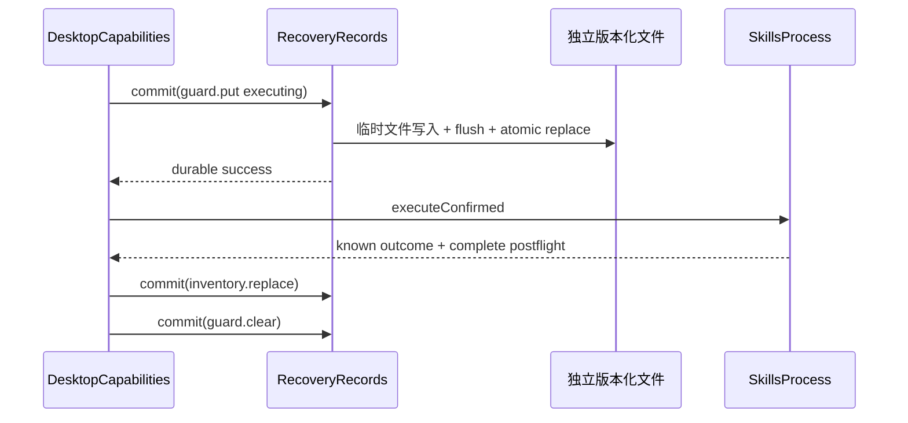

# 恢复与持久化
活跃贡献者：oldwinter、chendongdong

## 目的

恢复系统保存“安全地重新进入应用状态所需的最少证据”，而不是保存另一个已安装 Skill 真相或可重放执行历史。`RecoveryRecords` 是版本化、封闭的主进程持久化接口：调用方只能 `restore()` 或提交一个已命名的 `DurableChange`，不能读取任意 JSON、路径或通用 repository。

应用状态所有权见 [Desktop Capabilities](desktop-capabilities/index.md)；Inventory 为什么恢复为 stale 见[库存](../features/inventory.md)。

## 目录布局

| 仓库根路径 | 内容 |
| --- | --- |
| `apps/desktop/src/main/persistence/recovery-records.ts` | schema、迁移、JSON 与 memory adapter、原子写入和 quarantine |
| `apps/desktop/src/main/persistence/recovery-host-trust.ts` | 将 OpenSSH 公钥 store 映射到 `RecoveryRecords` |
| `apps/desktop/src/main/persistence/update-check-records.ts` | 独立的更新检查时间记录 |
| `apps/desktop/src/main/persistence/deferred-update-records.ts` | 独立的已下载更新候选记录 |
| `apps/desktop/src/main/application/desktop-capabilities.ts` | 恢复投影、Guard 生命周期和显式 reconciliation |
| `apps/desktop/src/main/composition-root.ts` | 在 Electron userData 下创建生产 records |

## 关键抽象

### `RecoveryRecords`

```text
restore(): RestoredRecoveryRecords
commit(change: DurableChange): Result<void, RecoveryCommitError>
```

当前封闭 `DurableChange` 包括：

- `targets.replace`；
- `target.remap`；
- `inventory.replace`；
- `guard.put`、`guard.clear`；
- `guards.clear-corruption`，且必须携带验证后的 remaining Guards；
- `host-trust.replace`；
- `collections.acknowledgements.replace`。

没有通用 `set(key, value)`、任意文件写入、可执行计划存储或“清空所有恢复状态”操作。

### 独立版本化 stores

| Store | 当前格式 | 保存内容 |
| --- | --- | --- |
| `inventory-snapshots.json` | Inventory Snapshot v3 | 每 Target 最后一份 allowlisted 完整证据 |
| `mutation-guards.json` | Mutation Guard v3 | 操作、deadline、effects 与 Target/dialect/registry/harness binding digest |
| `target-definitions.json` | Target Definition v4 | 稳定 UUID、Generation、workspace、Harness 集合和非秘密属性 |
| `known_hosts` | 严格 OpenSSH 公钥行 | 应用明确确认的公共 host key，不含 credential |
| `collection-acknowledgements.json` | Collection Acknowledgement v1 | 用户已审阅 release/delta 的事实 |

更新检查和 deferred restart 使用自己的小型版本化记录，不进入 `RecoveryRecords`，详见[更新协调](updates.md)。

### Authority allowlist

Inventory Snapshot 只保留 CLI 版本、规范 entries、Generation、observed time 和 TargetId。不会持久化 Prepared/Confirmed Mutation、确认 token、private argv、preview、比较、renderer Snapshot、raw stdout/stderr、SSH stream、环境或未知 CLI 字段。Host Trust 只保存公共算法、key 与有效 lookup identity。

## 工作方式



Mutation Guard 必须先 durable，进程才可启动。若执行终止或 effects 无法确定、postflight 缺失、Inventory 保存失败或 Guard 清除失败，应用保持/重写为 `reconciliation-required`，不会以退出或 UI 重载作为清除依据。

启动时：

1. `restore()` 分别加载各 store，隔离不相关失败。
2. Target Definitions 先恢复或初始化，legacy Target identity 通过受限 `target.remap` 合并。
3. 所有 Inventory Snapshot 都以 `freshness: "stale"` 投影；Generation 不匹配还附带 stale 错误。
4. surviving Guard 使对应 Target 进入 Reconciliation Required。
5. Guard store 无法安全读取时，Target fail closed；Target store 失败还会使 Target authority 不可用并阻止安全重启。

## 文件安全与迁移

- 写入在应用级 promise lock 下串行执行。
- 文件以同目录 `wx`、`0600` 临时文件写入并 `sync()`，随后 rename 原子替换；POSIX 再同步父目录。
- 已发布旧 schema 通过确定性的相邻版本规则迁移；迁移前建立并校验 `.backup`。
- 更新 schema 高于当前版本时保留原文件并 write-block，旧应用不会覆盖。
- 无效 JSON/schema 会被移入唯一 quarantine；Guard、Target 和 Host Trust 还使用 failure marker 防止之后把损坏状态当作空。
- Target 与 Guard 联合迁移失败时保持 fail closed；未知 legacy Harness 不猜测。

## 集成点

- `DesktopCapabilities.initialize()` 是恢复结果的语义拥有者；`RecoveryRecords` 只拥有 bytes、schema 与 transition durability。
- [本地 CLI 边界](local-cli-boundary.md)返回完整 postflight Inventory 后，应用层才尝试替换 Snapshot。
- Target Definition 的提案只有在 `targets.replace` 成功后才进入 live catalog。
- `restartSafety()` 将 surviving Guard、reconciliation 和 recovery uncertainty 提供给 UpdateCoordinator，阻止不安全即时重启。

## 修改入口

1. 新增 durable authority 时先判断是否真的需要持久化；derived、view-local 或可重新观察的数据不应进入 store。
2. 必须通过 `DurableChange` 增加具名 transition，并为 memory/JSON adapter 同时实现契约。
3. 修改 schema 时只新增版本与确定性迁移，保留旧、corrupt、中断写、新版拒写、幂等与 backup fixture。
4. 不要将内部 store 宣称为同步、备份或 interchange 格式；不要增加通用 Guard clear、mutation replay 或 overwrite-newer。

## Key source files

- `apps/desktop/src/main/persistence/recovery-records.ts`
- `apps/desktop/src/main/persistence/recovery-records.test.ts`
- `apps/desktop/src/main/persistence/recovery-host-trust.ts`
- `apps/desktop/src/main/application/desktop-capabilities.ts`
- `apps/desktop/src/main/composition-root.ts`
- `docs/adr/0007-persist-bounded-recovery-records.md`
- `docs/adr/0022-recover-through-versioned-records-and-typed-repairs.md`
