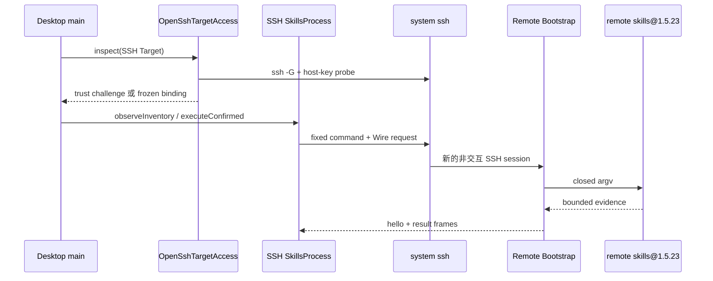

# 远端传输实验
活跃贡献者：oldwinter、chendongdong

> **醒目范围声明：这是架构/实验实现，不是当前 V1 能力。V1 的公开承诺是 Local-only；不得把本页代码路径、测试或 ADR 目的地描述为已发布 SSH Target。**

## 目的

该实验验证如何让 SSH Target 复用 `SkillsProcess`，同时保留固定远端命令、结构化 Wire 数据、显式主机信任和不确定结果恢复。它不提供 V1 用户能力：生产组合虽构造 OpenSSH/Wire adapters，但同时设置 `v1LocalOnlyTargets: true`，应用层拒绝 SSH Target 创建/编辑、refresh、host-trust review 与远端合集。

当前源码的 Wire 常量仍是 **Protocol v2**，只实现 observe、mutate、cancel。`docs/adr/0016-promote-posix-ssh-with-wire-v3.md` 接受的是后续 **Wire v3** 目的地，并要求绑定 Generation、Dialect、Registry、Bootstrap、workspace 和完整 Harness 集合，且加入 source inspection。两者不可混称；在 v3 与对应 packaged gates 完成前，当前实现只应视作实验资产。

## 目录布局

| 仓库根路径 | 内容 |
| --- | --- |
| `apps/desktop/src/main/ssh/openssh-target.ts` | OpenSSH config 解析、冻结、host-key probe 与 app-owned trust |
| `apps/desktop/src/main/ssh/host-public-key.ts` | 支持算法与严格公钥解析 |
| `apps/desktop/src/main/adapters/ssh-skills-process.ts` | SSH transport runner 与实验 `SkillsProcess` |
| `apps/desktop/src/main/targets/local-skills-targets.ts` | SSH Definition/`open()` 分支与绑定漂移 proposal |
| `apps/desktop/src/main/persistence/recovery-host-trust.ts` | app-owned `known_hosts` 适配 |
| `packages/skills-runtime/src/wire.ts` | 当前 Wire v2 frame schema、codec 与 bounds |
| `packages/remote-bootstrap/src/index.ts` | build-time fixed Node program 与 command/digest |

Remote Bootstrap package 的结构与构建说明见[Remote Bootstrap](../packages/remote-bootstrap.md)。

## 关键抽象

### Connection Reference 与 Effective Binding

SSH Target 保存 OpenSSH alias，不保存私钥或密码。实验 access adapter 用 `ssh -G -- alias` 解析 user、hostname、port、host-key identity 及 jump-host 配置，过滤会改变安全行为的字段并生成冻结 configuration。Binding digest 包含冻结配置、workspace、Harness、Wire version 与 Remote Bootstrap digest；变化会提出 Generation 推进，而不是静默复用旧 session。

### 主机信任

应用拥有独立 OpenSSH-format public-key store，不修改用户 `known_hosts`。探测生成五分钟的 first-use 或 rotation challenge，展示 effective lookup identity、算法和 SHA256 fingerprint。确认前会重新解析并扫描，要求 key 与 binding digest 完全一致，然后才替换该 identity 的公钥。Credential 仍由系统 OpenSSH 配置与 agent 处理。

### Wire 与 Remote Bootstrap

当前实验通过 SSH stdin/stdout 传输有长度前缀的 UTF-8 JSON frame；stderr 保持独立且只计 byte 数。SSH remote command 是 `packages/remote-bootstrap` 构建出的固定 `node -e ...` 字符串，不含 Target、workspace、skill name、Mutation 或 renderer 数据。Remote Bootstrap 验证 closed request 后自行构造固定 `npx --yes skills@1.5.23` argv。

Bootstrap 首先发送包含自身 digest 的 `hello`。Desktop 要求 digest 和 protocol 精确匹配，再接受一个完整 Inventory 或 mutation result；不存在协议降级或任意 command/argv seam。

## 工作方式

每次 observation 或 mutation 使用新的非交互 session，关闭 TTY、agent forwarding、port forwarding、ControlMaster、local command 和宽松 host-key 接受。远端要求 POSIX、`node` 与 `npx`；Windows 可以作为桌面客户端平台，但不属于 Remote SSH Target 目的地。

## 取消与不确定性

Mutation 取消先发送 matching Wire cancel frame，并等待 Remote Bootstrap 证明远端 mutation process group 已清理。只有最终 `mutation-result` 明确给出 `cleanup: "confirmed"`、匹配 request ID、CLI 版本和完整 postflight，local adapter 才把 termination 视为 known。

如果 transport 丢失、frame 不完整、digest/请求不匹配、远端清理未证明或本地 SSH process tree 只能被强制结束，实验 adapter 返回 `termination: "unknown"` 与 `effects: "possible"`。应用必须保留 Mutation Guard、阻止自动 retry 和普通 mutation，并要求 deadline-aware reconciliation；本地 SSH 进程退出不是远端停止证据。

## 当前缺口与发布门槛

当前实现与已接受 Wire v3 目的地之间至少存在以下明确差距：

- runtime 常量仍为 `WIRE_PROTOCOL_VERSION = 2`；
- request 未绑定完整 Target Generation、Dialect、Registry version/digest 和 Harness 集合；
- Wire 操作尚无 source inspection；
- V1 capability gate 主动拒绝全部 SSH 用户流程；
- localhost/Linux tracer 不能替代 live external host、跨机器和 Windows/macOS 原生资格证明。

因此本页只能指导实验维护。公共 SSH 文档必须等 ADR 0016 的 Milestone 3/4 packaged trust、observation、uncertainty 与 recovery gates 通过后再更新。V1 Target 入口见[Target 管理](target-management.md)。

## 集成点

- `SkillsTargets.open()` 让 Local 与 SSH 在准备完成后共享 `SkillsProcess` 三方法 seam。
- Host Trust 公钥通过[恢复与持久化](recovery-and-persistence.md)保存，但密码、私钥和 raw SSH 输出不持久化。
- `DesktopCapabilities` 的 mutation Guard、Trusted Review 和 reconciliation 规则不因 transport 改变。
- 远端协议边界的威胁与 redaction 原则见[安全](../security.md)。

## 修改入口

1. 不要通过删除 `v1LocalOnlyTargets` gate 来“启用”SSH；先完成 Wire v3 contract、migration、packaged tracers 和明确产品发布决定。
2. Wire 变化必须 fail closed 且版本断开，不使用 optional fields 伪装兼容；Desktop、runtime、Bootstrap digest 和 tests 必须同一提交更新。
3. 远端命令必须保持 build-time constant；所有动态值仅通过有界 frame，Remote Bootstrap 只构造 closed Skills argv。
4. 不要记录或投影 hostname、user、workspace、proxy command、agent socket、payload 或 raw stdout/stderr。
5. 取消逻辑必须继续区分“local transport 已退出”“remote cleanup 已证明”和“effects 已观察”。

## Key source files

- `apps/desktop/src/main/ssh/openssh-target.ts`
- `apps/desktop/src/main/ssh/host-public-key.ts`
- `apps/desktop/src/main/adapters/ssh-skills-process.ts`
- `apps/desktop/src/main/targets/skills-targets.ts`
- `apps/desktop/src/main/targets/local-skills-targets.ts`
- `apps/desktop/src/main/persistence/recovery-host-trust.ts`
- `packages/skills-runtime/src/wire.ts`
- `packages/remote-bootstrap/src/index.ts`
- `apps/desktop/src/main/composition-root.ts`
- `docs/adr/0016-promote-posix-ssh-with-wire-v3.md`
- `docs/adr/0024-qualify-an-unsigned-mission-candidate.md`
