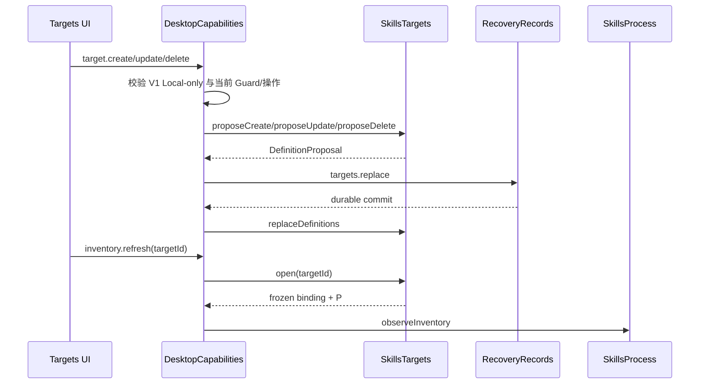

# Target 管理
活跃贡献者：oldwinter、chendongdong

## 目的

Target 是应用拥有的稳定执行身份：一台机器、一个规范 workspace 和一个非空规范 Harness 集合。Target 管理负责 Definition、Generation、打开时的有效绑定和持久化提案；它不把显示名称、路径或 OpenSSH alias 当作身份。

**当前 V1 只开放 Local Target。** 生产组合显式传入 `v1LocalOnlyTargets: true`；SSH Definition、host-trust review、SSH refresh 和涉及 SSH 的合集操作都会被应用层拒绝。远端代码的真实状态见[远端传输实验](remote-transport-experimental.md)。

## 目录布局

| 仓库根路径 | 内容 |
| --- | --- |
| `apps/desktop/src/main/targets/skills-targets.ts` | `SkillsTargets`、`TargetSession`、`EffectiveTargetBinding` 接口 |
| `apps/desktop/src/main/targets/local-skills-targets.ts` | Local 初始 Target、Definition 规范化、提案与 `open()` |
| `apps/desktop/src/main/targets/workspace-path.ts` | Local workspace label 和根路径判断 |
| `apps/desktop/src/contracts/workspace.ts` | `TargetDraft`、公开/持久化 Definition schema |
| `apps/desktop/src/main/application/desktop-capabilities.ts` | Target 请求授权、会话失效、持久化和 V1 Local-only gate |
| `apps/desktop/src/main/persistence/recovery-records.ts` | Target Definition v4 文档与迁移 |

## 关键抽象

### Target Definition

持久化 Definition 包含稳定 UUID `id`、`kind`、`label`、规范 `workspace`、`harnessIds`、`generation`、固定 Skills dialect/registry 标识，以及仅 SSH 使用的 `connectionReference` 和 `executionBindingDigest`。`workspaceLabel` 是运行时展示投影，不进入持久化文档。

Local 初始 Target 的标签是 `This device`，Harness 是 `codex`，workspace 来自组合根选择并经 `realpath()` 规范化。Local Target 的 `connectionReference` 与 `executionBindingDigest` 必须为 `null`。

### Generation

稳定 `TargetId` 不因编辑而变化。以下执行相关字段改变时，Generation 加一并清除旧执行绑定摘要：

- `kind`；
- 规范 workspace；
- Harness 集合；
- SSH Connection Reference。

只改显示 label 不推进 Generation。应用层在执行相关变化后丢弃 Fresh Target Session、Prepared Mutation、比较/合集计划，并把已有 Inventory 作为 stale 证据保留。

### 提案后提交

`SkillsTargets` 的 `proposeCreate()`、`proposeUpdate()` 和 `proposeDelete()` 返回 `TargetDefinitionProposal`，不会直接改变目录。`DesktopCapabilities` 先通过 `RecoveryRecords.commit({type: "targets.replace"})` 持久化完整 Definition 集合，成功后才调用 `replaceDefinitions()`。这避免内存目录先于 durable state 前进。

### 打开 Target

`open(TargetId)` 返回结构化错误、需要处理的绑定/信任状态，或包含以下内容的 `TargetSession`：

- 当前 Definition；
- 冻结的 `EffectiveTargetBinding`；
- 绑定该 Target 与 Generation 的 `SkillsProcess`。

打开不会为 SSH 保留连接；Local 打开也不执行 Inventory。只有后续 refresh 才调用 `observeInventory()`。

## 工作方式

## 约束与删除规则

- Local workspace 必须是绝对路径并通过主进程规范化；SSH workspace 的模型要求规范 POSIX 绝对路径。
- SSH alias 只是 Connection Reference，不是 `TargetId` 或主机身份。
- Definition 中 Harness 集合必须非空、唯一并按 pinned Registry 顺序规范化。
- 最后一个 Target 不能删除；有 Mutation Guard、reconciliation、Target reservation 或相关活动工作的 Target 不能编辑或删除。
- 恢复时旧的非 UUID Local identity 可通过受限映射迁移到 UUID；未知 legacy Harness 不猜测，迁移失败并保持可恢复。

## 集成点

- Inventory refresh 在 Target 打开后建立 Fresh Target Session；详见[库存](../features/inventory.md)。
- `SkillsProcess` 的准备结果绑定 TargetId、Generation 与 InventoryId；Generation 变化使其失效。
- Definition 和上一份 Inventory Snapshot 由[恢复与持久化](recovery-and-persistence.md)分别保存，后者不成为 Target 权威。
- Harness ID、Dialect 与 Registry 的规范数据来自 [Skills Runtime](../packages/skills-runtime.md)。

## 修改入口

1. 修改 Target schema 时，从 `apps/desktop/src/contracts/workspace.ts` 和 Target v4 持久化迁移同时开始，保持已发布字段向后可读。
2. 修改 identity 或 Generation 规则时，更新 `apps/desktop/src/main/targets/local-skills-targets.ts` 的 proposal 比较、应用层会话失效逻辑和 migration fixtures。
3. 新增 Target kind 时必须先有明确产品决定、`SkillsTargets.open()` 契约、主进程 capability gate、持久化 schema 与 adapter tests；不能仅在 renderer 增加选项。
4. V1 不得移除 `v1LocalOnlyTargets: true` 或绕过其各条请求 gate，除非远端里程碑及发布决策明确完成。

## Key source files

- `apps/desktop/src/main/targets/skills-targets.ts`
- `apps/desktop/src/main/targets/local-skills-targets.ts`
- `apps/desktop/src/main/targets/workspace-path.ts`
- `apps/desktop/src/contracts/workspace.ts`
- `apps/desktop/src/main/application/desktop-capabilities.ts`
- `apps/desktop/src/main/composition-root.ts`
- `apps/desktop/src/main/persistence/recovery-records.ts`
- `docs/adr/0006-bind-ssh-targets-to-one-skills-process.md`
- `docs/adr/0022-recover-through-versioned-records-and-typed-repairs.md`
