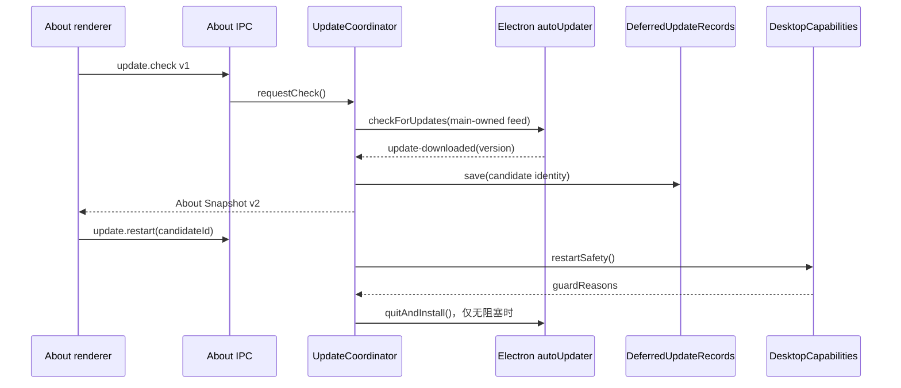

# 更新协调
活跃贡献者：oldwinter、chendongdong

## 目的

更新协调把平台更新政策、检查频率、Electron `autoUpdater`、下载候选、延期重启和安全阻塞集中在主进程。renderer 只能读取 About Snapshot、请求检查、请求一个已识别候选的重启或导出有界诊断；它从不获得 feed URL 或安装权限。

**当前组合根使用 `releaseChannel: "unsigned-preview"`。因此当前 unsigned-preview 构建只提供手动升级指引，不进入自动更新 feed。** Stable Release 的签名、发布和更新要求见[部署](../deployment.md)。

## 目录布局

| 仓库根路径 | 内容 |
| --- | --- |
| `apps/desktop/src/contracts/about-update-contracts.ts` | 平台 policy 与 update state schema |
| `apps/desktop/src/contracts/about.ts` | About 请求、Snapshot v1/v2、candidate 与 restart guards |
| `apps/desktop/src/main/application/update-platform-policy.ts` | automatic/manual/unavailable 平台选择 |
| `apps/desktop/src/main/application/update-coordinator.ts` | 检查调度与 updater 事件状态机 |
| `apps/desktop/src/main/application/deferred-update-controller.ts` | 下载候选持久化、恢复与受 Guard 约束的重启 |
| `apps/desktop/src/main/adapters/electron-auto-updater.ts` | Electron autoUpdater 适配 |
| `apps/desktop/src/main/update-composition.ts` | userData records、adapter 与 coordinator 组装 |
| `apps/desktop/src/main/persistence/update-check-records.ts` | 上次检查时间 |
| `apps/desktop/src/main/persistence/deferred-update-records.ts` | 延期候选身份 |

## 关键抽象

### 平台策略

`selectUpdatePlatformPolicy()` 返回三种互斥模式：

| 模式 | 条件 | 行为 |
| --- | --- | --- |
| `manual` | packaged unsigned preview；或 Linux | 指向固定 GitHub Releases URL；不调用 updater |
| `automatic` | packaged stable macOS arm64/x64 或 Windows x64 | stable channel，main-owned feed |
| `unavailable` | 其他未受支持组合 | 只说明此构建不能检查 |

即使 automatic 代码存在，也不能把 unsigned V1 候选描述为自动更新产品。

### `UpdateCoordinator`

Coordinator 是 `autoUpdater` 的唯一调用方。Automatic 模式启动后至少等待 30 秒，并根据 durable `lastCheckAt` 保证检查间隔不少于 24 小时；用户请求也不会绕过 active check、已有 candidate 或模式限制。检查前先保存本次时间，随后只发布固定的 `checking`、`update-available`、`update-downloaded`、`up-to-date` 或 `error` 状态。

### Deferred Update Controller

下载事件必须带可解析且严格高于当前版本的 stable semantic version。Controller 生成并持久化 candidate 的 UUID、version、platform、architecture、downloaded time 与 running version，保存成功后才公开候选。恢复时只接受与当前平台/架构和下载时运行版本一致的候选；无效或不确定记录会阻塞而不是被当作空。

### 重启安全

`DesktopCapabilities.restartSafety()` 按固定原因集报告：

- `mutation-active`；
- `protected-process-active`；
- `trusted-review-active`；
- `reconciliation-required`；
- `recovery-uncertain`。

即时重启只对本次 session 下载、candidate ID 精确匹配、无 Guard 且 adapter 支持安装的候选开放。`prepareRestart()` 后还会再次检查 Guard，最后才调用 `quitAndInstall()`。

## 工作方式

## 持久化与诊断

- `check-record-v1.json` 是严格 schema 的上次检查时间，以临时文件替换写入。
- `deferred-restart-v1.json` 最大 4 KiB，以 `0600` 临时文件、flush、replace 与父目录同步写入；损坏文件被 quarantine，新 schema 不被旧版本覆盖。
- release diagnostics 最大 16 KiB，只包含应用身份、候选身份、固定错误、Guard 原因和更新/重启状态；保存权限为 `0600`。
- 这些 records 与更新状态不授权 Skill mutation；其恢复语义与 [RecoveryRecords](recovery-and-persistence.md) 分离。

## 集成点

- `apps/desktop/src/main/adapters/electron-ipc.ts` 只允许 workspace 角色调用 About 合约，并校验 request/result schema。
- `apps/desktop/src/main/composition-root.ts` 将 `DesktopCapabilities.restartSafety()` 注入更新组合。
- `apps/desktop/src/main/adapters/electron-auto-updater.ts` 负责监听并及时移除 Electron event listener；错误细节不会直接跨 IPC。
- Stable macOS/Windows 才使用按 platform/architecture 分区的 `update.electronjs.org` feed；Linux和 unsigned preview 保持手动路径。

## 修改入口

1. 平台或发布渠道变化从 `apps/desktop/src/main/application/update-platform-policy.ts` 开始，并同步合约、部署文档和完整 policy matrix 测试。
2. 新 updater event 必须先进入封闭 `UpdateAdapterEvent`，再映射为固定 Snapshot；不要把 Electron event 或 error 原样发给 renderer。
3. 重启行为变化必须保留下载 candidate 持久化先于公开、两次 restart safety 检查和 candidate ID 防重放。
4. 当前 unsigned-preview 组合不得启用 stable feed；签名 Stable Release 条件不能用 buildable unsigned candidate 代替。

## Key source files

- `apps/desktop/src/contracts/about-update-contracts.ts`
- `apps/desktop/src/contracts/about.ts`
- `apps/desktop/src/main/application/update-platform-policy.ts`
- `apps/desktop/src/main/application/update-coordinator.ts`
- `apps/desktop/src/main/application/deferred-update-controller.ts`
- `apps/desktop/src/main/adapters/electron-auto-updater.ts`
- `apps/desktop/src/main/update-composition.ts`
- `apps/desktop/src/main/persistence/deferred-update-records.ts`
- `docs/adr/0011-ship-signed-platform-artifacts.md`
- `docs/adr/0013-publish-attested-unsigned-developer-previews.md`
